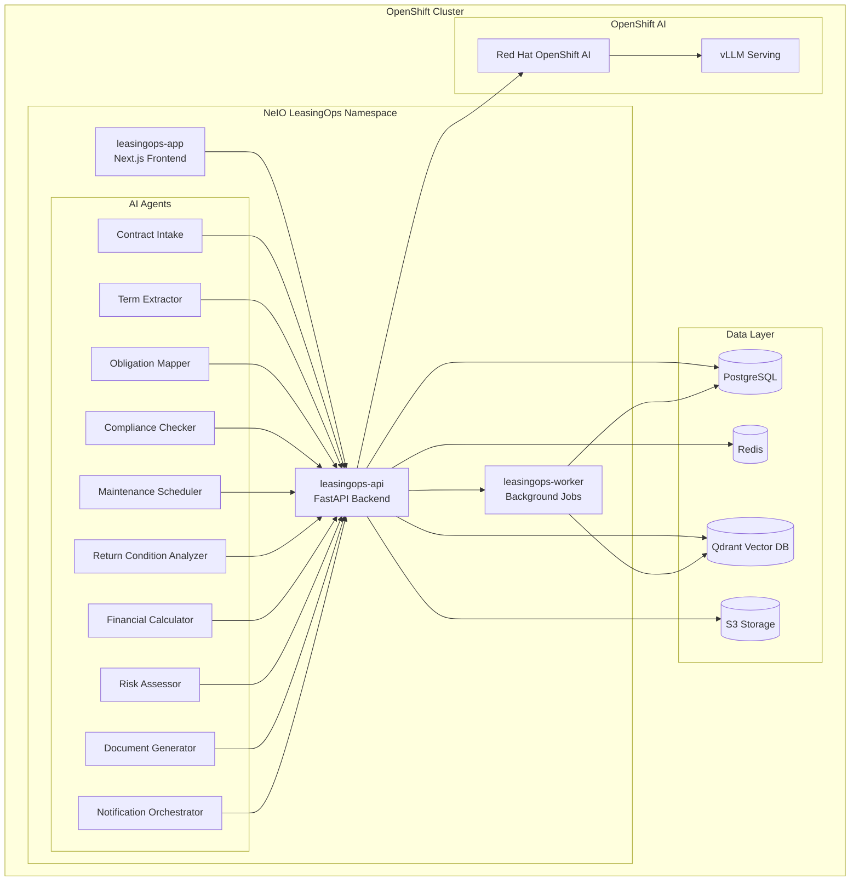

# NeIO LeasingOps - Red Hat OpenShift Quickstart

**Aircraft Leasing Operations AI Solution** - Powered by NeIO 2.0 on Red Hat OpenShift

## Overview

NeIO LeasingOps is an enterprise AI solution designed for aircraft leasing operations. It automates contract analysis, obligation tracking, maintenance scheduling, and compliance monitoring using a multi-agent AI architecture running on Red Hat OpenShift.

This repository contains Helm charts and deployment configurations for running NeIO LeasingOps on OpenShift 4.14+.

## Architecture



## Prerequisites

| Requirement | Version | Notes |
|-------------|---------|-------|
| Red Hat OpenShift | 4.14+ | Kubernetes 1.27+ |
| Helm | 3.x | Chart installation |
| NeIO License Token | - | Contact bala@codvo.ai or indranil@codvo.ai |
| Container Registry Access | - | Images hosted on `rhleasingopsacr.azurecr.io` — request pull credentials from bala@codvo.ai or indranil@codvo.ai |
| OpenShift CLI (oc) | 4.14+ | Cluster access |
| Red Hat OpenShift AI | 2.x | Optional, for on-cluster vLLM/LlamaStack inference |
| **LLM Inference** | - | vLLM + LlamaStack via [RH AI Architecture Charts](https://github.com/rh-ai-quickstart/ai-architecture-charts) (recommended) or RSDP-injected endpoint — see [Configure LLM Provider](#2-configure-llm-provider) |
| **Hugging Face Token** | - | Required for downloading `meta-llama/Llama-3.2-3B-Instruct` via the arch charts |

### Cluster Resources

| Component | CPU | Memory | Storage |
|-----------|-----|--------|---------|
| leasingops-app | 500m | 512Mi | - |
| leasingops-api | 2 | 4Gi | - |
| leasingops-worker | 2 | 4Gi | - |
| PostgreSQL | 1 | 2Gi | 50Gi |
| Redis | 500m | 1Gi | 10Gi |
| Qdrant | 2 | 4Gi | 100Gi |

## Quick Start

### 1. Validate License Token

```bash
# Set your NeIO license token
export NEIO_LICENSE_TOKEN="your-license-token"

# Validate the token
./scripts/validate-token.sh
```

### 2. Deploy LLM Inference (Architecture Charts)

NeIO LeasingOps uses [Red Hat AI Architecture Charts](https://github.com/rh-ai-quickstart/ai-architecture-charts) to deploy **vLLM + LlamaStack** in-cluster. This is the recommended approach for all OpenShift deployments — no external LLM API key required, no Ollama.

> See [mhdawson/arch-chart-example](https://github.com/mhdawson/arch-chart-example) for a minimal working example of these charts in action.

#### Step 1 — Add the architecture charts repo and install LLM inference

```bash
helm repo add rh-ai-quickstart https://rh-ai-quickstart.github.io/ai-architecture-charts
helm repo update

# Create a secret with your Hugging Face token (needed to pull Llama 3.2 weights)
oc create secret generic huggingface-secret \
  --from-literal=HF_TOKEN=$HF_TOKEN \
  -n leasingops

# Deploy vLLM (llm-service) + LlamaStack using the arch charts
# GPU cluster:
helm install llm-inference rh-ai-quickstart/llm-service \
  --namespace leasingops \
  --set device=gpu \
  --set models.llama-3-2-3b-instruct.enabled=true

# CPU-only cluster (evaluation / CRC):
helm install llm-inference rh-ai-quickstart/llm-service \
  --namespace leasingops \
  --set device=cpu \
  --set models.llama-3-2-3b-instruct.enabled=true

# Deploy LlamaStack (API layer over vLLM)
helm install llamastack rh-ai-quickstart/llama-stack \
  --namespace leasingops \
  --set models.llama-3-2-3b-instruct.enabled=true
```

Once the LlamaStack pod is ready, note the service endpoint (used in Step 4):
```bash
oc get svc llamastack -n leasingops
# → llamastack:8321 (cluster-internal)
```

#### Step 2 — Install NeIO LeasingOps pointing at LlamaStack

```bash
helm install leasingops neio/leasingops \
  --namespace leasingops \
  --set global.licenseToken=$NEIO_LICENSE_TOKEN \
  --set global.domain=leasingops.apps.your-cluster.com \
  --set llm.url="http://llamastack:8321" \
  --set llm.model="meta-llama/Llama-3.2-3B-Instruct" \
  --set llm.apiToken="" \
  -f examples/values-production.yaml
```

> **Larger models:** With GPU nodes, switch to `meta-llama/Llama-3-8b-instruct` or `meta-llama/Llama-3-70b-chat-hf` for better quality — just change `--set llm.model=` and redeploy the `llm-service` chart with the appropriate model enabled.

> **RSDP deployments:** The Red Hat Solution Deployment Platform automatically injects `llm.url`, `llm.apiToken`, and `llm.model` — no manual configuration needed. See [OpenShift AI Inference](#openshift-ai-inference) for full details.

### 3. Generate Pull Secret

NeIO LeasingOps container images are hosted on **Azure Container Registry** at `rhleasingopsacr.azurecr.io`.

To request registry credentials and a license token, contact:
- **bala@codvo.ai**
- **indranil@codvo.ai**

Once you have credentials:

```bash
# Create the pull secret in your namespace
oc create secret docker-registry acr-secret \
  --docker-server=rhleasingopsacr.azurecr.io \
  --docker-username=<acr-username> \
  --docker-password=<acr-password> \
  -n leasingops

# Or use the provided script (requires credentials in env)
./scripts/generate-pull-secret.sh
oc apply -f pull-secret.yaml -n leasingops
```

### 4. Deploy with Helm

```bash
# Add NeIO Helm repository
helm repo add neio https://charts.neio.ai
helm repo update

# Create namespace
oc new-project leasingops

# Install the chart
helm install leasingops neio/leasingops \
  --namespace leasingops \
  --set global.licenseToken=$NEIO_LICENSE_TOKEN \
  --set global.domain=leasingops.apps.your-cluster.com \
  -f examples/values-production.yaml
```

### 5. Verify Deployment

```bash
# Check pod status
oc get pods -n leasingops

# Verify all components are running
oc wait --for=condition=ready pod -l app.kubernetes.io/instance=leasingops -n leasingops --timeout=300s

# Access the application
echo "Application URL: https://$(oc get route leasingops-app -n leasingops -o jsonpath='{.spec.host}')"
```

### 6. Test with Sample Contracts

The `examples/sample-contracts/` directory contains **45 real aircraft leasing documents** across 10 document types — validated against the full 10-agent pipeline on CRC (OpenShift 4.14+, CPU-only, `llama3.2:3b`).

**Document types included:**

| Directory | Type | Count |
|-----------|------|-------|
| `01-lease-agreements/` | Lease Agreements (LA) | 6 |
| `02-delivery-condition-reports/` | Delivery Condition Reports (DCR) | 6 |
| `03-maintenance-reserve-claims/` | Maintenance Reserve Claims (MRC) | 6 |
| `04-return-condition-reports/` | Return Condition Reports (RCR) | 6 |
| `05-lease-amendments/` | Lease Amendments (AMEND) | 6 |
| `06-letters-of-intent/` | Letters of Intent (LOI) | 3 |
| `07-insurance-certificates/` | Insurance Certificates (IC) | 3 |
| `08-technical-acceptance-reports/` | Technical Acceptance Reports (TAR) | 3 |
| `09-default-notices/` | Default/Notice of Default (NOD) | 3 |
| `10-supplemental-rent-statements/` | Supplemental Rent Statements (SRS) | 3 |

**Upload via API:**

```bash
# Get the API route
API_URL=https://$(oc get route leasingops-api -n leasingops -o jsonpath='{.spec.host}')

# Upload all sample contracts
for pdf in examples/sample-contracts/**/*.pdf; do
  curl -s -X POST "$API_URL/api/v1/documents/upload" \
    -H "Authorization: Bearer $TOKEN" \
    -F "file=@$pdf" | jq -r '.document_id + " " + .filename'
done
```

**Monitor pipeline progress:**

```bash
# Check processing status
curl -s "$API_URL/api/v1/documents" \
  -H "Authorization: Bearer $TOKEN" | \
  jq '[.[] | {id, filename, status, current_agent}] | group_by(.status) | map({status: .[0].status, count: length})'
```

All 45 documents should pass through the 10-agent pipeline:
`contract_intake → term_extraction → obligation_mapping → utilization_reconcile → reserve_calculation → variance_detection → return_readiness → evidence_pack → decision_support → escalation`

Expected completion time: ~8–12 hours (CPU / `llama3.2:3b`), ~30–60 minutes (GPU / `Llama-3-8b`).

## Components

### leasingops-app

Next.js 15 frontend providing the user interface for lease management, document upload, contract review, and reporting dashboards.

| Feature | Description |
|---------|-------------|
| Contract Dashboard | View and manage all lease contracts |
| Document Upload | Drag-and-drop contract PDF upload |
| Obligation Tracker | Real-time obligation status and alerts |
| Compliance Reports | Automated compliance reporting |
| Maintenance Calendar | Visual maintenance scheduling |

### leasingops-api

FastAPI backend handling business logic, AI agent orchestration, and data persistence.

| Endpoint | Purpose |
|----------|---------|
| `/api/v1/contracts` | Contract CRUD operations |
| `/api/v1/obligations` | Obligation management |
| `/api/v1/maintenance` | Maintenance scheduling |
| `/api/v1/compliance` | Compliance checks |
| `/api/v1/chat` | AI-powered contract Q&A |

### leasingops-worker

Background job processor handling document ingestion, AI pipeline execution, and scheduled tasks.

| Job Type | Description |
|----------|-------------|
| Document Ingestion | PDF parsing and vectorization |
| Contract Analysis | AI-powered term extraction |
| Obligation Monitoring | Deadline tracking and alerts |
| Report Generation | Scheduled compliance reports |

## AI Agents

NeIO LeasingOps includes 10 specialized AI agents:

| Agent | Purpose |
|-------|---------|
| **Contract Intake Agent** | Validates and classifies incoming lease documents |
| **Term Extractor Agent** | Extracts key terms, dates, and financial details from contracts |
| **Obligation Mapper Agent** | Identifies and categorizes contractual obligations |
| **Compliance Checker Agent** | Validates compliance with regulatory requirements |
| **Maintenance Scheduler Agent** | Plans and optimizes maintenance schedules |
| **Return Condition Analyzer Agent** | Assesses aircraft return condition requirements |
| **Financial Calculator Agent** | Computes lease payments, reserves, and penalties |
| **Risk Assessor Agent** | Evaluates contract and operational risks |
| **Document Generator Agent** | Creates reports, notices, and compliance documents |
| **Notification Orchestrator Agent** | Manages alerts, reminders, and escalations |

## Configuration

### Helm Values

Key configuration options in `values.yaml`:

```yaml
global:
  licenseToken: ""              # Required: NeIO license token
  domain: ""                    # Required: Application domain
  storageClass: "gp3"           # Storage class for PVCs

app:
  replicas: 2
  resources:
    requests:
      cpu: 500m
      memory: 512Mi
    limits:
      cpu: 1
      memory: 1Gi

api:
  replicas: 3
  resources:
    requests:
      cpu: 2
      memory: 4Gi
    limits:
      cpu: 4
      memory: 8Gi

worker:
  replicas: 2
  concurrency: 4
  resources:
    requests:
      cpu: 2
      memory: 4Gi

postgresql:
  enabled: true
  primary:
    persistence:
      size: 50Gi

redis:
  enabled: true
  master:
    persistence:
      size: 10Gi

qdrant:
  enabled: true
  persistence:
    size: 100Gi

# LLM Inference — LlamaStack (arch chart, backed by vLLM)
# Deploy llm-service + llama-stack arch charts first, then point here
llm:
  url: "http://llamastack:8321"   # LlamaStack service (arch chart)
  model: "meta-llama/Llama-3.2-3B-Instruct"  # or Llama-3-8b-instruct for GPU
  apiToken: ""                    # empty for cluster-internal endpoints
  maxTokens: 4096
  temperature: 0.7
```

### Environment Variables

| Variable | Description | Required |
|----------|-------------|----------|
| `NEIO_LICENSE_TOKEN` | NeIO license token | Yes |
| `LLAMASTACK_URL` | LlamaStack service URL (default: `http://llamastack:8321`) | Auto-configured |
| `LLAMASTACK_MODEL` | Model served by LlamaStack/Ollama (default: `llama3.2:3b`) | Auto-configured |
| `DATABASE_URL` | PostgreSQL connection string | Auto-configured |
| `REDIS_URL` | Redis connection string | Auto-configured |

## OpenShift AI Inference

NeIO LeasingOps uses **LlamaStack** as its inference layer, backed by **vLLM** deployed via the [Red Hat AI Architecture Charts](https://github.com/rh-ai-quickstart/ai-architecture-charts). This is the recommended pattern for all OpenShift deployments — including development, evaluation, and production.

### How It Works

```
leasingops-worker
      │
      ▼
LlamaStack (arch chart)
      │
      └── vLLM / llm-service (arch chart)
          ├── CPU: quay.io/ecosystem-appeng/vllm:cpu  (eval / CRC)
          └── GPU: vllm/vllm-openai  (production, NVIDIA/AMD/Gaudi)
```

LlamaStack exposes an **OpenAI-compatible chat completions endpoint**. The worker calls:

```
{llm.url}/v1/openai/v1/chat/completions
```

This is the LlamaStack-specific path that proxies to the underlying vLLM backend.

### Helm Values for Inference

| Helm Value | Description | Example |
|------------|-------------|---------|
| `llm.url` | Base URL of the LlamaStack or vLLM endpoint | `https://llama-70b.rhoai.svc.cluster.local` |
| `llm.apiToken` | Bearer token (empty for cluster-internal endpoints) | `""` |
| `llm.model` | Model identifier as registered in RHOAI | `meta-llama/Llama-3-70b-chat-hf` |
| `llm.maxTokens` | Max tokens per completion | `4096` |
| `llm.temperature` | Sampling temperature | `0.7` |

### Deploying with Architecture Charts

The recommended way to deploy LLM inference is via the [Red Hat AI Architecture Charts](https://github.com/rh-ai-quickstart/ai-architecture-charts). See [mhdawson/arch-chart-example](https://github.com/mhdawson/arch-chart-example) for a minimal working example.

The `llm-service` chart deploys vLLM and supports multiple device types:

| Device | Image | Use case |
|--------|-------|----------|
| `gpu` | `vllm/vllm-openai:v0.11.1` | Production (NVIDIA GPU) |
| `gpu-amd` | `quay.io/modh/vllm:rhoai-2.25-rocm` | AMD ROCm GPU |
| `hpu` | `quay.io/modh/vllm:rhoai-2.25-gaudi` | Intel Gaudi |
| `cpu` | `quay.io/ecosystem-appeng/vllm:cpu-v0.9.2` | Evaluation / CRC (no GPU) |

Once deployed, LlamaStack runs at `http://llamastack:8321` in the same namespace. The worker and API receive:

```
LLAMASTACK_URL=http://llamastack:8321
LLAMASTACK_MODEL=meta-llama/Llama-3.2-3B-Instruct
```

> **Storage:** The API and worker share a `ReadWriteOnce` PVC (`leasingops-uploads`, 5Gi) for uploaded documents. OpenShift restricted SCC requires `fsGroup: 1000` in the pod security context — the chart sets this automatically.

### RSDP Automatic Injection

When deployed through the **Red Hat Solution Deployment Platform (RSDP)**, the three LLM values are automatically injected — no manual configuration is required:

```yaml
# values-rsdp.yaml (template — RSDP fills these at deploy time)
llm:
  url: ""        # RSDP injects the RHOAI inference endpoint
  apiToken: ""   # RSDP injects a short-lived token
  model: ""      # RSDP injects the registered model name
```

### Supported Models

| Model | Recommended For | GPU Memory |
|-------|-----------------|------------|
| `meta-llama/Llama-3.2-3B-Instruct` | Evaluation / CRC (arch chart, `device: cpu`) | None (CPU) |
| `meta-llama/Llama-3-8b-instruct` | Balanced quality/cost (arch chart, `device: gpu`) | 1× A100 40GB |
| `meta-llama/Llama-3-70b-chat-hf` | Production — highest quality | 2× A100 80GB |
| `mistralai/Mistral-7B-Instruct-v0.3` | Resource-constrained GPU clusters | 1× A100 40GB |

For complete RHOAI architecture diagrams, integration details, and GPU operator configuration, see [docs/REDHAT_AI_INTEGRATION.md](docs/REDHAT_AI_INTEGRATION.md).

---

## Documentation

| Document | Description |
|----------|-------------|
| [Installation Guide](docs/INSTALLATION.md) | Detailed installation instructions |
| [Configuration Reference](docs/CONFIGURATION.md) | Complete configuration options |
| [Architecture Overview](docs/ARCHITECTURE.md) | System architecture details |
| [AI Agents Guide](docs/AGENTS.md) | AI agent capabilities and customization |
| [Troubleshooting](docs/TROUBLESHOOTING.md) | Common issues and solutions |
| [Upgrade Guide](docs/UPGRADE.md) | Version upgrade procedures |
| [Security](docs/SECURITY.md) | Security best practices |
| [Red Hat OpenShift AI Integration](docs/REDHAT_AI_INTEGRATION.md) | RHOAI architecture and integration details |

## Access & Licensing

To use NeIO LeasingOps you need:

1. **License token** — required for deployment
2. **Container registry credentials** — pull access to `rhleasingopsacr.azurecr.io`

Contact **bala@codvo.ai** or **indranil@codvo.ai** to request both.

## Support

- **Documentation**: [https://docs.neio.ai/leasingops](https://docs.neio.ai/leasingops)
- **Issues**: GitHub Issues in this repository
- **Access & Licensing**: bala@codvo.ai or indranil@codvo.ai
- **Enterprise Support**: support@codvo.ai

## License

See [LICENSE](LICENSE) for details. Deployment configurations are Apache 2.0 licensed. NeIO LeasingOps application code is proprietary and requires a valid license.

---

*NeIO LeasingOps v1.0 | Powered by NeIO 2.0 | CODVO.AI*
