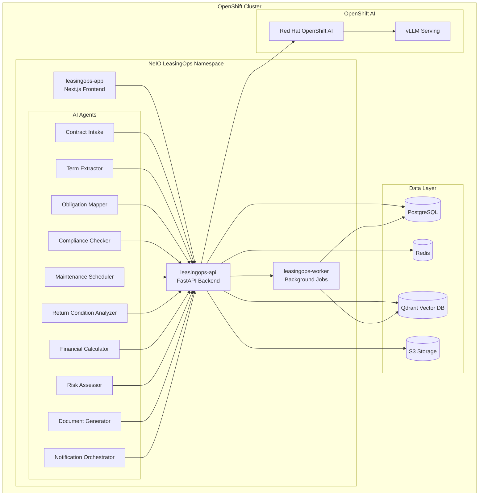

# NeIO LeasingOps - Red Hat OpenShift Quickstart

**Aircraft Leasing Operations AI Solution** - Powered by NeIO 2.0 on Red Hat OpenShift

## Overview

NeIO LeasingOps is an enterprise AI solution designed for aircraft leasing operations. It automates contract analysis, obligation tracking, maintenance scheduling, and compliance monitoring using a multi-agent AI architecture running on Red Hat OpenShift.

This repository contains Helm charts and deployment configurations for running NeIO LeasingOps on OpenShift 4.14+.

## Architecture



## Prerequisites

| Requirement | Version | Notes |
|-------------|---------|-------|
| Red Hat OpenShift | 4.14+ | Kubernetes 1.27+ |
| Helm | 3.x | Chart installation |
| NeIO License Token | - | Contact sales@codvo.ai |
| OpenShift CLI (oc) | 4.14+ | Cluster access |
| Red Hat OpenShift AI | 2.x | Optional, for local LLM serving |

### Cluster Resources

| Component | CPU | Memory | Storage |
|-----------|-----|--------|---------|
| leasingops-app | 500m | 512Mi | - |
| leasingops-api | 2 | 4Gi | - |
| leasingops-worker | 2 | 4Gi | - |
| PostgreSQL | 1 | 2Gi | 50Gi |
| Redis | 500m | 1Gi | 10Gi |
| Qdrant | 2 | 4Gi | 100Gi |

## Quick Start

### 1. Validate License Token

```bash
# Set your NeIO license token
export NEIO_LICENSE_TOKEN="your-license-token"

# Validate the token
./scripts/validate-token.sh
```

### 2. Generate Pull Secret

```bash
# Generate OpenShift pull secret for NeIO container registry
./scripts/generate-pull-secret.sh

# Apply the pull secret to your namespace
oc apply -f pull-secret.yaml -n leasingops
```

### 3. Deploy with Helm

```bash
# Add NeIO Helm repository
helm repo add neio https://charts.neio.ai
helm repo update

# Create namespace
oc new-project leasingops

# Install the chart
helm install leasingops neio/leasingops \
  --namespace leasingops \
  --set global.licenseToken=$NEIO_LICENSE_TOKEN \
  --set global.domain=leasingops.apps.your-cluster.com \
  -f examples/values-production.yaml
```

### 4. Verify Deployment

```bash
# Check pod status
oc get pods -n leasingops

# Verify all components are running
oc wait --for=condition=ready pod -l app.kubernetes.io/instance=leasingops -n leasingops --timeout=300s

# Access the application
echo "Application URL: https://$(oc get route leasingops-app -n leasingops -o jsonpath='{.spec.host}')"
```

## Components

### leasingops-app

Next.js 15 frontend providing the user interface for lease management, document upload, contract review, and reporting dashboards.

| Feature | Description |
|---------|-------------|
| Contract Dashboard | View and manage all lease contracts |
| Document Upload | Drag-and-drop contract PDF upload |
| Obligation Tracker | Real-time obligation status and alerts |
| Compliance Reports | Automated compliance reporting |
| Maintenance Calendar | Visual maintenance scheduling |

### leasingops-api

FastAPI backend handling business logic, AI agent orchestration, and data persistence.

| Endpoint | Purpose |
|----------|---------|
| `/api/v1/contracts` | Contract CRUD operations |
| `/api/v1/obligations` | Obligation management |
| `/api/v1/maintenance` | Maintenance scheduling |
| `/api/v1/compliance` | Compliance checks |
| `/api/v1/chat` | AI-powered contract Q&A |

### leasingops-worker

Background job processor handling document ingestion, AI pipeline execution, and scheduled tasks.

| Job Type | Description |
|----------|-------------|
| Document Ingestion | PDF parsing and vectorization |
| Contract Analysis | AI-powered term extraction |
| Obligation Monitoring | Deadline tracking and alerts |
| Report Generation | Scheduled compliance reports |

## AI Agents

NeIO LeasingOps includes 10 specialized AI agents:

| Agent | Purpose |
|-------|---------|
| **Contract Intake Agent** | Validates and classifies incoming lease documents |
| **Term Extractor Agent** | Extracts key terms, dates, and financial details from contracts |
| **Obligation Mapper Agent** | Identifies and categorizes contractual obligations |
| **Compliance Checker Agent** | Validates compliance with regulatory requirements |
| **Maintenance Scheduler Agent** | Plans and optimizes maintenance schedules |
| **Return Condition Analyzer Agent** | Assesses aircraft return condition requirements |
| **Financial Calculator Agent** | Computes lease payments, reserves, and penalties |
| **Risk Assessor Agent** | Evaluates contract and operational risks |
| **Document Generator Agent** | Creates reports, notices, and compliance documents |
| **Notification Orchestrator Agent** | Manages alerts, reminders, and escalations |

## Configuration

### Helm Values

Key configuration options in `values.yaml`:

```yaml
global:
  licenseToken: ""              # Required: NeIO license token
  domain: ""                    # Required: Application domain
  storageClass: "gp3"           # Storage class for PVCs

app:
  replicas: 2
  resources:
    requests:
      cpu: 500m
      memory: 512Mi
    limits:
      cpu: 1
      memory: 1Gi

api:
  replicas: 3
  resources:
    requests:
      cpu: 2
      memory: 4Gi
    limits:
      cpu: 4
      memory: 8Gi

worker:
  replicas: 2
  concurrency: 4
  resources:
    requests:
      cpu: 2
      memory: 4Gi

postgresql:
  enabled: true
  primary:
    persistence:
      size: 50Gi

redis:
  enabled: true
  master:
    persistence:
      size: 10Gi

qdrant:
  enabled: true
  persistence:
    size: 100Gi

# AI Configuration
ai:
  provider: "anthropic"         # anthropic, openai, or openshift-ai
  model: "claude-sonnet-4-20250514"
  embeddingModel: "voyage-3"

  # For OpenShift AI local serving
  openshiftAI:
    enabled: false
    servingRuntime: "vllm"
    modelName: "mistral-7b-instruct"
```

### Environment Variables

| Variable | Description | Required |
|----------|-------------|----------|
| `NEIO_LICENSE_TOKEN` | NeIO license token | Yes |
| `ANTHROPIC_API_KEY` | Anthropic API key (if using Claude) | Conditional |
| `OPENAI_API_KEY` | OpenAI API key (if using GPT) | Conditional |
| `VOYAGE_API_KEY` | Voyage AI embedding API key | Yes |
| `DATABASE_URL` | PostgreSQL connection string | Auto-configured |
| `REDIS_URL` | Redis connection string | Auto-configured |
| `QDRANT_URL` | Qdrant connection string | Auto-configured |

## Documentation

| Document | Description |
|----------|-------------|
| [Installation Guide](docs/installation.md) | Detailed installation instructions |
| [Configuration Reference](docs/configuration.md) | Complete configuration options |
| [Architecture Overview](docs/architecture.md) | System architecture details |
| [AI Agents Guide](docs/agents.md) | AI agent capabilities and customization |
| [Troubleshooting](docs/troubleshooting.md) | Common issues and solutions |
| [Upgrade Guide](docs/upgrade.md) | Version upgrade procedures |
| [Security](docs/security.md) | Security best practices |

## Support

- **Documentation**: [https://docs.neio.ai/leasingops](https://docs.neio.ai/leasingops)
- **Issues**: GitHub Issues in this repository
- **Enterprise Support**: support@codvo.ai
- **Sales**: sales@codvo.ai

## License

See [LICENSE](LICENSE) for details. Deployment configurations are Apache 2.0 licensed. NeIO LeasingOps application code is proprietary and requires a valid license.

---

*NeIO LeasingOps v1.0 | Powered by NeIO 2.0 | CODVO.AI*
