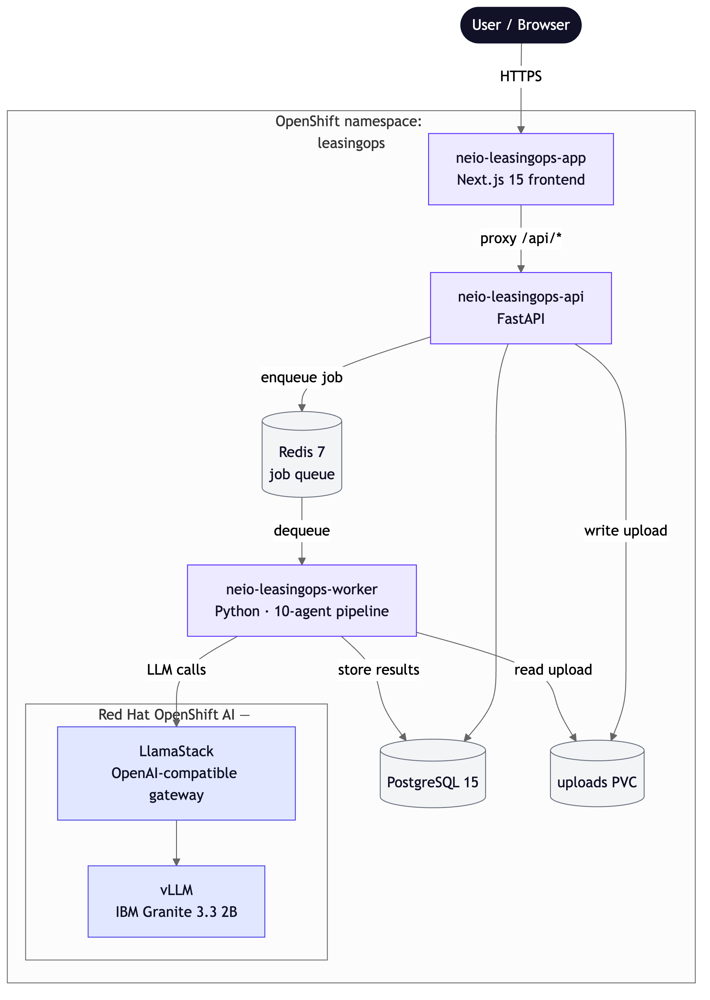

# Aircraft lease management and reconciliation with AI agents on Red Hat OpenShift AI

Process aircraft lease documents on Red Hat OpenShift AI with a ten-agent workflow that extracts terms, maps obligations, calculates reserves, detects variance, assesses return readiness, and drafts return, extension, or buyout recommendations with traceable evidence.

## Table of contents

- [Detailed description](#detailed-description)
  - [Who is this for?](#who-is-this-for)
  - [The business case for automated lease processing](#the-business-case-for-automated-lease-processing)
  - [What this quickstart provides](#what-this-quickstart-provides)
  - [What you'll build](#what-youll-build)
    - [Key technologies](#key-technologies)
  - [Architecture](#architecture)
- [Requirements](#requirements)
  - [Minimum hardware requirements](#minimum-hardware-requirements)
  - [Minimum software requirements](#minimum-software-requirements)
  - [Required user permissions](#required-user-permissions)
- [Deploy](#deploy)
  - [Clone the repository](#clone-the-repository)
  - [Install (one command)](#install-one-command)
  - [Verify and log in](#verify-and-log-in)
  - [Walk through the application](#walk-through-the-application)
  - [Demo mode versus production mode](#demo-mode-versus-production-mode)
  - [The ten agents](#the-ten-agents)
  - [What you've accomplished](#what-youve-accomplished)
  - [Delete](#delete)
- [Appendices](#appendices)
  - [Appendix A: CPU instead of GPU](#appendix-a-cpu-instead-of-gpu)
  - [Appendix B: external PostgreSQL or Redis](#appendix-b-external-postgresql-or-redis)
  - [Appendix C: GitOps](#appendix-c-gitops)
- [Troubleshooting](#troubleshooting)
- [Where to get help](#where-to-get-help)
- [License](#license)
- [Tags](#tags)

## Detailed description

NeIO LeasingOps is an aircraft-lease document pipeline. Users upload PDF contracts and the platform runs them through ten AI agents that extract terms, map obligations, calculate reserves, detect variance, assess return readiness, and produce a decision recommendation. A retrieval-augmented assistant answers questions about the processed contracts and cites the source documents.

This repository is the Helm chart and sample contracts for running it on OpenShift 4.19 or later. The chart deploys the application (frontend, API, background worker) and its PostgreSQL and Redis. Granite is served separately by the Red Hat AI Architecture charts (vLLM + LlamaStack).

### Who is this for?

This quickstart is for:

- **Aviation lessor and lessee operations teams** evaluating AI for lease administration and reconciliation
- **Solution architects** assessing an agentic document-processing pattern on OpenShift AI
- **Platform and DevOps engineers** deploying agent-based systems with Helm on OpenShift
- **Teams exploring the Red Hat AI quickstart catalog** who want a working, end-to-end example

### The business case for automated lease processing

Aircraft leases are among the densest commercial documents in existence. A single agreement can span hundreds of pages and set out variable payment schedules, maintenance reserves tied to flight hours and cycles, precise return conditions, obligations split across lessors, lessees, and MRO providers, and compliance requirements that cross more than one regulator.

The usual way to handle this is manual review by a specialist team that extracts the terms, reconciles them against operational data, and validates everything by hand. It works, but it is slow, it does not scale, and it ties up scarce expertise on repetitive reading while decisions wait.

A multi-agent pipeline does the first pass: it reads each contract the same way every time, links every extracted fact back to its source clause for audit, and surfaces the variances and decisions that need a human. People review and act on structured results instead of reading raw PDFs.

### What this quickstart provides

This quickstart provides the Helm chart, sample contracts, and documentation to deploy and explore the application on your own OpenShift AI environment. It deploys the full application stack and its data services, and connects to a Granite model served by the Red Hat AI Architecture charts. The application images are provided by Codvo (see [Required user permissions](#required-user-permissions)); the Helm chart and configuration are open source.

### What you'll build

Time to complete: 30-60 minutes (longer on the first run while the model downloads).

By the end of this quickstart, you will have:

- NeIO LeasingOps deployed on OpenShift, with its frontend, API, background worker, PostgreSQL, and Redis
- A Granite model served through vLLM and LlamaStack on Red Hat OpenShift AI
- The ten-agent pipeline processing real lease PDFs from upload to decision recommendation
- A retrieval-augmented assistant answering questions about the processed contracts with source citations
- Sample lease documents across ten document types to run through the pipeline
- An understanding of demo versus production processing modes, and how to point the chart at a larger model or external data services

#### Key technologies

- **[Next.js](https://nextjs.org/)** - frontend for document upload and results
- **[FastAPI](https://fastapi.tiangolo.com/)** - backend API for ingestion and contract operations
- **[LangGraph](https://langchain-ai.github.io/langgraph/)** - orchestration framework for the ten agents
- **[vLLM](https://github.com/vllm-project/vllm)** - inference engine serving the model
- **[Llama Stack](https://github.com/meta-llama/llama-stack)** - OpenAI-compatible gateway in front of vLLM
- **[IBM Granite 3.3 2B Instruct](https://huggingface.co/ibm-granite/granite-3.3-2b-instruct)** - the default model (Apache 2.0, no gated weights)
- **[Docling](https://github.com/docling-project/docling)** - PDF parsing, with a PyMuPDF fallback
- **[Red Hat OpenShift AI](https://www.redhat.com/en/technologies/cloud-computing/openshift/ai) (KServe)** - serves the model on the cluster
- **[Helm](https://helm.sh/)** - packaging and deployment
- **[PostgreSQL](https://www.postgresql.org/)** and **[Redis](https://redis.io/)** - document records, agent results, and the job queue

### Architecture



The browser talks only to the frontend. The frontend proxies API calls to the backend in-cluster, so no backend URL is baked into anything and one image set works on any cluster. For the detailed component design and the agent pipeline, see [docs/ARCHITECTURE.md](docs/ARCHITECTURE.md); for how the quickstart uses Red Hat OpenShift AI, see [docs/REDHAT_AI_INTEGRATION.md](docs/REDHAT_AI_INTEGRATION.md).

## Requirements

### Minimum hardware requirements

The following are the resources to add on top of a base OpenShift cluster:

- Three worker nodes with 8 CPU / 32 GB each, one of them a GPU node for Granite inference. CPU-only inference is possible but slow; see [Appendix A](#appendix-a-cpu-instead-of-gpu).
- Storage for the model and the uploads PVC (the chart requests a 5Gi PVC; the model server downloads the model on first start).

### Minimum software requirements

**Local tools:**

- [oc CLI](https://docs.openshift.com/container-platform/latest/cli_reference/openshift_cli/getting-started-cli.html) - OpenShift command line tool
- [Helm 3.x](https://helm.sh/docs/intro/install/) - Kubernetes package manager
- [git](https://git-scm.com/downloads) - version control

**Cluster environment:**

- An OpenShift 4.19+ cluster
- The OpenShift AI Operator (version 3.4 or later). It provides KServe, which serves the Granite model that the chart installs.

You do not need a Hugging Face token. The model, `ibm-granite/granite-3.3-2b-instruct`, is Apache 2.0 and not gated.

### Required user permissions

- `cluster-admin` on the cluster, or `admin` on the target namespace
- ACR pull credentials for `rhleasingopsacr.azurecr.io`, used to pull the application images. Email `bala@codvo.ai` or `indranil@codvo.ai`; you will be sent a username and a password, which you pass to the install as `imageCredentials.username` / `imageCredentials.password`.

## Deploy

This section walks you through deploying, verifying, and exploring the quickstart.

### Clone the repository

```bash
git clone https://github.com/rh-ai-quickstart/Agentic-Lease-Management-and-Reconciliation-with-Codvo.git
cd Agentic-Lease-Management-and-Reconciliation-with-Codvo
```

### Install (one command)

A single `helm install` brings up the whole quickstart: the model server (vLLM + LlamaStack, pulled in as chart dependencies), the application (frontend, API, worker), and its PostgreSQL and Redis. The chart generates its own database, cache, JWT, and demo-login credentials, registers the Granite model with LlamaStack, and lets OpenShift assign the route hostnames — so there is nothing to pre-create.

Install with the bundled wrapper, passing the ACR pull credentials Codvo sent you (the application images are proprietary). It runs `helm dependency build` and `helm install --create-namespace` for you:

```bash
make install NAMESPACE=leasingops ACR_USER='<USERNAME>' ACR_PASS='<PASSWORD>'
```

Quote the credentials — ACR tokens contain characters the shell would otherwise expand.

For manual Helm installation (no Make), the equivalent is:

```bash
helm dependency build ./leasingops/helm

helm install neio-leasingops ./leasingops/helm \
  --namespace leasingops --create-namespace \
  --set imageCredentials.username='<USERNAME>' \
  --set imageCredentials.password='<PASSWORD>' \
  -f leasingops/helm/values-openshift.yaml
```

That one command deploys: the `llm-service` (vLLM serving Granite 3.3 2B on the GPU) and `llama-stack` subcharts; the application and its PostgreSQL and Redis; the ServiceAccount and the SCC binding the images need on OpenShift; the auto-generated `neio-leasingops-secrets`; the ACR pull secret; and a post-install Job that registers the model with LlamaStack. The Granite model downloads on the vLLM pod's first start, which takes a few minutes.

- **No GPU?** Add `--set llm-service.device=cpu --set 'llm-service.models.granite-3-3-2b-instruct.device=cpu'`. Inference is much slower; keep `worker.llmCallTimeoutSeconds` at `360` or higher for full end-to-end document processing. See [Appendix A](#appendix-a-cpu-instead-of-gpu).
- **Tainted GPU nodes?** Add the matching toleration, for example `--set 'llm-service.models.granite-3-3-2b-instruct.tolerations[0].key=nvidia.com/gpu' --set 'llm-service.models.granite-3-3-2b-instruct.tolerations[0].operator=Exists' --set 'llm-service.models.granite-3-3-2b-instruct.tolerations[0].effect=NoSchedule'`.
- **GitOps / bring-your-own secret?** Set `secrets.sealed=true` and ship a `SealedSecret`; see [Appendix C](#appendix-c-gitops).

The image tags are pinned to the validated build in `values-openshift.yaml`. Newer tags may exist; ask Codvo before changing them.

### Verify and log in

Wait for the application pods, then check them:

```bash
oc rollout status deploy/neio-leasingops-api -n leasingops --timeout=300s
oc rollout status deploy/neio-leasingops-app -n leasingops --timeout=300s
oc rollout status deploy/neio-leasingops-worker -n leasingops --timeout=300s
oc get pods -n leasingops
```

All pods should be `Running`. API health:

```bash
curl -k "https://$(oc get route neio-leasingops-api -n leasingops -o jsonpath='{.spec.host}')/health"
```

Expected: `{"status":"healthy","version":"1.0.0",...}`.

Run the bundled smoke test, which logs in, uploads a document, and confirms the pipeline picks it up:

```bash
helm test neio-leasingops -n leasingops --timeout 5m
```

Get the frontend URL and the demo password:

```bash
echo "https://$(oc get route neio-leasingops-app -n leasingops -o jsonpath='{.spec.host}')"

oc get secret neio-leasingops-secrets -n leasingops \
  -o jsonpath='{.data.DEMO_PASSWORD}' | base64 -d
```

Open the frontend URL and log in as `demo@leasingops.ai` with that password.

### Walk through the application

For a fuller, screen-by-screen guide to the features (document processing, the assistant, and the dashboards), see [docs/GETTING_STARTED.md](docs/GETTING_STARTED.md).

The left sidebar groups the application into Command, Operations, Processing, and Administration. Here is a tour that exercises the whole pipeline end to end.

1. **Upload a contract.** Go to **Operations > Fleet Portfolio**. Click **Upload**, pick a PDF from `examples/sample-contracts/`, and confirm. The upload card shows the pipeline working: it names each agent as it runs, from Contract Intake through Escalation.
2. **Watch the agents run in sequence.** Open **Processing > Pipeline** while the document processes. Each of the ten agents runs in order as the worker completes it. On a GPU the full run takes roughly a minute per document. On CPU-hosted Granite, expect a full lease agreement to take materially longer; our ROSA CPU validation completed successfully but several LLM stages took 1-3 minutes each.
3. **Read the extracted terms.** When the run finishes, open the document from Fleet Portfolio, or go to **Processing > Term Extraction**. This is where the Term Extractor's output lands: dates, financials, parties, aircraft details, and conditions pulled from the contract.
4. **Check return readiness.** Go to **Operations > Return Readiness**. The Return Readiness agent's redelivery gap analysis and cost estimates show here.
5. **See the decision and any escalations.** **Command > Decisions** shows the return/extend/buyout recommendation with its risk rationale. **Command > Escalations** lists anything the pipeline routed to a stakeholder. **Processing > Evidence Packs** assembles the audit-ready bundle for a document.
6. **Ask the assistant.** Open the assistant and ask a question about the contract you uploaded, for example "When does this lease expire?" or "What are the maintenance reserve obligations?". The assistant answers from the extracted data and cites its sources.
7. **Review the audit trail.** **Administration > Audit Trail** records the activity for the workspace, including the documents you uploaded.

The repository ships sample lease documents across ten document types in `examples/sample-contracts/`. Upload one to try the pipeline, or several to see the Fleet Portfolio fill up.

### Demo mode versus production mode

The application runs in one of two processing modes, set per workspace under **Administration > Settings**:

- **Production mode (the default).** Uploads run the real pipeline: Docling extracts the PDF, then the ten agents process it through the background worker. This is what the quickstart's model server is for. Agent progress, audit events, and downstream pages (Decisions, Return Readiness, Evidence Packs) all reflect real results. A document takes roughly a minute per run on a GPU. CPU-backed Granite is supported for cost-sensitive demos, but full processing can take 20-30 minutes depending on document size and node capacity.
- **Demo mode.** Uploads skip the worker and the model entirely: the API writes synthetic extraction data immediately and the document jumps straight to "extracted". Useful for a fast UI tour when you have no GPU or no worker, but it does not exercise the agents and it does not write audit events, so the Audit Trail and Pipeline pages stay empty. If you switch to demo mode, expect those screens to look inactive; that is the mode, not a bug.

Leave it on production for a real walkthrough. Switch to demo only when you explicitly want the instant, synthetic path.

### The ten agents

Documents flow through these in order:

1. Contract Intake: validates the upload and classifies the document type.
2. Term Extractor: pulls out dates, financials, parties, aircraft details, conditions.
3. Obligation Mapper: identifies contractual obligations with deadlines and owners.
4. Utilization Reconciler: compares actual flight hours and cycles against the MRO data.
5. Reserve Calculator: tracks maintenance reserve balances, contributions, drawdowns, shortfalls.
6. Variance Detector: flags discrepancies between contract terms and actual performance.
7. Return Readiness: assesses redelivery compliance, produces gap analysis and cost estimates.
8. Evidence Pack: assembles audit-ready documentation linking evidence to contract clauses.
9. Decision Support: produces return/extend/buyout analysis with risk-adjusted recommendations.
10. Escalation: routes high-severity items to stakeholders with full context.

### What you've accomplished

You have deployed NeIO LeasingOps on OpenShift, served a Granite model through vLLM and LlamaStack on OpenShift AI, run aircraft lease PDFs through the ten-agent pipeline, and queried the results with a source-citing assistant. From here you can point the chart at a larger model (the `llm-service` values), use external data services ([Appendix B](#appendix-b-external-postgresql-or-redis)), or drive the install from GitOps ([Appendix C](#appendix-c-gitops)).

### Delete

To remove the quickstart and reset the cluster between runs, use the bundled teardown script. It is one command, idempotent, and needs no manual steps:

```bash
./scripts/teardown.sh            # prompts for confirmation
./scripts/teardown.sh -y         # no prompt (automation / Red Hat Demo Platform)
NAMESPACE=my-ns ./scripts/teardown.sh -y
```

It uninstalls every Helm release in the namespace (the app, plus `llamastack` and `llm-inference` if present), deletes the KServe InferenceServices and PersistentVolumeClaims, then deletes the namespace and waits for it to fully terminate, clearing stuck finalizers if the delete hangs. `make destroy` runs the same script. It does not touch cluster-scoped operators (the GPU operator, RHOAI / KServe / Knative).

## Appendices

### Appendix A: CPU instead of GPU

If you have no GPU node, serve Granite on CPU by adding two flags to the install. Inference is much slower (around 40 seconds per agent call), acceptable for a demo but not for load testing.

```bash
helm install neio-leasingops ./leasingops/helm \
  --namespace leasingops --create-namespace \
  --set imageCredentials.username='<USERNAME>' \
  --set imageCredentials.password='<PASSWORD>' \
  --set llm-service.device=cpu \
  --set 'llm-service.models.granite-3-3-2b-instruct.device=cpu' \
  -f leasingops/helm/values-openshift.yaml
```

Everything else in the quickstart is identical.

### Appendix B: external PostgreSQL or Redis

The chart deploys its own single-replica PostgreSQL and Redis by default, which suits a quickstart. For a managed database or an existing Redis, disable the in-cluster ones and point the chart at yours:

```bash
  --set database.deployInCluster=false \
  --set database.external.host=<your-postgres-host> \
  --set cache.deployInCluster=false \
  --set cache.host=<your-redis-host>
```

The credentials still come from `neio-leasingops-secrets`. For an external database, create the `leasingops` database and user beforehand.

### Appendix C: GitOps

The chart is GitOps-ready: the ServiceAccount, SCC binding, and model registration are all chart resources, so a single ArgoCD `Application` drives the install. `examples/argocd-application.yaml` is a working manifest. For secrets, ship `neio-leasingops-secrets` as a Bitnami `SealedSecret` (encrypt with `kubeseal`, commit the result); `examples/sealed-secret.example.yaml` shows the shape.

## Troubleshooting

API or worker pod in `CrashLoopBackOff`: almost always a missing key in `neio-leasingops-secrets`. The chart generates this secret; confirm it exists (`oc get secret neio-leasingops-secrets -n leasingops`), then `oc rollout restart deploy/neio-leasingops-worker -n leasingops`.

`helm test` fails at the login step: retrieve `DEMO_PASSWORD` ([Verify and log in](#verify-and-log-in)) and confirm you can `curl` the API `/health` route. If health is fine but login fails, the API pod may not have restarted after a secret change; `oc rollout restart deploy/neio-leasingops-api -n leasingops`.

A document stops partway through the pipeline: check the worker log, `oc logs deploy/neio-leasingops-worker -n leasingops --tail=100`. It prints a heartbeat every few cycles and a timing line per LLM call, so a stall is visible.

CPU-based Granite appears to retry the larger agent stages: check for `llm_call_timeout` in the worker logs. The worker uses `LLM_CALL_TIMEOUT_SECONDS`, exposed by this chart as `worker.llmCallTimeoutSeconds`. For CPU demos use at least `360`; for example:

```bash
helm upgrade neio-leasingops ./leasingops/helm \
  -n leasingops \
  -f leasingops/helm/values-openshift.yaml \
  --set worker.llmCallTimeoutSeconds=360
```

Then restart or wait for the worker rollout and re-upload the document.

The Audit Trail or agent progress looks empty after an upload: confirm the workspace is in production mode under **Administration > Settings**. Demo mode writes synthetic data without running the worker, so it produces no audit events and no live agent progress.

The assistant gives an answer that disagrees with the contract: the default model is Granite 3.3 2B, a small model chosen so the quickstart runs on modest hardware. It can misread dates and figures, for example calling a current lease expired. Treat the assistant as a drafting aid and verify against the extracted terms on the document page. For sharper answers, point the chart at a larger Granite model via the `llm-service` values.

vLLM pod stuck `Pending`: the GPU node is tainted and the install had no matching toleration. Re-install with the toleration `--set` flags shown under [Install (one command)](#install-one-command).

## Where to get help

For access credentials or deployment questions, contact `bala@codvo.ai` or `indranil@codvo.ai`.

Repository: https://github.com/rh-ai-quickstart/Agentic-Lease-Management-and-Reconciliation-with-Codvo

## License

Helm chart and deployment configuration: Apache 2.0. Application images are proprietary and require a registry pull token from Codvo.

## Tags

- **Title:** Aircraft lease management and reconciliation with AI agents on Red Hat OpenShift AI
- **Description:** Process aircraft lease documents on Red Hat OpenShift AI with a ten-agent workflow that extracts terms, maps obligations, calculates reserves, detects variance, assesses return readiness, and drafts return, extension, or buyout recommendations with traceable evidence.
- **Industry:** Adopt and scale AI
- **Product:** OpenShift AI
- **Use case:** Agentic document processing and reconciliation
- **Contributor org:** Codvo.ai
