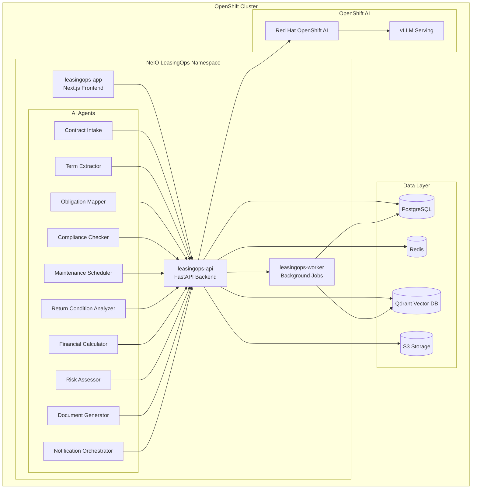

# NeIO LeasingOps - Red Hat OpenShift Quickstart

**Aircraft Leasing Operations AI Solution** - Powered by NeIO 2.0 on Red Hat OpenShift

## Overview

NeIO LeasingOps is an enterprise AI solution designed for aircraft leasing operations. It automates contract analysis, obligation tracking, maintenance scheduling, and compliance monitoring using a multi-agent AI architecture running on Red Hat OpenShift.

This repository contains Helm charts and deployment configurations for running NeIO LeasingOps on OpenShift 4.14+.

## Architecture



## Prerequisites

| Requirement | Version | Notes |
|-------------|---------|-------|
| Red Hat OpenShift | 4.14+ | Kubernetes 1.27+ |
| Helm | 3.x | Chart installation |
| NeIO License Token | - | Contact sales@codvo.ai |
| OpenShift CLI (oc) | 4.14+ | Cluster access |
| Red Hat OpenShift AI | 2.x | Optional, for on-cluster vLLM/LlamaStack inference |
| **LLM Inference** | - | Bundled Ollama + LlamaStack (no external key) or Red Hat OpenShift AI vLLM — see [Configure LLM Provider](#2-configure-llm-provider) |

### Cluster Resources

| Component | CPU | Memory | Storage |
|-----------|-----|--------|---------|
| leasingops-app | 500m | 512Mi | - |
| leasingops-api | 2 | 4Gi | - |
| leasingops-worker | 2 | 4Gi | - |
| PostgreSQL | 1 | 2Gi | 50Gi |
| Redis | 500m | 1Gi | 10Gi |
| Qdrant | 2 | 4Gi | 100Gi |

## Quick Start

### 1. Validate License Token

```bash
# Set your NeIO license token
export NEIO_LICENSE_TOKEN="your-license-token"

# Validate the token
./scripts/validate-token.sh
```

### 2. Configure LLM Provider

NeIO LeasingOps runs inference through **Red Hat OpenShift AI** — no external LLM API key required. Choose the path that matches your cluster setup before running `helm install`.

#### Option A: Bundled Ollama + LlamaStack (CRC / Air-Gapped) — no external key

The chart deploys Ollama (model: `llama3.2:3b`) and LlamaStack distribution-ollama in-cluster. This is the **tested and validated path** for CRC and air-gapped clusters — no GPU or external API key required.

```bash
helm install leasingops neio/leasingops \
  --namespace leasingops \
  --set global.licenseToken=$NEIO_LICENSE_TOKEN \
  --set global.domain=leasingops.apps.your-cluster.com \
  --set llm.url="http://llamastack:8321" \
  --set llm.model="llama3.2:3b" \
  --set llm.apiToken="" \
  -f examples/values-production.yaml
```

#### Option B: Red Hat OpenShift AI (vLLM) — no external key

```bash
# Get the vLLM serving endpoint from your RHOAI namespace
VLLM_URL=$(oc get inferenceservice llama3-70b -n rhoai-model-serving \
  -o jsonpath='{.status.url}')

helm install leasingops neio/leasingops \
  --namespace leasingops \
  --set global.licenseToken=$NEIO_LICENSE_TOKEN \
  --set global.domain=leasingops.apps.your-cluster.com \
  --set llm.url="${VLLM_URL}" \
  --set llm.model="meta-llama/Llama-3-70b-chat-hf" \
  --set llm.apiToken="" \
  -f examples/values-production.yaml
```

> **RSDP deployments:** The Red Hat Solution Deployment Platform automatically injects `llm.url`, `llm.apiToken`, and `llm.model` — no manual configuration needed. See [OpenShift AI Inference](#openshift-ai-inference) for full details.

### 3. Generate Pull Secret

```bash
# Generate OpenShift pull secret for NeIO container registry
./scripts/generate-pull-secret.sh

# Apply the pull secret to your namespace
oc apply -f pull-secret.yaml -n leasingops
```

### 4. Deploy with Helm

```bash
# Add NeIO Helm repository
helm repo add neio https://charts.neio.ai
helm repo update

# Create namespace
oc new-project leasingops

# Install the chart
helm install leasingops neio/leasingops \
  --namespace leasingops \
  --set global.licenseToken=$NEIO_LICENSE_TOKEN \
  --set global.domain=leasingops.apps.your-cluster.com \
  -f examples/values-production.yaml
```

### 5. Verify Deployment

```bash
# Check pod status
oc get pods -n leasingops

# Verify all components are running
oc wait --for=condition=ready pod -l app.kubernetes.io/instance=leasingops -n leasingops --timeout=300s

# Access the application
echo "Application URL: https://$(oc get route leasingops-app -n leasingops -o jsonpath='{.spec.host}')"
```

## Components

### leasingops-app

Next.js 15 frontend providing the user interface for lease management, document upload, contract review, and reporting dashboards.

| Feature | Description |
|---------|-------------|
| Contract Dashboard | View and manage all lease contracts |
| Document Upload | Drag-and-drop contract PDF upload |
| Obligation Tracker | Real-time obligation status and alerts |
| Compliance Reports | Automated compliance reporting |
| Maintenance Calendar | Visual maintenance scheduling |

### leasingops-api

FastAPI backend handling business logic, AI agent orchestration, and data persistence.

| Endpoint | Purpose |
|----------|---------|
| `/api/v1/contracts` | Contract CRUD operations |
| `/api/v1/obligations` | Obligation management |
| `/api/v1/maintenance` | Maintenance scheduling |
| `/api/v1/compliance` | Compliance checks |
| `/api/v1/chat` | AI-powered contract Q&A |

### leasingops-worker

Background job processor handling document ingestion, AI pipeline execution, and scheduled tasks.

| Job Type | Description |
|----------|-------------|
| Document Ingestion | PDF parsing and vectorization |
| Contract Analysis | AI-powered term extraction |
| Obligation Monitoring | Deadline tracking and alerts |
| Report Generation | Scheduled compliance reports |

## AI Agents

NeIO LeasingOps includes 10 specialized AI agents:

| Agent | Purpose |
|-------|---------|
| **Contract Intake Agent** | Validates and classifies incoming lease documents |
| **Term Extractor Agent** | Extracts key terms, dates, and financial details from contracts |
| **Obligation Mapper Agent** | Identifies and categorizes contractual obligations |
| **Compliance Checker Agent** | Validates compliance with regulatory requirements |
| **Maintenance Scheduler Agent** | Plans and optimizes maintenance schedules |
| **Return Condition Analyzer Agent** | Assesses aircraft return condition requirements |
| **Financial Calculator Agent** | Computes lease payments, reserves, and penalties |
| **Risk Assessor Agent** | Evaluates contract and operational risks |
| **Document Generator Agent** | Creates reports, notices, and compliance documents |
| **Notification Orchestrator Agent** | Manages alerts, reminders, and escalations |

## Configuration

### Helm Values

Key configuration options in `values.yaml`:

```yaml
global:
  licenseToken: ""              # Required: NeIO license token
  domain: ""                    # Required: Application domain
  storageClass: "gp3"           # Storage class for PVCs

app:
  replicas: 2
  resources:
    requests:
      cpu: 500m
      memory: 512Mi
    limits:
      cpu: 1
      memory: 1Gi

api:
  replicas: 3
  resources:
    requests:
      cpu: 2
      memory: 4Gi
    limits:
      cpu: 4
      memory: 8Gi

worker:
  replicas: 2
  concurrency: 4
  resources:
    requests:
      cpu: 2
      memory: 4Gi

postgresql:
  enabled: true
  primary:
    persistence:
      size: 50Gi

redis:
  enabled: true
  master:
    persistence:
      size: 10Gi

qdrant:
  enabled: true
  persistence:
    size: 100Gi

# LLM Inference — LlamaStack (bundled Ollama) or RHOAI vLLM
llm:
  url: "http://llamastack:8321"   # bundled in-cluster; override for RHOAI vLLM
  model: "llama3.2:3b"            # override for production (e.g. meta-llama/Llama-3-70b-chat-hf)
  apiToken: ""                    # empty for in-cluster endpoints
  maxTokens: 4096
  temperature: 0.7
```

### Environment Variables

| Variable | Description | Required |
|----------|-------------|----------|
| `NEIO_LICENSE_TOKEN` | NeIO license token | Yes |
| `LLAMASTACK_URL` | LlamaStack service URL (default: `http://llamastack:8321`) | Auto-configured |
| `LLAMASTACK_MODEL` | Model served by LlamaStack/Ollama (default: `llama3.2:3b`) | Auto-configured |
| `DATABASE_URL` | PostgreSQL connection string | Auto-configured |
| `REDIS_URL` | Redis connection string | Auto-configured |

## OpenShift AI Inference

NeIO LeasingOps is designed to run inference through **Red Hat OpenShift AI** as the primary path for enterprise deployments. The worker service uses **LlamaStack** as its inference layer, which connects to either a self-managed **Ollama** instance (bundled, for development/evaluation) or a production **vLLM** serving runtime deployed via OpenShift AI.

### How It Works

```
leasingops-worker
      │
      ▼
LlamaStack  ──────────────────────────────────────────────┐
      │                                                    │
      ├── Ollama (self-managed, bundled)                   │  OpenShift AI
      │   For: local dev, air-gapped eval                  │  vLLM serving
      │                                                    │  (production)
      └── vLLM via OpenShift AI  ─────────────────────────┘
          For: production, GPU-accelerated workloads
```

LlamaStack exposes an **OpenAI-compatible chat completions endpoint**. The worker calls:

```
{llm.url}/v1/openai/v1/chat/completions
```

This is the LlamaStack-specific path that proxies to the underlying vLLM or Ollama backend.

### Helm Values for Inference

| Helm Value | Description | Example |
|------------|-------------|---------|
| `llm.url` | Base URL of the LlamaStack or vLLM endpoint | `https://llama-70b.rhoai.svc.cluster.local` |
| `llm.apiToken` | Bearer token (empty for cluster-internal endpoints) | `""` |
| `llm.model` | Model identifier as registered in RHOAI | `meta-llama/Llama-3-70b-chat-hf` |
| `llm.maxTokens` | Max tokens per completion | `4096` |
| `llm.temperature` | Sampling temperature | `0.7` |

### Bundled Ollama + LlamaStack (CRC / Air-Gapped / Evaluation)

The chart includes Ollama and LlamaStack as in-cluster deployments. This path was validated on **CRC (OpenShift 4.14+ / CodeReady Containers)** with CPU-only inference using `llama3.2:3b`.

When the chart deploys with bundled inference enabled:
- **Ollama** runs at `http://ollama:11434`, serves `llama3.2:3b` (pulled on first start via init container)
- **LlamaStack** runs at `http://llamastack:8321`, backed by Ollama
- The worker connects to `http://llamastack:8321` and calls the OpenAI-compat endpoint

The worker and API receive these env vars automatically from Helm:

```
LLAMASTACK_URL=http://llamastack:8321
LLAMASTACK_MODEL=llama3.2:3b
```

No GPU required. Expect ~6–30s per agent call on CPU (varies by token count).

> **Storage:** The API and worker share a `ReadWriteOnce` PVC (`leasingops-uploads`, 5Gi) for uploaded documents. OpenShift restricted SCC requires `fsGroup: 1000` in the pod security context — the chart sets this automatically.

### Configuring for OpenShift AI (vLLM)

1. **Deploy a model via OpenShift AI** — use the RHOAI dashboard or a `ServingRuntime` + `InferenceService` manifest to serve a Llama 3 or Mistral model with vLLM.

2. **Get the inference endpoint:**

   ```bash
   oc get inferenceservice -n rhoai-model-serving
   # Note the URL for your model, e.g.:
   # https://llama3-70b-rhoai-model-serving.apps.your-cluster.com
   ```

3. **Install the chart pointing at OpenShift AI:**

   ```bash
   helm install leasingops neio/leasingops \
     --namespace leasingops \
     --set global.licenseToken=$NEIO_LICENSE_TOKEN \
     --set global.domain=leasingops.apps.your-cluster.com \
     --set llm.url="https://llama3-70b-rhoai-model-serving.apps.your-cluster.com" \
     --set llm.model="meta-llama/Llama-3-8b-instruct" \
     --set llm.apiToken="" \
     -f examples/values-production.yaml
   ```

### RSDP Automatic Injection

When deployed through the **Red Hat Solution Deployment Platform (RSDP)**, the three LLM values are automatically injected — no manual configuration is required:

```yaml
# values-rsdp.yaml (template — RSDP fills these at deploy time)
llm:
  url: ""        # RSDP injects the RHOAI inference endpoint
  apiToken: ""   # RSDP injects a short-lived token
  model: ""      # RSDP injects the registered model name
```

### Supported Models

| Model | Recommended For | GPU Memory |
|-------|-----------------|------------|
| `llama3.2:3b` | CRC / air-gapped / CPU-only evaluation (bundled Ollama) | None (CPU) |
| `meta-llama/Llama-3-8b-instruct` | Balanced quality/cost | 1× A100 40GB |
| `meta-llama/Llama-3-70b-chat-hf` | Production (highest quality) | 2× A100 80GB |
| `mistralai/Mistral-7B-Instruct-v0.3` | Resource-constrained clusters | 1× A100 40GB |

For complete RHOAI architecture diagrams, integration details, and GPU operator configuration, see [docs/REDHAT_AI_INTEGRATION.md](docs/REDHAT_AI_INTEGRATION.md).

---

## Documentation

| Document | Description |
|----------|-------------|
| [Installation Guide](docs/INSTALLATION.md) | Detailed installation instructions |
| [Configuration Reference](docs/CONFIGURATION.md) | Complete configuration options |
| [Architecture Overview](docs/ARCHITECTURE.md) | System architecture details |
| [AI Agents Guide](docs/AGENTS.md) | AI agent capabilities and customization |
| [Troubleshooting](docs/TROUBLESHOOTING.md) | Common issues and solutions |
| [Upgrade Guide](docs/UPGRADE.md) | Version upgrade procedures |
| [Security](docs/SECURITY.md) | Security best practices |
| [Red Hat OpenShift AI Integration](docs/REDHAT_AI_INTEGRATION.md) | RHOAI architecture and integration details |

## Support

- **Documentation**: [https://docs.neio.ai/leasingops](https://docs.neio.ai/leasingops)
- **Issues**: GitHub Issues in this repository
- **Enterprise Support**: support@codvo.ai
- **Sales**: sales@codvo.ai

## License

See [LICENSE](LICENSE) for details. Deployment configurations are Apache 2.0 licensed. NeIO LeasingOps application code is proprietary and requires a valid license.

---

*NeIO LeasingOps v1.0 | Powered by NeIO 2.0 | CODVO.AI*
