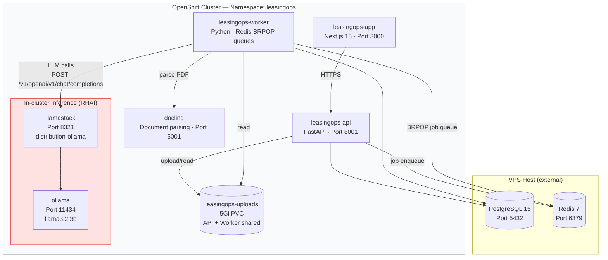
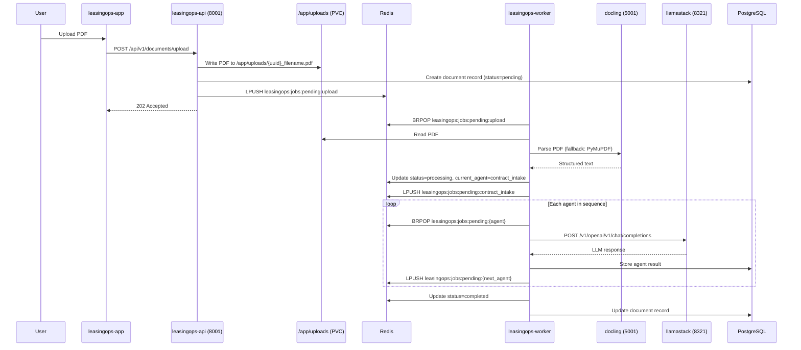

# NeIO LeasingOps — Architecture Overview

This document describes the system as it is deployed and tested on OpenShift 4.14+ (validated on CRC with CPU-only inference).

---

## System Overview

NeIO LeasingOps is a document-processing pipeline that drives aircraft lease contracts through 10 sequential AI agents. Users upload PDF contracts; the worker processes each document through the full agent chain and surfaces structured outputs (extracted terms, obligations, variances, return readiness, decision recommendations).

All components run in a single OpenShift namespace (`leasingops`).



---

## Components

### leasingops-app

Next.js 15 frontend served at the OpenShift route.

| | |
|---|---|
| **Port** | 3000 |
| **Route** | `https://leasingops.apps.<cluster-domain>` |
| **Image** | `rhleasingopsacr.azurecr.io/leasingops-app` |
| **Env** | `NEXT_PUBLIC_API_URL` → leasingops-api route |

### leasingops-api

FastAPI backend. Handles document uploads, contract CRUD, and exposes the REST API.

| | |
|---|---|
| **Port** | 8001 |
| **Route** | `https://leasingops-api.apps.<cluster-domain>` |
| **Image** | `rhleasingopsacr.azurecr.io/leasingops-api` |
| **Storage** | Mounts `leasingops-uploads` PVC at `/app/uploads` |

**Endpoints:**

| Endpoint | Purpose |
|----------|---------|
| `POST /api/v1/documents/upload` | Accept PDF, enqueue ingestion job |
| `GET /api/v1/documents` | List documents with pipeline status |
| `GET /api/v1/documents/{id}` | Document detail + agent results |
| `GET /health` | Liveness / readiness probe |

### leasingops-worker

Background processor. Polls Redis job queues and drives each document through the 10-agent pipeline sequentially.

| | |
|---|---|
| **Command** | `python worker.py` |
| **Image** | `rhleasingopsacr.azurecr.io/leasingops-worker` |
| **Storage** | Mounts `leasingops-uploads` PVC at `/app/uploads` |
| **Queue pattern** | Redis BRPOP on `leasingops:jobs:pending:{job_type}` |
| **Status key** | `leasingops:status:{doc_id}` (Redis hash) |

### Ollama

Runs the language model on CPU (or GPU if available). Pre-pulls `llama3.2:3b` via init container on first start.

| | |
|---|---|
| **Image** | `docker.io/ollama/ollama:latest` |
| **Port** | 11434 |
| **Model** | `llama3.2:3b` (init container: `ollama pull llama3.2:3b`) |
| **Storage** | `ollama-models` PVC (10Gi) at `/root/.ollama` |
| **GPU** | Auto-detected. When a GPU node is available, Ollama uses it without config changes. |

### LlamaStack (distribution-ollama)

OpenAI-compatible API gateway over Ollama. All agent LLM calls go through LlamaStack.

| | |
|---|---|
| **Image** | `docker.io/llamastack/distribution-ollama:latest` |
| **Port** | 8321 |
| **Ollama backend** | `http://ollama:11434` |
| **OpenAI-compat endpoint** | `POST /v1/openai/v1/chat/completions` |

> **Important:** The LlamaStack distribution-ollama image exposes the OpenAI-compatible endpoint at `/v1/openai/v1/chat/completions`, **not** `/v1/chat/completions`. The worker's `LLAMASTACK_URL` is set to `http://llamastack:8321` and the OpenAI client is configured with `base_url=http://llamastack:8321/v1/openai/v1`.

### Docling (optional)

Document parsing service. The worker sends PDFs to Docling for structured text extraction. Falls back to PyMuPDF automatically when Docling is unavailable — no config change needed.

| | |
|---|---|
| **Image** | `quay.io/docling-project/docling-serve` (CPU build) |
| **Port** | 5001 |
| **Fallback** | PyMuPDF (built into worker image) |

### Data Layer (external to cluster)

PostgreSQL and Redis run on the VPS host, reachable from pods via the host's public IP. CRC uses passt networking — pods reach the host at its public IP rather than a gateway address.

| Service | Default port | Used for |
|---------|-------------|----------|
| PostgreSQL 15 | 5432 | Document records, agent results, contracts |
| Redis 7 | 6379 | Job queues (`leasingops:jobs:pending:*`) and status hashes |

### Shared PVC

`leasingops-uploads` (5Gi, ReadWriteOnce) is mounted by both the API and worker at `/app/uploads`. The API writes uploaded PDFs; the worker reads them for processing.

OpenShift restricted SCC requires `fsGroup: 1000` in the pod security context for PVC write access — the chart sets this automatically.

---

## 10-Agent Pipeline

Documents are processed sequentially through 10 agents. Each agent is a Redis job type. When an agent completes, it enqueues the next agent's job.


**Job queue pattern:**

```
Redis list:  leasingops:jobs:pending:{job_type}  ← worker BRPOP
Redis hash:  leasingops:status:{doc_id}           ← status + current_agent
Redis hash:  leasingops:jobs:{job_id}             ← job payload
```

### Agent Descriptions

| Agent | Job type | Purpose |
|-------|----------|---------|
| **Contract Intake** | `contract_intake` | Validates and classifies incoming document (dry lease, wet lease, MRC, amendment, etc.) |
| **Term Extractor** | `term_extraction` | Extracts dates, financials, parties, aircraft details, and conditions |
| **Obligation Mapper** | `obligation_mapping` | Identifies all contractual obligations with deadlines and responsible parties |
| **Utilization Reconciler** | `utilization_reconcile` | Compares actual flight hours/cycles against contracted MRO data |
| **Reserve Calculator** | `reserve_calculation` | Tracks maintenance reserve balances, contributions, drawdowns, and shortfalls |
| **Variance Detector** | `variance_detection` | Flags discrepancies between contract terms and actual performance |
| **Return Readiness** | `return_readiness` | Assesses redelivery compliance — gap analysis, cost estimates, timeline |
| **Evidence Pack** | `evidence_pack` | Assembles audit-ready documentation linking evidence to contract clauses |
| **Decision Support** | `decision_support` | Produces return/extend/buyout analysis with risk-adjusted recommendations |
| **Escalation** | `escalation` | Routes items requiring human judgment to stakeholders with full context |

---

## Document Ingestion Flow



---

## Inference Architecture

```
leasingops-worker
        │
        │  POST /v1/openai/v1/chat/completions
        ▼
llamastack:8321  (distribution-ollama)
        │
        │  Ollama API
        ▼
ollama:11434
        │
        ▼
llama3.2:3b  (CPU, or GPU if available)
```

**Worker env vars:**

| Variable | Value | Description |
|----------|-------|-------------|
| `LLAMASTACK_URL` | `http://llamastack:8321` | LlamaStack service (in-cluster) |
| `LLAMASTACK_MODEL` | `llama3.2:3b` | Model name as registered in Ollama |

**LLM call code pattern:**

```python
from openai import AsyncOpenAI

client = AsyncOpenAI(
    base_url="http://llamastack:8321/v1/openai/v1",
    api_key="llamastack",  # LlamaStack does not enforce API keys
)

response = await client.chat.completions.create(
    model="llama3.2:3b",
    messages=[...],
    temperature=0.1,
    max_tokens=4096,
)
```

---

## Deployment Architecture

### Namespace

All components deploy into the **`leasingops`** namespace.

### Pods

| Pod | Replicas | Resources (request/limit) |
|-----|----------|--------------------------|
| leasingops-app | 1 | 100m CPU / 500m · 256Mi / 512Mi |
| leasingops-api | 1 | 200m CPU / 1000m · 512Mi / 1Gi |
| leasingops-worker | 1 | 200m CPU / 1000m · 512Mi / 2Gi |
| ollama | 1 | 200m CPU / 2000m · 256Mi / 4Gi |
| llamastack | 1 | 100m CPU / 500m · 512Mi / 1Gi |
| docling | 1 (optional) | — |

### Storage

| PVC | Size | Access | Mounted by |
|-----|------|--------|------------|
| `leasingops-uploads` | 5Gi | ReadWriteOnce | api, worker |
| `ollama-models` | 10Gi | ReadWriteOnce | ollama |

### Routes (TLS edge termination)

| Route | Service | Port |
|-------|---------|------|
| `leasingops.apps.<domain>` | leasingops-app | 3000 |
| `leasingops-api.apps.<domain>` | leasingops-api | 8001 |

### Secrets

All sensitive values live in the `leasingops-secrets` Secret:

| Key | Description |
|-----|-------------|
| `LEASINGOPS_DATABASE_URL` | PostgreSQL connection string (`postgresql+asyncpg://...`) |
| `REDIS_URL` | Redis connection string (`redis://:password@host:6379`) |
| `JWT_SECRET_KEY` | 64-char random string for token signing |
| `UIP_INTERNAL_API_KEY` | Optional — inter-service auth key |

---

## Production Path (GPU / RHOAI)

The deployment above was validated on CRC (CPU-only, `llama3.2:3b`). For production with GPU:

1. **Same stack, bigger model** — Ollama auto-detects GPU. Switch `LLAMASTACK_MODEL` to `llama3.1:8b` or `llama3.1:70b`. No other changes required.

2. **Red Hat OpenShift AI (vLLM)** — Replace the bundled Ollama+LlamaStack with an RHOAI-managed vLLM serving runtime. Set `LLAMASTACK_URL` to the RHOAI inference endpoint. The worker code is unchanged — it calls the same OpenAI-compatible API.

   ```bash
   VLLM_URL=$(oc get inferenceservice llama3-70b -n rhoai-model-serving \
     -o jsonpath='{.status.url}')
   # Set LLAMASTACK_URL=$VLLM_URL in leasingops-secrets
   # Update LLAMASTACK_MODEL=meta-llama/Llama-3-70b-chat-hf
   ```

3. **RSDP deployments** — `llm.url`, `llm.apiToken`, and `llm.model` are injected automatically by RSDP. No manual configuration needed.

---

## Related Docs

- [Installation Guide](./INSTALLATION.md)
- [Configuration Reference](./CONFIGURATION.md)
- [AI Agents Guide](./AGENTS.md)
- [Troubleshooting](./TROUBLESHOOTING.md)
- [Red Hat OpenShift AI Integration](./REDHAT_AI_INTEGRATION.md)

---

*NeIO LeasingOps | Validated on OpenShift 4.14+ (CRC) with llama3.2:3b*
