# NeIO LeasingOps - Architecture Overview

**Version:** 2.0 (Updated per Michael Dawson's detailed feedback - Feb 5, 2026)
**Status:** Ready for Red Hat Review
**Reviewer:** Michael Dawson (Red Hat)

---

## Red Hat Feedback Addressed

| Feedback | Status | Section |
|----------|--------|---------|
| Everything inside OpenShift cluster (not separate blocks) | **ADDRESSED v2.0** | System Architecture |
| RAG via Llama Stack Memory API (not custom pipeline) | **ADDRESSED v2.0** | Llama Stack Gateway Pattern |
| Multi-model: specify per request, no dynamic routing | **ADDRESSED v2.0** | Model Configuration |
| Remove InstructLab from quickstart | **ADDRESSED v2.0** | Removed |
| Remove Model Catalog/Registry (no fine-tuning) | **ADDRESSED v2.0** | Removed |
| Agents → Llama Stack Responses API (port 8321) | **ADDRESSED v2.0** | OpenShift AI Integration |
| Llama Stack is gateway, not LLM-D | **ADDRESSED v2.0** | Model Serving |
| llm-d behind Llama Stack in config | **ADDRESSED v2.0** | Scalability |
| Remove NVIDIA GPU Operator (OpenShift AI manages) | **ADDRESSED v2.0** | Removed |
| Fix Mermaid flow order (Llama Stack → llm-d → vLLM) | **ADDRESSED v2.0** | All diagrams |
| Add Llama Stack pod to deployment diagram | **ADDRESSED v2.0** | Deployment Architecture |

---

This document provides a comprehensive overview of the NeIO LeasingOps system architecture, including component descriptions, AI agents, data flow, and integration points.

## System Architecture

> **All components run inside the OpenShift cluster.** NeIO application pods, OpenShift AI (Llama Stack + vLLM), and the data layer are all deployed as pods in different namespaces on the same cluster.

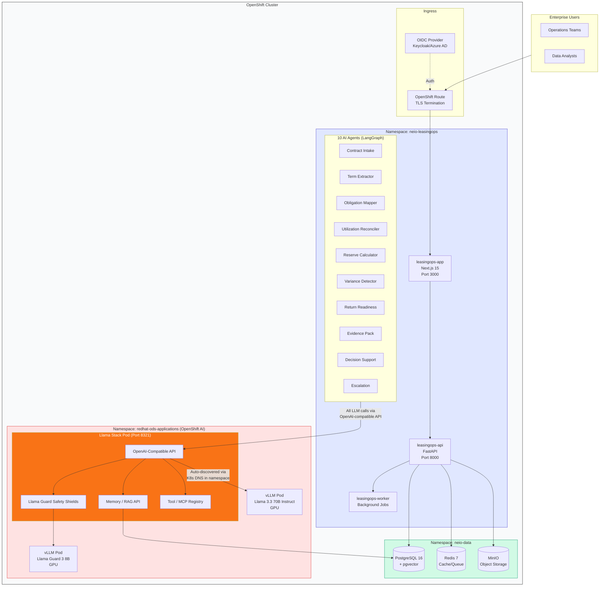

> **ARCHITECTURE PRINCIPLE:** All LLM inference requests from NeIO agents route through **Llama Stack (port 8321)** using the OpenAI-compatible API. Llama Stack handles guardrails, memory/RAG, and tool execution. vLLM models are auto-discovered via Kubernetes DNS in the same namespace. Direct vLLM access is not permitted.

## Component Descriptions

### Frontend Tier

#### leasingops-app

The user-facing web application built with Next.js 15.

| Aspect | Details |
|--------|---------|
| **Technology** | Next.js 15, React 19, TypeScript |
| **Port** | 3000 |
| **Replicas** | 2 (configurable) |
| **Resources** | 500m CPU, 512Mi memory |

**Key Features:**
- Contract dashboard with real-time status
- Drag-and-drop document upload
- Obligation tracking and alerts
- Maintenance calendar visualization
- Compliance reporting dashboards
- AI-powered chat interface for contract Q&A

### API Tier

#### leasingops-api

The core backend service handling business logic and AI orchestration.

| Aspect | Details |
|--------|---------|
| **Technology** | FastAPI, Python 3.12, Pydantic |
| **Port** | 8000 |
| **Replicas** | 3 (configurable) |
| **Resources** | 2 CPU, 4Gi memory |

**API Endpoints:**

| Endpoint | Purpose |
|----------|---------|
| `/api/v1/contracts` | Contract CRUD operations |
| `/api/v1/obligations` | Obligation management and tracking |
| `/api/v1/maintenance` | Maintenance scheduling and history |
| `/api/v1/compliance` | Compliance checks and reporting |
| `/api/v1/chat` | AI-powered contract Q&A |
| `/api/v1/documents` | Document upload and management |
| `/api/v1/reports` | Report generation and download |
| `/health` | Health check endpoint |
| `/metrics` | Prometheus metrics |

#### leasingops-worker

Background job processor for async operations.

| Aspect | Details |
|--------|---------|
| **Technology** | Python, Celery/ARQ |
| **Concurrency** | 4 workers (configurable) |
| **Replicas** | 2 (configurable) |
| **Resources** | 2 CPU, 4Gi memory |

**Job Types:**

| Job | Description | Typical Duration |
|-----|-------------|------------------|
| Document Ingestion | PDF parsing, OCR, chunking | 30s - 5min |
| Contract Analysis | AI term extraction | 1 - 3min |
| Embedding Generation | Vector embeddings for RAG | 10s - 1min |
| Obligation Monitoring | Deadline checks, alerts | < 10s |
| Report Generation | Compliance reports | 30s - 2min |
| Notification Dispatch | Email, webhook delivery | < 5s |

---

## AI Agents Overview

NeIO LeasingOps includes 10 specialized AI agents that work together to automate aircraft leasing operations.

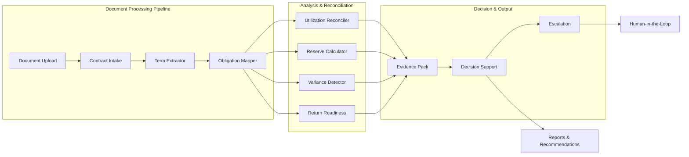

### 1. Contract Intake Agent

**Purpose:** Validates and classifies incoming lease documents.

| Capability | Description |
|------------|-------------|
| Document Classification | Identifies lease type (dry, wet, ACMI, etc.) |
| Quality Validation | Checks document quality, OCR readiness |
| Metadata Extraction | Extracts basic document metadata |
| Routing | Determines processing pipeline based on document type |

**Input:** Raw PDF documents
**Output:** Classified document with metadata, ready for processing

---

### 2. Term Extractor Agent

**Purpose:** Extracts key terms, dates, and financial details from contracts.

| Capability | Description |
|------------|-------------|
| Date Extraction | Lease start/end, delivery dates, return windows |
| Financial Terms | Monthly rent, security deposits, reserves |
| Party Identification | Lessor, lessee, guarantors, maintenance providers |
| Aircraft Details | MSN, registration, engine types, configurations |
| Condition Requirements | Delivery and return conditions |

**Input:** Classified contract document
**Output:** Structured term data (JSON)

---

### 3. Obligation Mapper Agent

**Purpose:** Identifies and categorizes contractual obligations.

| Capability | Description |
|------------|-------------|
| Obligation Identification | Finds all contractual obligations |
| Categorization | Maintenance, financial, reporting, insurance, etc. |
| Deadline Extraction | Due dates, recurring schedules |
| Responsibility Assignment | Identifies responsible party for each obligation |
| Dependency Mapping | Links related obligations |

**Input:** Extracted contract terms
**Output:** Obligation registry with deadlines and responsibilities

---

### 4. Utilization Reconciler Agent

**Purpose:** Compares actual aircraft utilization against contractual MRO data.

| Capability | Description |
|------------|-------------|
| Flight Hours Reconciliation | Compares logged vs. contracted flight hours |
| Cycles Tracking | Monitors takeoff/landing cycles against limits |
| MRO Data Comparison | Reconciles maintenance records with contract terms |
| Utilization Alerts | Flags over/under-utilization patterns |
| Rate Adjustments | Calculates rate impacts from utilization variances |

**Input:** Contract terms, MRO data, utilization records
**Output:** Reconciliation report with variances

---

### 5. Reserve Calculator Agent

**Purpose:** Tracks and forecasts maintenance reserve contributions and drawdowns.

| Capability | Description |
|------------|-------------|
| Reserve Tracking | Monitors airframe, engine, APU reserve balances |
| Contribution Calculations | Computes monthly/hourly reserve rates |
| Drawdown Validation | Validates reserve claims against contract terms |
| Shortfall Detection | Identifies reserve funding gaps |
| End-of-Lease Projections | Forecasts reserve positions at lease end |

**Input:** Contract financial terms, maintenance events, utilization data
**Output:** Reserve balance reports, forecasts, shortfall alerts

---

### 6. Variance Detector Agent

**Purpose:** Identifies discrepancies between contract terms and actual performance.

| Capability | Description |
|------------|-------------|
| Financial Variances | Detects payment discrepancies, rate mismatches |
| Compliance Variances | Flags deviations from contractual obligations |
| Maintenance Variances | Identifies gaps between scheduled and actual maintenance |
| Threshold Alerting | Configurable tolerance levels for variance flagging |
| Trend Analysis | Tracks variance patterns over time |

**Input:** All extracted data, reconciliation results
**Output:** Variance report with severity ratings

---

### 7. Return Readiness Agent

**Purpose:** Assesses aircraft redelivery compliance and preparation requirements.

| Capability | Description |
|------------|-------------|
| Return Condition Parsing | Interprets redelivery condition clauses |
| Gap Assessment | Current condition vs. return requirements |
| Cost Estimation | Estimates redelivery preparation costs |
| Timeline Planning | Creates return preparation timeline |
| Half-Time Analysis | Calculates component life remaining at return |

**Input:** Contract return conditions, current aircraft status
**Output:** Return readiness checklist, cost estimates, timeline

---

### 8. Evidence Pack Agent

**Purpose:** Assembles audit-ready documentation packages for compliance and decisions.

| Capability | Description |
|------------|-------------|
| Document Assembly | Collects and organizes supporting documents |
| Evidence Linking | Links evidence to specific contract clauses |
| Compliance Packaging | Creates regulatory compliance packages |
| Version Management | Tracks document versions and changes |
| Export Formats | Generates PDF, Word, Excel evidence packs |

**Input:** Processed data from all upstream agents
**Output:** Structured evidence packages (PDF, DOCX, XLSX)

---

### 9. Decision Support Agent

**Purpose:** Provides data-driven recommendations for lease decisions.

| Capability | Description |
|------------|-------------|
| Return/Extend/Buyout Analysis | Compares options with financial projections |
| Risk-Adjusted Scoring | Weights decisions by risk factors |
| Scenario Modeling | What-if analysis for different outcomes |
| Market Benchmarking | Compares terms against market rates |
| Recommendation Generation | Produces actionable recommendations with confidence scores |

**Input:** All agent outputs, market data
**Output:** Decision recommendations with supporting evidence

---

### 10. Escalation Agent

**Purpose:** Routes decisions requiring human judgment to the appropriate stakeholders.

| Capability | Description |
|------------|-------------|
| Threshold Detection | Identifies decisions requiring human review |
| Stakeholder Routing | Routes to appropriate decision-makers based on type/value |
| SLA Tracking | Monitors response times for escalated items |
| Context Assembly | Provides full context package for human reviewers |
| Resolution Tracking | Tracks outcomes of escalated decisions |

**Input:** Flagged items from Decision Support and Variance Detector
**Output:** Escalation notifications, human review queues

---

## Data Flow Diagrams

### Document Ingestion Flow

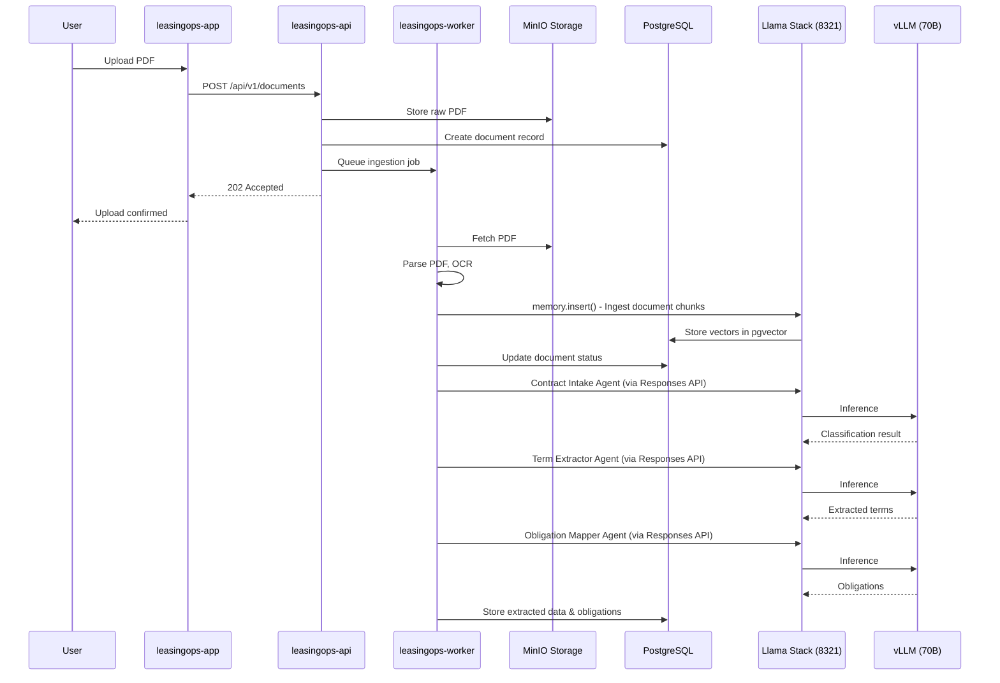

### Query Flow (RAG via Llama Stack Memory API)

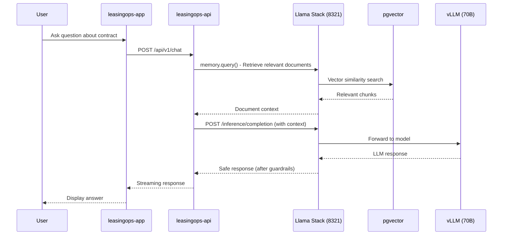

### Obligation Monitoring Flow

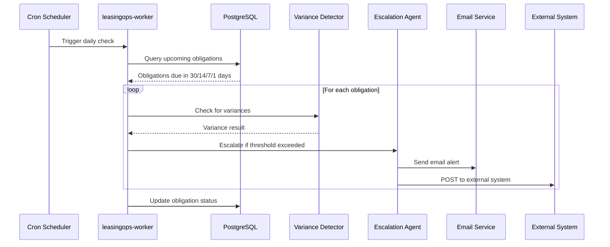

---

## Integration Points

### OpenShift AI Integration (REVISED per Michael Dawson's Feedback - Feb 5, 2026)

> **IMPORTANT:** All LLM inference from NeIO agents routes through **Llama Stack (port 8321)** using the OpenAI-compatible API. Llama Stack handles guardrails, memory/RAG, and tool execution. Models are auto-discovered via Kubernetes DNS. Direct vLLM access is not permitted.

NeIO LeasingOps integrates with Red Hat OpenShift AI using the **Llama Stack Model Serving Pattern**:

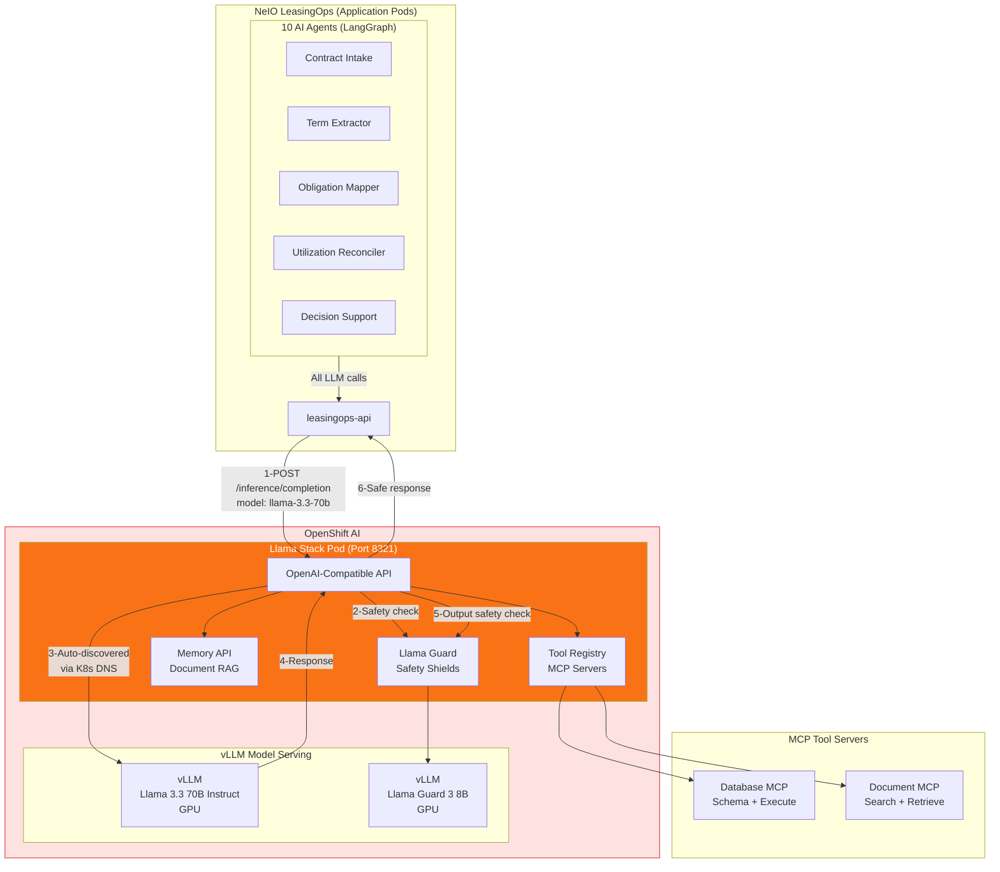

### Llama Stack Model Serving Pattern (REQUIRED)

**Why Llama Stack?**

| Feature | Benefit |
|---------|---------|
| **OpenAI-Compatible API** | Standard API (port 8321) that all NeIO agents use for inference |
| **Llama Guard Safety Shields** | Filters harmful/inappropriate content before AND after inference |
| **Memory / RAG API** | Built-in document ingestion and retrieval (replaces custom RAG pipeline) |
| **Tool / MCP Registry** | Centralized MCP server management for database/document tools |
| **Model Specification** | Agents specify model per request (no dynamic routing needed) |
| **Auto-Discovery** | vLLM models discovered automatically via Kubernetes DNS in same namespace |

**Request Flow:**

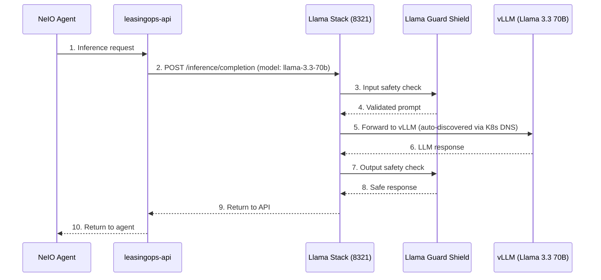

### Model Configuration

Agents specify the model per request. No dynamic multi-model routing is needed for the quickstart:

| Agent | Model | Reason |
|-------|-------|--------|
| Term Extractor, Decision Support | Llama 3.3 70B Instruct | Complex reasoning tasks |
| Contract Intake, Escalation | Llama 3.3 70B Instruct | Document understanding |
| All agents (safety shield) | Llama Guard 3 8B | Input/output guardrails |

### Llama Stack Configuration (uses Red Hat Helm chart)

We use the existing `rh-ai-quickstart/ai-architecture-charts/llama-stack` Helm chart:

```yaml
# values.yaml for llama-stack chart
image:
  repository: quay.io/ai-on-openshift/llama-stack-server
  tag: latest

service:
  port: 8321

# Safety shields
shields:
  - name: llama-guard
    model: meta-llama/Llama-Guard-3-8B

# Models auto-discovered via K8s DNS in same namespace
# No need to configure model endpoints manually

# Memory/RAG configuration
memory:
  backend: redis
  redisHost: redis.neio-data.svc.cluster.local

# MCP Tool servers
tools:
  mcpServers:
    - name: database-mcp
      endpoint: "http://database-mcp.neio-leasingops.svc:8080"
    - name: document-mcp
      endpoint: "http://document-mcp.neio-leasingops.svc:8080"
```

### vLLM Model Serving (uses Red Hat Helm chart)

We use the existing `rh-ai-quickstart/ai-architecture-charts/llm-service` chart:

```yaml
# values.yaml for llm-service chart (Llama 3.3 70B)
image:
  repository: quay.io/modh/vllm
  tag: latest

model:
  name: meta-llama/Llama-3.3-70B-Instruct
  maxModelLen: 8192

resources:
  gpu:
    type: nvidia.com/gpu
    count: 2
  tensorParallelism: 2

# OpenShift AI manages GPU operator - no need to configure directly
```

### Scaling with llm-d (Optional - Production Only)

For production deployments requiring high inference throughput, **llm-d** can be configured as the inference backend **behind** Llama Stack:

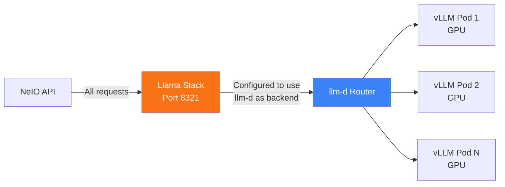

> **Note:** llm-d sits **between** Llama Stack and vLLM, not in front. Llama Stack is always the entry point. llm-d is configured in Llama Stack's values.yaml as the inference backend.

**Serving Runtime Summary:**

| Runtime | Role | When Needed |
|---------|------|-------------|
| **Llama Stack** | Gateway (REQUIRED) | Always - handles guardrails, memory, tools, API |
| **vLLM** | Inference engine | Always - runs the models on GPU |
| **llm-d** | Load balancer | Production only - distributes across multiple vLLM pods |

### External LLM Providers

When using external LLM providers, the API routes requests through a unified interface.

| Provider | Models | Use Case |
|----------|--------|----------|
| Anthropic | Claude Sonnet 4, Claude Opus 4 | Primary LLM for agents |
| OpenAI | GPT-4o, GPT-4 Turbo | Alternative LLM provider |
| Voyage AI | voyage-3, voyage-code-3 | Embedding generation |

**Configuration Priority:**

1. OpenShift AI (if `ai.openshiftAI.enabled: true`)
2. Anthropic (if `ANTHROPIC_API_KEY` is set)
3. OpenAI (if `OPENAI_API_KEY` is set)

### External System Integrations

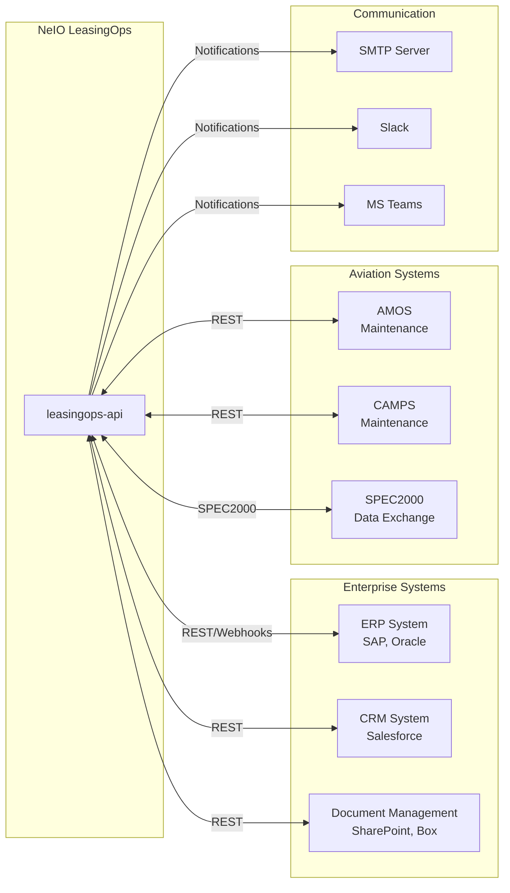

---

## Deployment Architecture

### High Availability Configuration

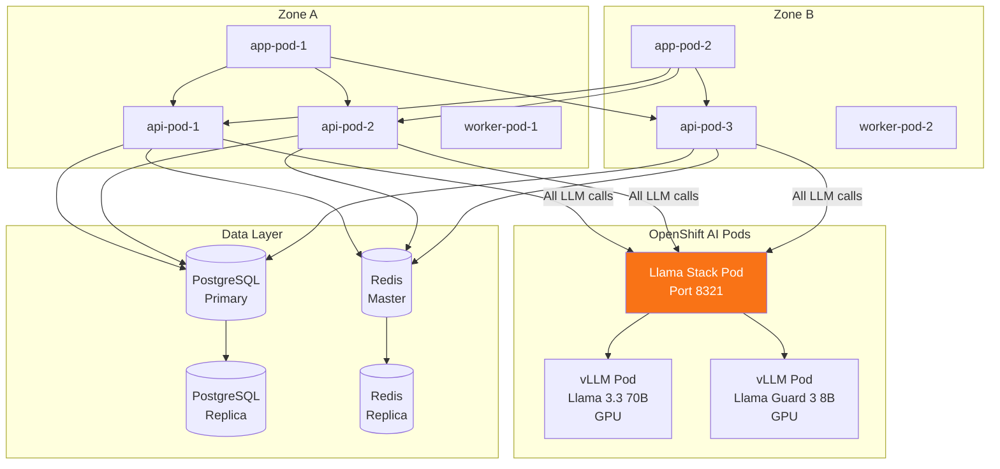

### Resource Requirements

| Component | Min CPU | Min Memory | Recommended CPU | Recommended Memory | Storage | GPU |
|-----------|---------|------------|-----------------|-------------------|---------|-----|
| leasingops-app | 500m | 512Mi | 1 | 1Gi | - | - |
| leasingops-api | 2 | 4Gi | 4 | 8Gi | - | - |
| leasingops-worker | 2 | 4Gi | 4 | 8Gi | - | - |
| Llama Stack | 1 | 2Gi | 2 | 4Gi | - | - |
| vLLM (Llama 3.3 70B) | 4 | 16Gi | 8 | 32Gi | - | 2x A100 |
| vLLM (Llama Guard 3 8B) | 2 | 8Gi | 4 | 16Gi | - | 1x A100 |
| PostgreSQL + pgvector | 1 | 2Gi | 2 | 4Gi | 50Gi | - |
| Redis | 500m | 1Gi | 1 | 2Gi | 10Gi | - |
| MinIO | 500m | 1Gi | 1 | 2Gi | 100Gi | - |

---

## Security Architecture

See [SECURITY.md](./SECURITY.md) for detailed security documentation.

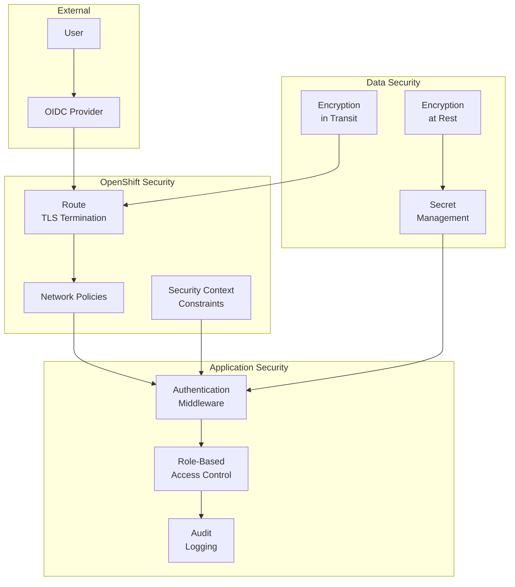

---

## Monitoring and Observability

### Metrics Collection

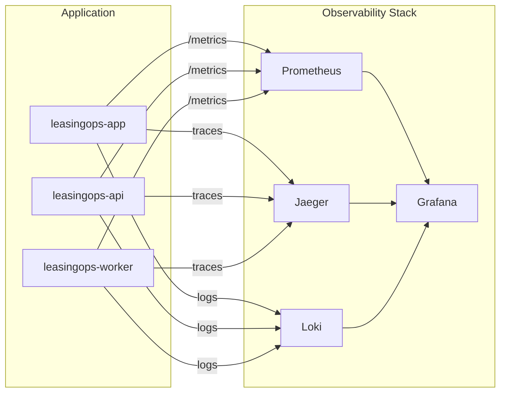

**Key Metrics:**

| Category | Metrics |
|----------|---------|
| API | Request latency, error rate, throughput |
| Worker | Job duration, queue depth, failure rate |
| AI | Token usage, inference latency, cache hit rate |
| Database | Connection pool, query latency, replication lag |
| Vector Store | Search latency, index size, recall rate |

---

## Next Steps

- [Installation Guide](./INSTALLATION.md) - Deploy NeIO LeasingOps
- [Configuration Reference](./CONFIGURATION.md) - Customize your deployment
- [Security Guide](./SECURITY.md) - Security best practices
- [Troubleshooting](./TROUBLESHOOTING.md) - Common issues and solutions

---

## Action Items

| Action Item | Assignee | Status |
|-------------|----------|--------|
| Review updated architecture (v2.0) | Michael (Red Hat) | **PENDING** |
| Complete deployment on Red Hat Partner Lab | CODVO team | IN PROGRESS |
| Revise architecture diagrams per Michael's 9 feedback items | CODVO team | **COMPLETED v2.0** ✓ |
| Update deck slides 5, 6, 7 with corrected diagrams | PM / Rohini | **PENDING** |
| Create updated marketing flyer for LeasingOps | Rohini | PENDING |
| Send Google Drive link for product demo video | Rohini | PENDING |
| Coordinate Red Hat Summit participation | Bert | PENDING |

---

## Red Hat Summit 2026 (May 11-14, Atlanta)

### Proposed Theater Presentation

**Title:** "NeIO LeasingOps: AI-Powered Digital Coworker for Equipment Leasing on OpenShift AI"

**Abstract:** Demonstration of how NeIO LeasingOps leverages Red Hat OpenShift AI's Llama Stack, llm-d, and guardrails to automate aircraft lease management with 10 specialized AI agents working in concert.

**Demo Flow:**
1. Upload lease contract PDF
2. Show Llama Stack guardrails filtering sensitive content
3. Term extraction with confidence scores
4. Variance detection against MRO data
5. Decision support recommendations (return vs extend vs buyout)
6. Human-in-the-loop escalation workflow

---

*Document Version: 2.0 | Updated: February 5, 2026 | Status: Ready for Michael Dawson's Re-Review*
