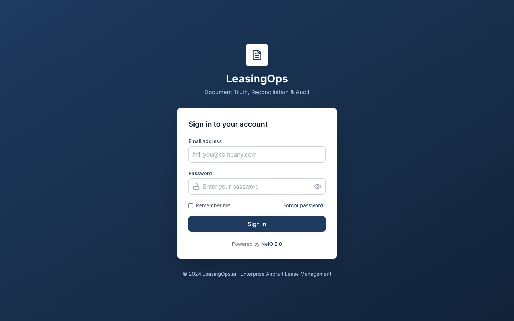

# Getting Started with NeIO LeasingOps

A guided tour of the application once it is deployed. If you have not deployed it
yet, start with the [README](../README.md); this guide picks up at the point where
you can open the app in a browser and log in.

It covers four things:

1. [The application at a glance](#1-the-application-at-a-glance)
2. [Document processing](#2-document-processing)
3. [Asking questions with the NeIO Assistant (RAG)](#3-asking-questions-with-the-neio-assistant-rag)
4. [Dashboards and charts](#4-dashboards-and-charts)

> Screen captures are referenced inline as ``. The image files
> are added separately; see the [capture checklist](#screen-capture-checklist) at
> the end for the exact screen and action behind each one.

---

## 1. The application at a glance

Open the app route (`https://leasingops.apps.<your-cluster-domain>`) and log in
with the demo credentials from the install (see README step 5).

The left sidebar groups everything into four areas:

| Group | What lives there |
|-------|------------------|
| **Command** | Decisions, Escalations - the outcomes the pipeline produces |
| **Operations** | Fleet Portfolio (your contracts), Return Readiness, Reconciliation |
| **Processing** | Pipeline (live agent view), Term Extraction, Evidence Packs |
| **Administration** | Settings (demo/production mode), Audit Trail |

### Production and demo modes

The app processes in **Production mode** by default: every upload runs the real
ten-agent pipeline through the worker and model server. The mode is set per
workspace under **Administration > Settings**.

When you have no GPU, or just want a fast click-through, switch to **Demo mode**:
the API writes synthetic extraction data instantly, with no worker or model in the
loop. The difference:

| | Production mode (default) | Demo mode |
|---|---|---|
| Speed | ~1 minute per document on a GPU | Instant |
| What runs | Docling + the ten agents via the worker | Synthetic extraction data |
| Needs the model server | Yes | No |
| Audit Trail / Pipeline pages | Populated | Stay empty (no real work) |

> Tip: leave it on production for a real walkthrough so you can watch the agents run
> and the audit trail fill in. Switch to demo only when you want the instant,
> synthetic path, for example a quick UI tour with no GPU.

---

## 2. Document processing

This is the core of the application: a lease contract goes in, structured results
come out.

### Upload a contract

Go to **Operations > Fleet Portfolio** and click **Upload**. Pick a file (PDF or
DOCX). The repository ships sample contracts across ten document types in
[`examples/sample-contracts/`](../examples/sample-contracts/) if you do not have
one handy.

### Watch the pipeline run

In production mode, open **Processing > Pipeline** while the document processes.
Each of the ten agents lights up in order as the worker finishes it:

1. **Contract Intake** - validates the upload and classifies the document type
2. **Term Extractor** - pulls dates, financials, parties, aircraft details, conditions
3. **Obligation Mapper** - identifies obligations with deadlines and owners
4. **Utilization Reconciler** - compares actual flight hours and cycles against MRO data
5. **Reserve Calculator** - tracks maintenance reserve balances, contributions, drawdowns, shortfalls
6. **Variance Detector** - flags discrepancies between contract terms and actual performance
7. **Return Readiness** - assesses redelivery compliance, gap analysis and cost estimates
8. **Evidence Pack** - assembles audit-ready documentation linked to contract clauses
9. **Decision Support** - produces the return / extend / buyout analysis
10. **Escalation** - routes high-severity items to stakeholders with full context

### Read the results

When the run finishes:

- **Processing > Term Extraction** shows the extracted fields: dates, financials,
  parties, aircraft details, and conditions pulled from the contract.
- **Operations > Return Readiness** shows the redelivery gap analysis and cost estimates.
- **Command > Decisions** shows the return/extend/buyout recommendation and its risk rationale.
- **Processing > Evidence Packs** assembles the audit-ready bundle, with each fact
  linked back to the clause it came from.

**Supported inputs:** PDF and DOCX lease documents. In production mode, Docling
parses the document (with a PyMuPDF fallback) before the agents run.

---

## 3. Asking questions with the NeIO Assistant (RAG)

The **NeIO Assistant** answers natural-language questions about the contracts you
have uploaded. It is a retrieval-augmented (RAG) chat: it finds the most relevant
passages in your documents, then answers from them and shows its sources.

Open it from the **NeIO Assistant** button at the bottom right of any screen, or
type a question into the search bar.

Try questions like:

- "When does this lease expire?"
- "What are the maintenance reserve obligations?"
- "Who is the lessor and who is the guarantor?"
- "What are the return conditions at end of lease?"

Each answer is followed by **source cards**. A source card shows the document name,
the page the passage came from, a snippet of the matched text, and a relevance
score (a percentage). Click a card to open that document at the cited location, so
you can verify the answer against the original contract rather than trusting the
model blind.

> In production mode the Assistant retrieves from the contracts you uploaded and
> processed. In demo mode it answers from the synthetic data, so you have something
> to query even without a model server running.

---

## 4. Dashboards and charts

Several screens summarize the portfolio visually rather than document by document.

- **Operations > Fleet Portfolio** is the top-level view of every contract and its
  current pipeline status, with portfolio-level counts.
- **Command > Decisions** presents the return / extend / buyout analysis as a
  comparison, so you can weigh the options for an end-of-term lease at a glance.
- **Administration** (Performance) charts agent throughput and processing metrics
  for the workspace, so you can see how the pipeline is performing over time.

**Interacting with the charts:** hover a series for the underlying value, and use
the page filters (workspace, document) to scope what the charts summarize. Selecting
a contract from Fleet Portfolio drills into that single document's extracted terms,
obligations, and decision.

---

## Where to go next

- [The ten agents, in depth](ARCHITECTURE.md#10-agent-pipeline)
- [Configuration reference](CONFIGURATION.md)
- [Troubleshooting](TROUBLESHOOTING.md)
- Reset the cluster between demos: `./scripts/teardown.sh` (see README, "Clean up")

---

## Screen capture checklist

The images above are placeholders. Capture each on a live deployment and save it to
`docs/images/` under the filename shown. The Pipeline and Audit Trail screens need
production mode (so there is real agent activity to show); the rest are fine in
either mode.

| File | Screen | How to reproduce |
|------|--------|------------------|
| `01-login.png` | Login | Open the app route, before logging in |
| `02-home-sidebar.png` | Home | After login, full window showing the four sidebar groups |
| `03-settings-mode-toggle.png` | Administration > Settings | The demo/production mode toggle |
| `04-fleet-portfolio-upload.png` | Operations > Fleet Portfolio | Upload dialog open |
| `05-pipeline-stages.png` | Processing > Pipeline | Production mode, mid-run, agents lighting up |
| `06-term-extraction.png` | Processing > Term Extraction | A processed document's extracted fields |
| `07-assistant-rag.png` | NeIO Assistant | An answer to "When does this lease expire?" |
| `08-assistant-source-card.png` | NeIO Assistant | Close-up of a source card (filename, page, score) |
| `09-fleet-portfolio-overview.png` | Operations > Fleet Portfolio | List populated with several contracts |
| `10-decisions-charts.png` | Command > Decisions | The return/extend/buyout comparison |

Recommended: 1440px-wide window, light theme, sample data from
`examples/sample-contracts/` so no real customer data appears in screenshots.
