# Getting Started with NeIO LeasingOps

A guided tour of the application once it is deployed. If you have not deployed it
yet, start with the [README](../README.md); this guide picks up at the point where
you can open the app in a browser and log in.

It covers four things:

1. [The application at a glance](#1-the-application-at-a-glance)
2. [Document processing](#2-document-processing)
3. [Asking questions with the LeasingOps Assistant (RAG)](#3-asking-questions-with-the-leasingops-assistant-rag)
4. [Dashboards and charts](#4-dashboards-and-charts)

> The screenshots below are live captures of the application.

---

## 1. The application at a glance

Open the app route (`https://leasingops.apps.<your-cluster-domain>`) and log in
with the demo credentials from the install (see README step 5).

After login you land on the **Control Center**. The left sidebar groups everything
into four areas:

| Group | What lives there |
|-------|------------------|
| **Command** | Control Center, Escalations, Decisions |
| **Operations** | Fleet Portfolio (your contracts), Reconciliation, Return Readiness |
| **Processing** | Pipeline, Term Extraction, Human Review, Evidence Packs |
| **Administration** | Governance, Audit Trail, Settings |

The Control Center is the home dashboard: the assistant prompt up top, Quick Access
tiles, a Fleet Summary, an Attention Required feed, and a Work Queue that shows
documents moving through the ten-agent pipeline in real time (for example,
"Processing MSA-2024-089 — Stage 3/10: Obligation Mapping").

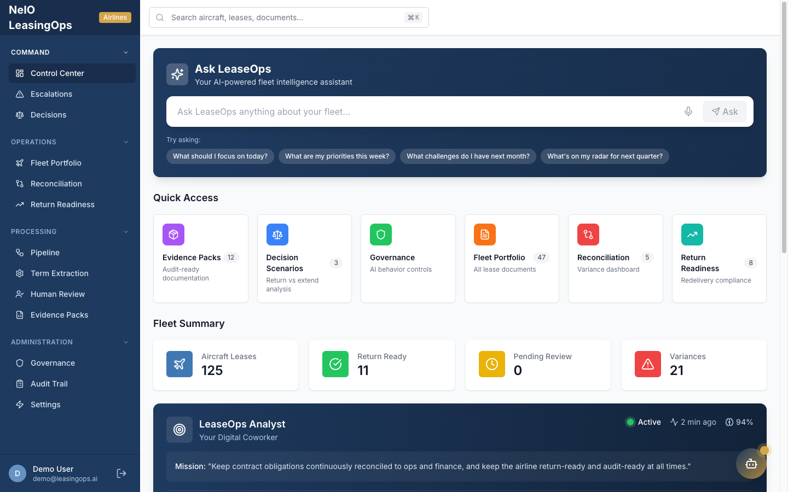

### Production and demo modes

The app processes in **Production mode** by default: every upload runs the real
ten-agent pipeline through the worker and model server. The mode is set per
workspace under **Administration > Settings > Document Processing Mode** (shown
below switched to Demo).

When you have no GPU, or just want a fast click-through, switch to **Demo mode**:
the API writes synthetic extraction data instantly, with no worker or model in the
loop. The difference:

| | Production mode (default) | Demo mode |
|---|---|---|
| Speed | ~1 minute per document on a GPU | Instant |
| What runs | Docling + the ten agents via the worker | Synthetic extraction data |
| Needs the model server | Yes | No |
| Audit Trail / Pipeline pages | Populated | Stay empty (no real work) |

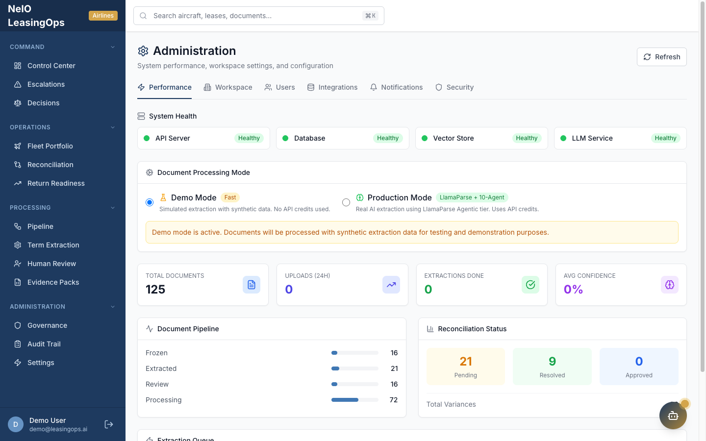

> Leave it on production for a real walkthrough so you can watch the agents run and
> the audit trail fill in. Switch to demo only when you want the instant, synthetic
> path, for example a quick UI tour with no GPU.

---

## 2. Document processing

This is the core of the application: a lease contract goes in, structured results
come out.

### Upload a contract

Go to **Operations > Fleet Portfolio** and click **Upload** (or drag and drop a PDF,
up to 50 MB). The repository ships sample contracts across ten document types in
[`examples/sample-contracts/`](../examples/sample-contracts/) if you do not have one
handy. The list below the upload area is every contract in the workspace, with its
lessor, lessee, and document type.

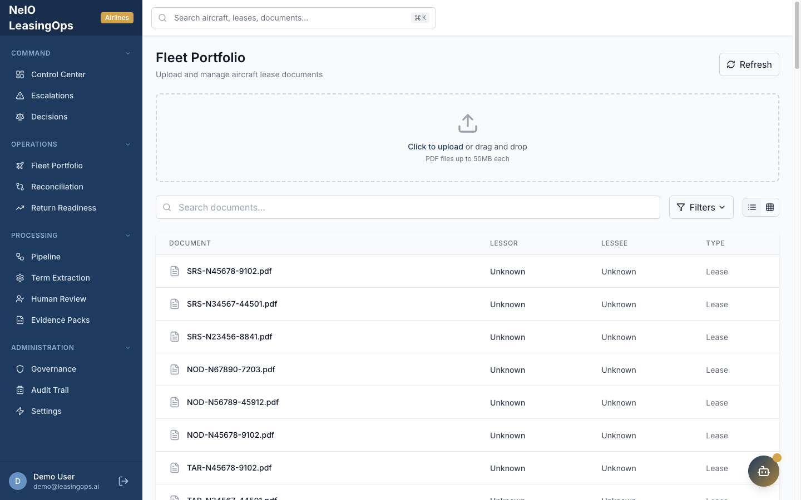

### The processing pipeline

In production mode, each document runs through the ten agents in order:

1. **Contract Intake** — validates the upload and classifies the document type
2. **Term Extractor** — pulls dates, financials, parties, aircraft details, conditions
3. **Obligation Mapper** — identifies obligations with deadlines and owners
4. **Utilization Reconciler** — compares actual flight hours and cycles against MRO data
5. **Reserve Calculator** — tracks maintenance reserve balances, contributions, drawdowns, shortfalls
6. **Variance Detector** — flags discrepancies between contract terms and actual performance
7. **Return Readiness** — assesses redelivery compliance, gap analysis and cost estimates
8. **Evidence Pack** — assembles audit-ready documentation linked to contract clauses
9. **Decision Support** — produces the return / extend / buyout analysis
10. **Escalation** — routes high-severity items to stakeholders with full context

The **Pipeline** screen (Processing > Pipeline) is a visual workflow builder: the
"Lease Document Processing" workflow chains document upload, term extraction, and
confidence checks, and you can add triggers, actions, and conditions.

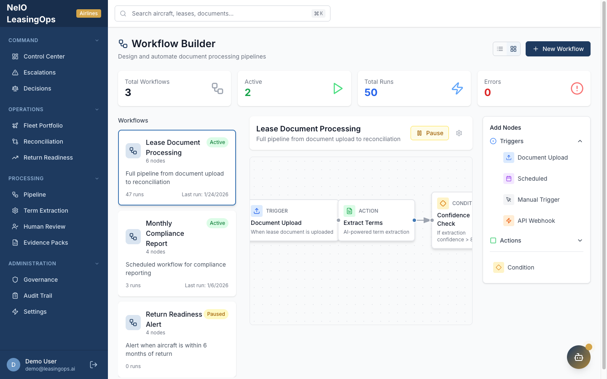

### Read the results

When a run finishes:

- **Processing > Term Extraction** shows the extracted fields: dates, financials,
  parties, aircraft details, and conditions pulled from the contract.
- **Operations > Return Readiness** shows the redelivery gap analysis and cost estimates.
- **Command > Decisions** shows the return/extend/buyout recommendation and its risk rationale.
- **Processing > Evidence Packs** assembles the audit-ready bundle, with each fact
  linked back to the clause it came from.

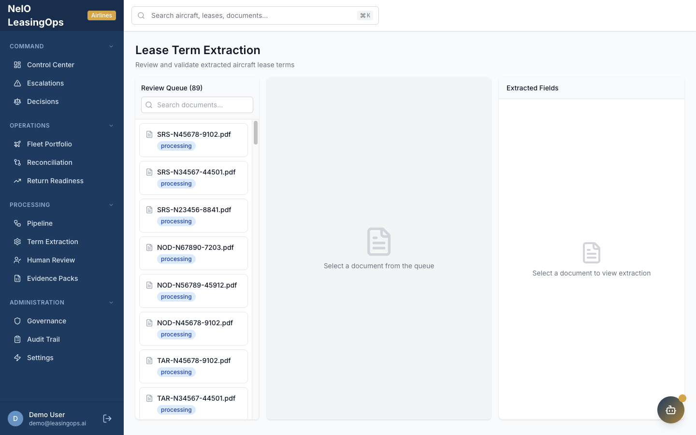

**Supported inputs:** PDF and DOCX lease documents. In production mode, Docling
parses the document (with a PyMuPDF fallback) before the agents run.

---

## 3. Asking questions with the LeasingOps Assistant (RAG)

The **LeasingOps Assistant** answers natural-language questions about the contracts
you have uploaded. It is a retrieval-augmented (RAG) chat: it finds the most relevant
passages in your documents, then answers from them and shows its sources. Open it
from the sidebar, the Control Center prompt, or the assistant button.

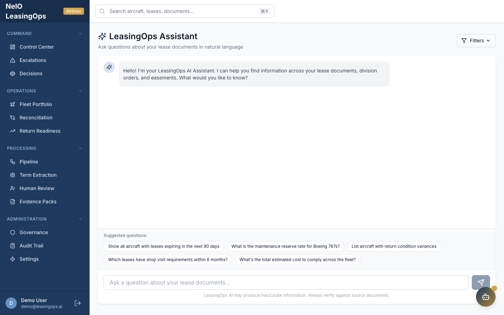

Try questions like:

- "What is the maintenance reserve rate for Boeing 787s?"
- "Show all aircraft with leases expiring in the next 90 days"
- "List aircraft with return condition variances"
- "What are the return conditions at end of lease?"

Each answer is followed by **source cards**. A source card shows the document name,
the page the passage came from, a snippet of the matched text, and a relevance score
(a percentage). Click a card to open that document at the cited location, so you can
verify the answer against the original contract rather than trusting the model blind.

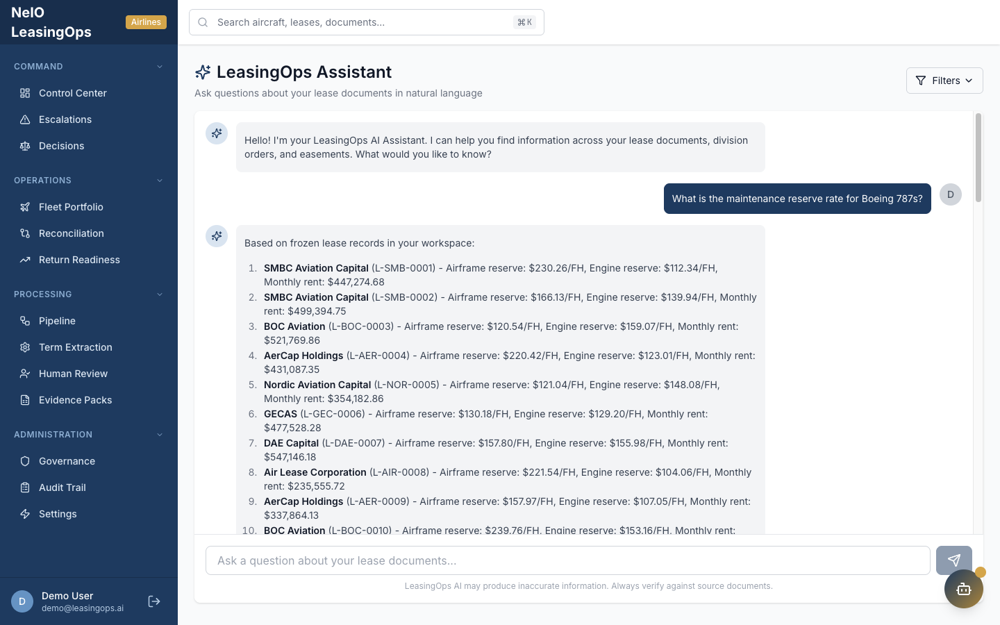

> In production mode the Assistant retrieves from the contracts you uploaded and
> processed. In demo mode it answers from the synthetic data, so you have something
> to query even without a model server running.

---

## 4. Dashboards and charts

Several screens summarize the portfolio visually rather than document by document.

**Decisions** (Command > Decisions) presents the end-of-term analysis as a side-by-side
comparison — return as-is vs extend vs buyout — with the cost of each option and a
recommended path, so you can weigh an expiring lease at a glance.

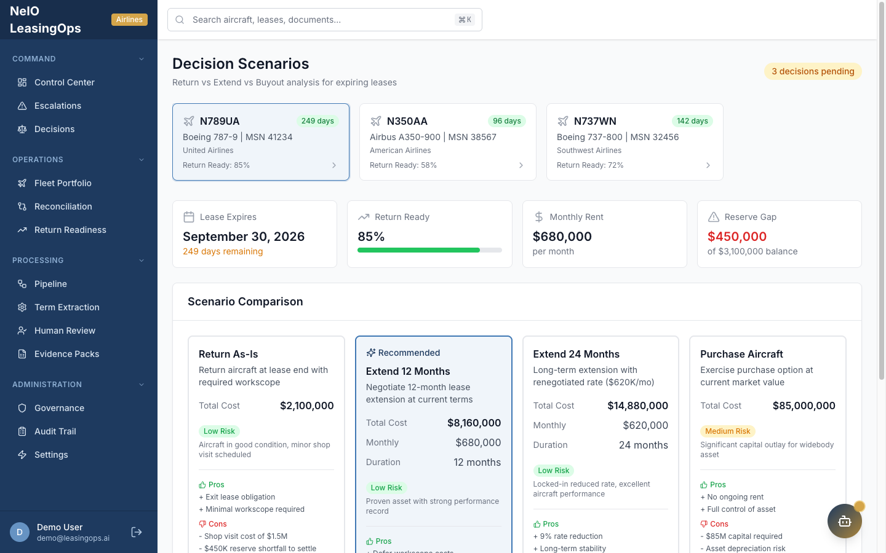

**Reconciliation** (Operations > Reconciliation) is the variance dashboard: contracted
utilization and reserves against actual operational data.

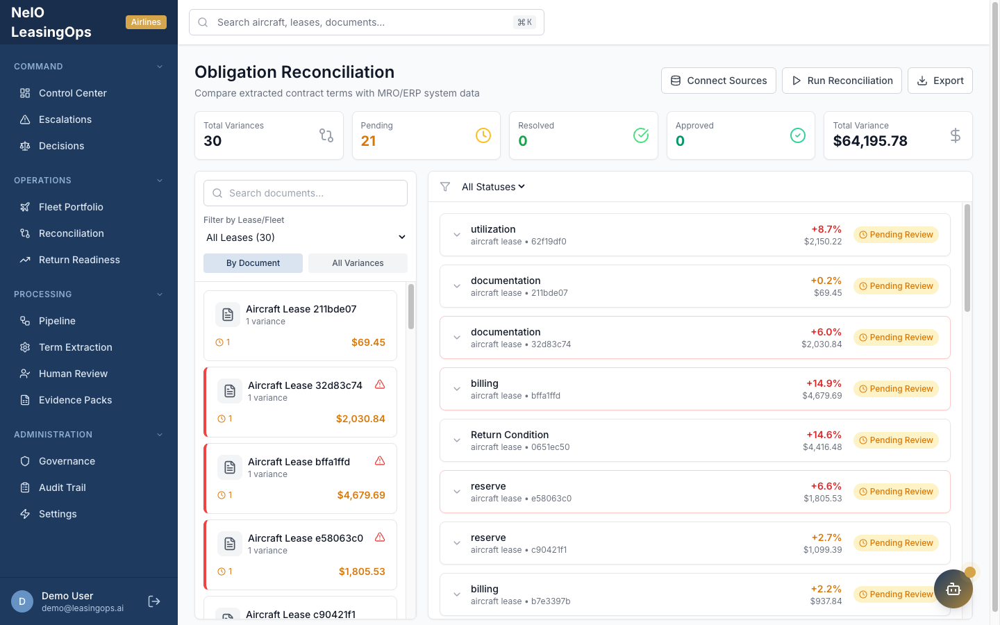

**Return Readiness** (Operations > Return Readiness) tracks redelivery compliance and
estimated cost-to-comply across the fleet.

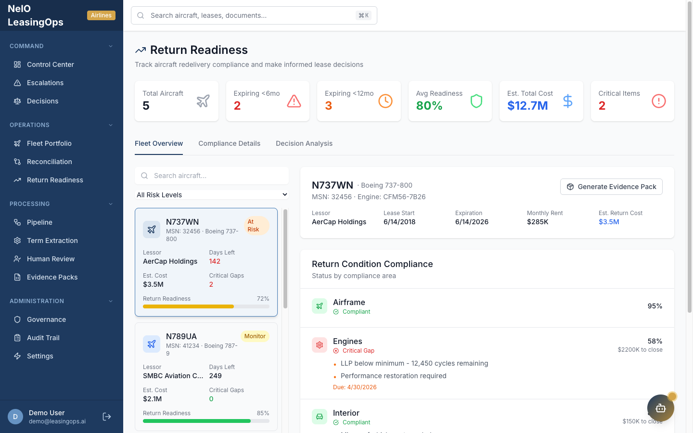

**Interacting with the charts:** hover a series for the underlying value, and use the
page filters (workspace, document) to scope what is summarized. Selecting a contract
from Fleet Portfolio drills into that single document's extracted terms, obligations,
and decision.

### More screens

The rest of the workspace, for reference:

| Screen | Purpose |
|--------|---------|
| 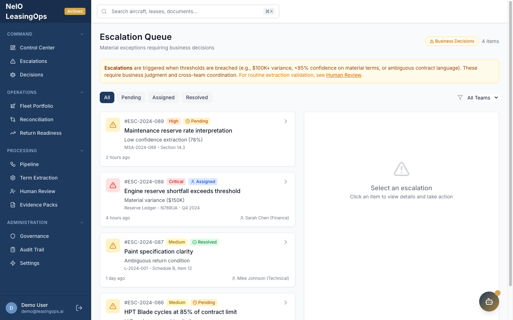 | **Escalations** — items the pipeline routed to a human, with context |
| 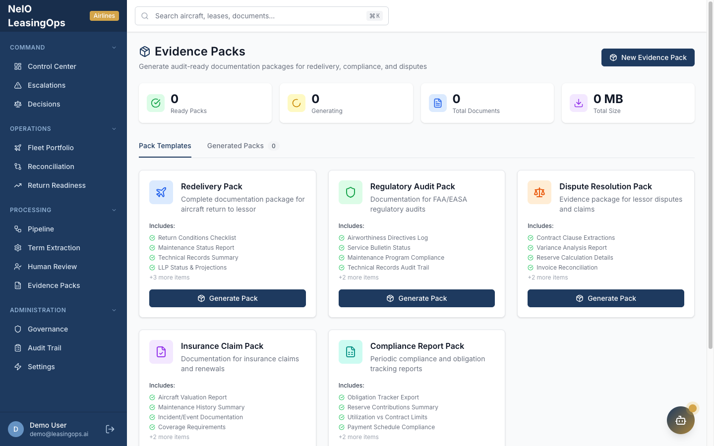 | **Evidence Packs** — audit-ready bundles linking findings to clauses |
| 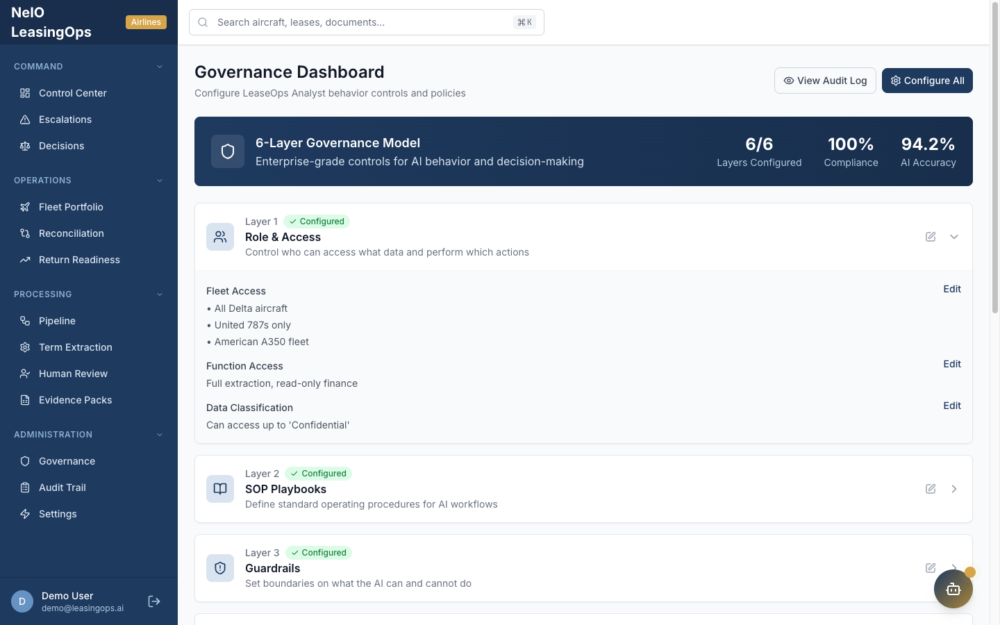 | **Governance** — AI behavior controls and policy |
| 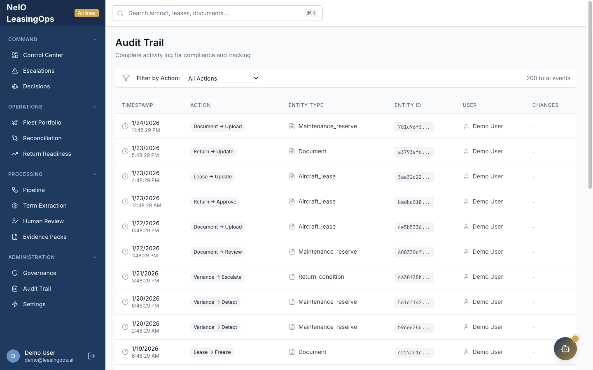 | **Audit Trail** — recorded activity for the workspace |

---

## Where to go next

- [The ten agents, in depth](ARCHITECTURE.md#10-agent-pipeline)
- [Configuration reference](CONFIGURATION.md)
- [Troubleshooting](TROUBLESHOOTING.md)
- Reset the cluster between demos: `./scripts/teardown.sh` (see README, "Clean up")
