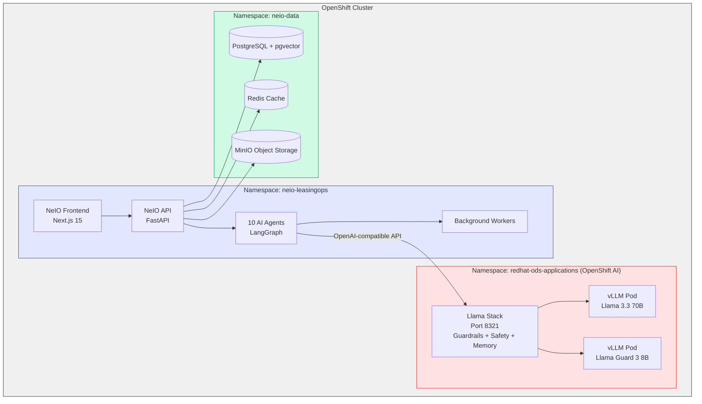
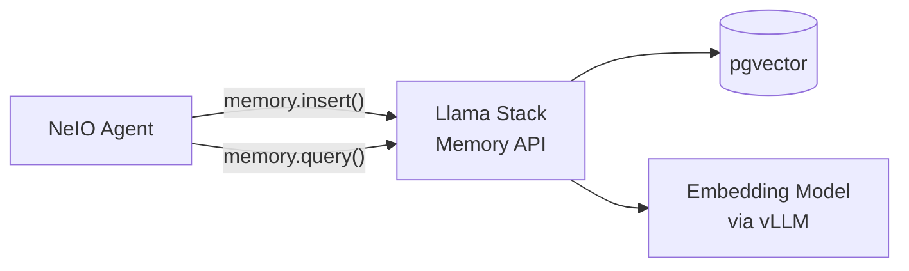
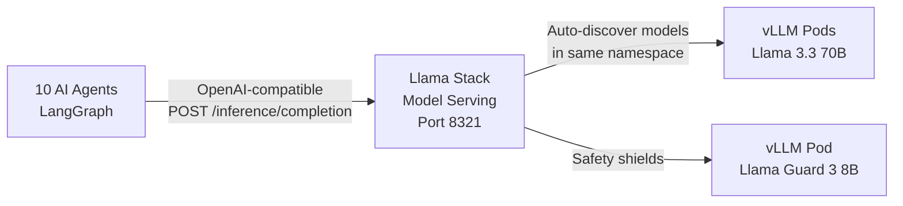
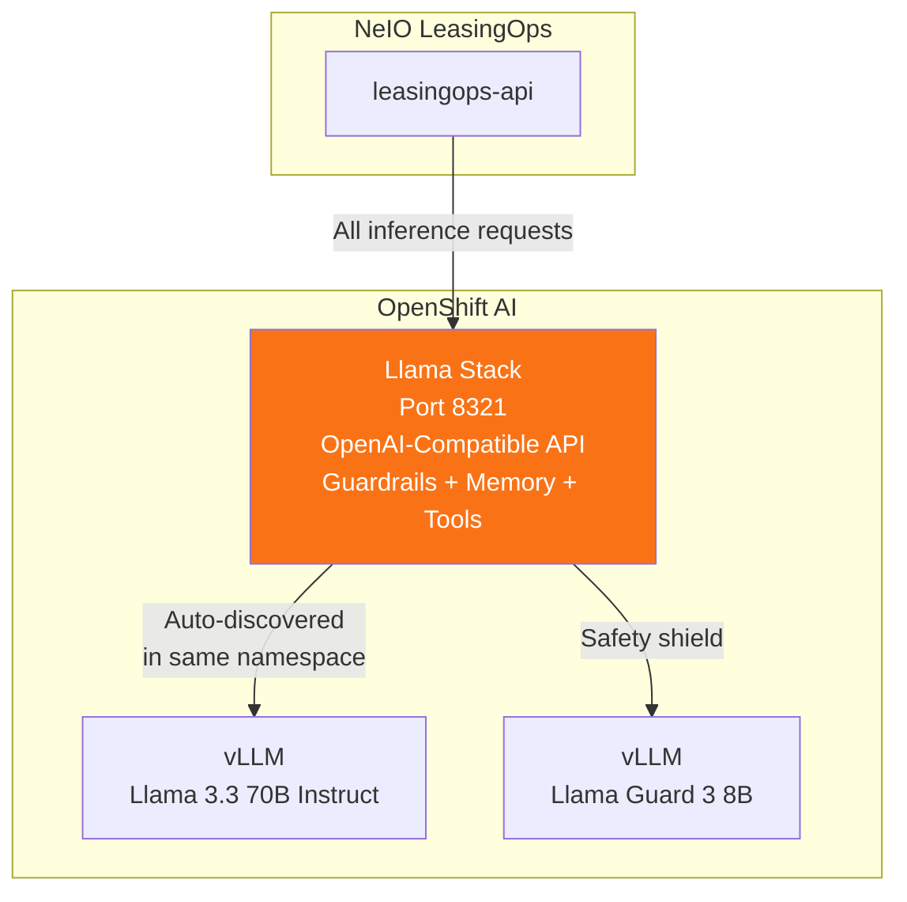
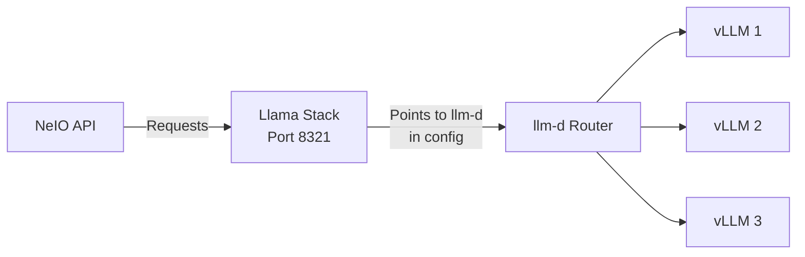
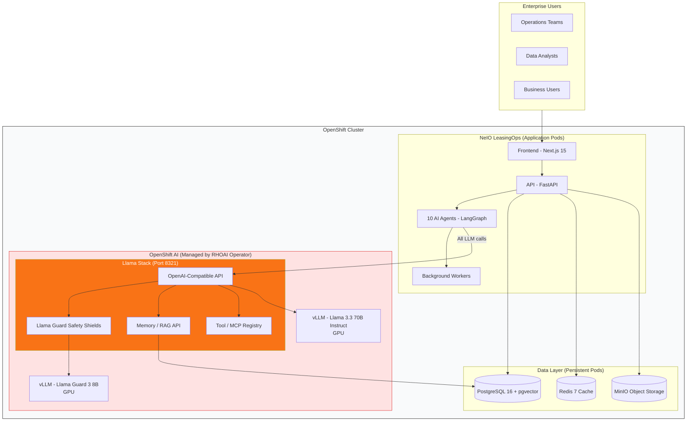
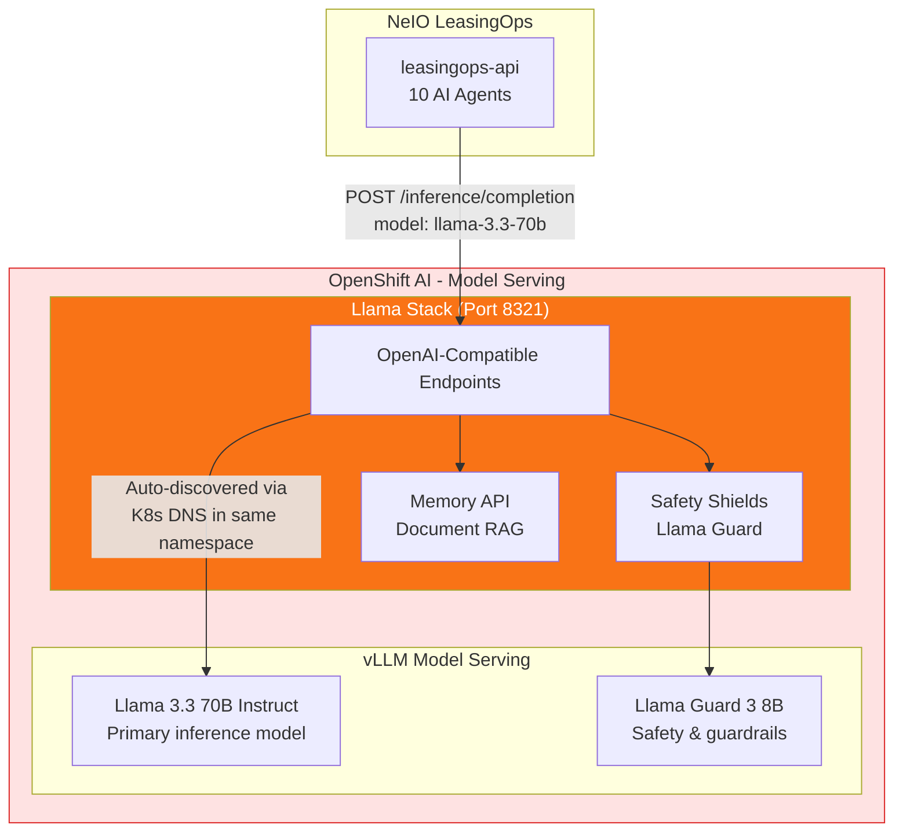
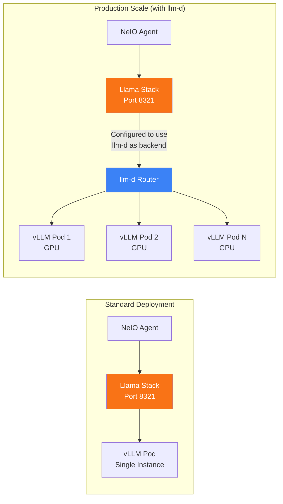

# Response to Michael's Architecture Feedback

**To:** Product Manager (for Red Hat coordination)
**From:** Bala Sista, Head of Technology & Architecture
**Date:** February 5, 2026
**Re:** Michael Dawson's feedback on NeIO LeasingOps deck

---

## Feedback Summary

Michael provided 9 detailed feedback items on the deck. Below is each item with our response and the specific changes needed per slide.

---

## Slide 5: "Architecture on Red Hat OpenShift"

### Feedback #1: Everything should be inside OpenShift

> *"On slide 5 it shows NeIO 2.0 platform and OpenShift AI as two different things, as well as the Data Layer. I'd expect that all components will be deployed to OpenShift."*

**Response: AGREE - Will Fix**

Michael is correct. The current slide draws NeIO 2.0 Platform, OpenShift AI, and Data Layer as three visually separate blocks. In reality, **everything runs inside the OpenShift cluster** as pods in different namespaces.

**What needs to change on Slide 5:**



**Key change:** Wrap everything inside a single "OpenShift Cluster" boundary. Use namespaces to show logical separation, not physical separation. NeIO, OpenShift AI, and Data are all pods running on the same cluster.

---

### Feedback #2: RAG Pipeline should use Llama Stack APIs

> *"It shows the RAG Pipeline/Hybrid Search in the AI Orchestration layer. What do you use to ingest and query the RAG databases? Llama Stack provides APIs to do this and wondering why those would not be used?"*

**Response: AGREE - Will Adopt Llama Stack Memory/RAG APIs**

Currently we use our own custom RAG pipeline (Voyage AI embeddings + Qdrant/pgvector retrieval). Michael is suggesting we should use the **Llama Stack Memory API** for document ingestion and retrieval instead.

**What needs to change on Slide 5:**
- Remove the standalone "RAG Pipeline / Hybrid Search" box from the AI Orchestration layer
- Instead, show the agents calling **Llama Stack Memory API** for document retrieval
- The underlying vector store (pgvector) still exists in Data Layer, but is accessed **through** Llama Stack, not directly



**Note to PM:** This is a significant architecture simplification. Instead of maintaining our own RAG pipeline, we adopt Llama Stack's built-in Memory/RAG APIs. This is better alignment with Red Hat's stack.

---

### Feedback #3: Multi-model routing

> *"Do you need multi-model routing where depending on the query it routes to different models on the fly, or do you specify the model to use for each request? With the Llama Stack responses API you can specify the model for each request."*

**Response: We specify the model per request. No dynamic multi-model routing needed for the quickstart.**

Our agents each know which model they need:
- **Term Extraction, Decision Support** = Llama 3.3 70B (needs reasoning power)
- **Contract Classification** = Llama 3.3 8B (lighter task)
- **Guardrails** = Llama Guard 3 8B (safety shield)

We use the Llama Stack Responses API and specify the model in each request. We do **not** need llm-d's dynamic multi-model routing for the quickstart.

**What needs to change on Slide 5:**
- Remove "llm-d Controller / Multi-Model Routing" box (misleading for quickstart)
- Show agents calling Llama Stack with model specified per request
- llm-d can be mentioned as a **scalability option** for production (Slide 7), not as core architecture

---

### Feedback #4: InstructLab in the quickstart?

> *"Are you planning InstructLab tuning of the models to be part of the quickstart?"*

**Response: NO - Not for the quickstart.**

InstructLab fine-tuning is a Phase 2 capability. The quickstart uses pre-trained models (Llama 3.3 70B, Llama Guard 3 8B) without fine-tuning.

**What needs to change on Slide 5:**
- Remove "InstructLab Fine-tuning" from the architecture diagram
- Can mention in a "Future Roadmap" slide that InstructLab tuning for domain-specific O&G lease terminology is planned

---

### Feedback #5: Model Catalog/Registry not needed

> *"The model catalog and registry are not necessary for using the Llama Stack APIs, but do make sense if you have model tuning planned."*

**Response: AGREE - Remove from quickstart architecture.**

Since we are not doing fine-tuning in the quickstart, the Model Catalog/Registry is not needed. Llama Stack directly references models served by vLLM via Kubernetes service discovery.

**What needs to change on Slide 5:**
- Remove "Model Catalog Registry" box
- Models are configured directly in Llama Stack's values.yaml

---

### Feedback #6: Agents should connect to Llama Stack, not directly

> *"I would have expected the AI Agents LangGraph line to go to the Llama Stack Responses API, so maybe a box called 'Llama Stack Model Serving'. You would then configure Llama Stack with the models you will be using and access them through the OpenAI compatible endpoints."*

**Response: AGREE - This is the core architecture fix.**

This is the most important change. The flow must be:



**What needs to change on Slide 5:**
- Draw a clear arrow from "10 AI Agents (LangGraph)" to a new box: **"Llama Stack Model Serving (Port 8321)"**
- Llama Stack then connects down to vLLM pods
- Remove any direct connection from agents to llm-d or vLLM

---

## Slide 6: "Model Serving through Red Hat OpenShift AI"

### Feedback #7: Inference should go to Llama Stack, not LLM-D Gateway

> *"I would expect that inference requests would go to the Llama Stack OpenAI compatible APIs instead, unless you need something specific from the LLM-D Gateway."*

**Response: AGREE - Llama Stack is the entry point, not LLM-D.**

The current Slide 6 shows: `leasingops-api → LLM-D Gateway → vLLM / Llama Stack`

It should be: `leasingops-api → Llama Stack (port 8321) → vLLM`



**What needs to change on Slide 6:**
- Replace "LLM-D Gateway / Unified API" with **"Llama Stack / OpenAI-Compatible API (Port 8321)"**
- Llama Stack connects to vLLM pods (not the other way around)
- Remove LLM-D from this slide entirely (move to Slide 7 scalability)
- Remove "Llama Stack / Agent framework" as a sibling of vLLM - it is the **gateway above** vLLM

---

### Feedback #8: Model Registry is for fine-tuned models, not hosting

> *"The model registry is more for storing custom fine-tuned models. It's separate from where models are hosted/made available. Deployed models don't fit in there."*

**Response: AGREE - Remove Model Registry from Slide 6.**

The current slide shows "Model Registry" containing "Deployed Models, Mistral 7B, Llama 2 13B, IBM Granite". This is wrong.

- Model Registry = storage for fine-tuned model artifacts (not needed in quickstart)
- Model Serving = vLLM pods running models (this is what we actually use)

**What needs to change on Slide 6:**
- Remove the entire "Model Registry" section at the bottom
- Replace with a simple list under vLLM: "Configured Models: Llama 3.3 70B Instruct, Llama Guard 3 8B"
- Update model names to what we actually use (remove Mistral 7B, Llama 2 13B, IBM Granite unless we plan to use them)

---

## Slide 7: "vLLM + llm-d Router for Inferencing at Scale"

### Feedback #9: llm-d should be behind Llama Stack

> *"The use of llm-d for scalability sounds good, but I think it would still be a case of pointing Llama Stack at llm-d in the Llama Stack configuration versus pointing to it directly."*

**Response: AGREE - llm-d sits between Llama Stack and vLLM, not in front.**

The flow for production scalability:



**What needs to change on Slide 7:**
- Title: "Scaling Inference with llm-d (behind Llama Stack)"
- Show Llama Stack as the entry point, configured to use llm-d as its inference backend
- llm-d then distributes across vLLM pods
- The "Requests" on the left should go to Llama Stack first, not directly to llm-d

---

## Additional Feedback on Mermaid Diagrams in Repo

### Request Flow order is backwards

> *"In the mermaid diagrams the request includes Llama Stack but shows it backwards where requests go to llm-d and then to vLLM and then to Llama Stack. I'd expect it to be Llama Stack -> llm-d (if needed) -> vLLM"*

**Response: Will fix in quickstart repo.** The correct order is:

```
Agent → Llama Stack → llm-d (optional, for scale) → vLLM
```

### Missing Llama Stack pod in deployment diagram

> *"In the Deployment Architecture on Red Hat OpenShift I would also be showing a pod for Llama Stack."*

**Response: Will add.** Llama Stack runs as its own pod (port 8321) and must be shown explicitly.

### Use existing Helm charts

> *"The existing llama-stack and llm-service charts can be used to get instances running."*

**Response: AGREE.** We will use:
- `rh-ai-quickstart/ai-architecture-charts/llama-stack` chart for Llama Stack deployment
- `rh-ai-quickstart/ai-architecture-charts/llm-service` chart for vLLM model serving
- Our quickstart adds the NeIO application layer on top

### NVIDIA GPU Operator

> *"OpenShift AI handles the management of the NVIDIA GPU operator so not sure if you need to be setting that up directly."*

**Response: AGREE - Remove from our slides.** OpenShift AI manages GPU operator installation. We just need to request GPU resources in our pod specs. Remove "NVIDIA GPU Operator" from Slide 5.

---

## Summary of Changes Per Slide

### Slide 5 (Architecture) - Major Revisions

| Current | Change To |
|---------|-----------|
| NeIO, OpenShift AI, Data as separate blocks | **All inside one "OpenShift Cluster" boundary** |
| RAG Pipeline box in AI Orchestration | **Remove - use Llama Stack Memory API instead** |
| llm-d Controller / Multi-Model Routing | **Remove from core architecture (move to Slide 7)** |
| InstructLab Fine-tuning | **Remove from quickstart (mention as roadmap)** |
| Model Catalog Registry | **Remove (not needed without fine-tuning)** |
| Agents → Query Router → llm-d | **Agents → Llama Stack (port 8321) → vLLM** |
| NVIDIA GPU Operator box | **Remove (OpenShift AI manages this)** |

### Slide 6 (Model Serving) - Significant Revisions

| Current | Change To |
|---------|-----------|
| leasingops-api → LLM-D Gateway → vLLM/Llama Stack | **leasingops-api → Llama Stack (8321) → vLLM** |
| Llama Stack shown as sibling of vLLM | **Llama Stack is the gateway ABOVE vLLM** |
| Model Registry with Mistral/Llama 2/Granite | **Remove - list actual models under vLLM** |
| LLM-D Gateway as entry point | **Llama Stack as entry point** |

### Slide 7 (Scalability) - Moderate Revisions

| Current | Change To |
|---------|-----------|
| Requests → llm-d → vLLM | **Requests → Llama Stack → llm-d → vLLM** |
| llm-d as the first hop | **Llama Stack is always the first hop; llm-d is configured as its backend** |

---

## Corrected Slide 5 Architecture (Mermaid for PM)



## Corrected Slide 6 Model Serving (Mermaid for PM)



## Corrected Slide 7 Scalability (Mermaid for PM)



---

## What We Will Use from Red Hat Quickstart Charts

| Chart | Source | Purpose |
|-------|--------|---------|
| `llama-stack` | [rh-ai-quickstart/ai-architecture-charts/llama-stack](https://github.com/rh-ai-quickstart/ai-architecture-charts/tree/main/llama-stack) | Deploy Llama Stack with guardrails |
| `llm-service` | [rh-ai-quickstart/ai-architecture-charts/llm-service](https://github.com/rh-ai-quickstart/ai-architecture-charts/tree/main/llm-service) | Deploy vLLM model serving |
| `pgvector` | [rh-ai-quickstart/ai-architecture-charts/pgvector](https://github.com/rh-ai-quickstart/ai-architecture-charts/tree/main/pgvector) | PostgreSQL + pgvector |

Our quickstart adds the **NeIO LeasingOps application Helm chart** on top of these existing Red Hat charts.

---

## Action for Product Manager

1. **Update Slide 5** using the corrected architecture Mermaid above
2. **Update Slide 6** - replace LLM-D Gateway with Llama Stack as entry point
3. **Update Slide 7** - show Llama Stack in front of llm-d
4. **Remove** from slides: InstructLab, Model Catalog, NVIDIA GPU Operator, standalone RAG Pipeline
5. **Share updated deck** with Michael for re-review

---

*Document prepared by Architecture Team | February 5, 2026*
