# NeIO 2.0 + Red Hat OpenShift AI Integration

## Executive Summary

**NeIO 2.0** (Next-gen Enterprise Intelligence Orchestrator) is CODVO.AI's flagship enterprise AI platform built natively on **Red Hat OpenShift AI (RHOAI)**. This document outlines how NeIO leverages the complete Red Hat AI stack to deliver production-grade, enterprise-ready AI solutions for regulated industries.

**Target Audience:** Red Hat Partners, Enterprise Architects, Technical Decision Makers

---

## 1. High-Level Architecture

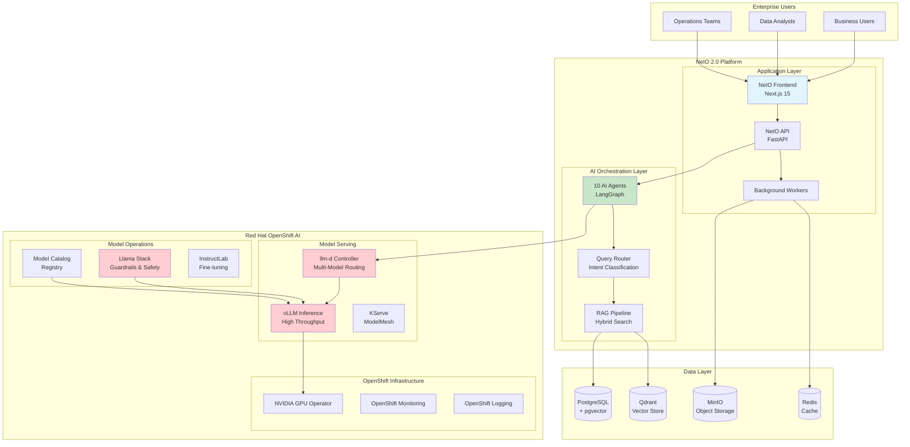

---

## 2. Red Hat OpenShift AI Services Integration

### 2.1 Service Overview

| Red Hat OpenShift AI Component | Purpose in NeIO | Integration Status |
|--------------------------------|-----------------|-------------------|
| **Red Hat OpenShift AI (RHOAI)** | AI/ML platform foundation | Integrated |
| **vLLM on OpenShift** | High-throughput LLM inference | Integrated |
| **llm-d** | Multi-model routing & load balancing | Integrated |
| **Llama Stack** | Safety guardrails & content filtering | Integrated |
| **KServe / ModelMesh** | Serverless model serving | Integrated |
| **InstructLab** | Domain-specific model tuning | Integrated |
| **Red Hat Model Catalog** | Enterprise model registry | Integrated |
| **NVIDIA GPU Operator on OpenShift** | GPU resource management | Integrated |

### 2.2 OpenShift Platform Services

| OpenShift Component | Purpose in NeIO |
|---------------------|-----------------|
| **OpenShift Routes** | TLS termination, ingress |
| **OpenShift Monitoring** | Prometheus, Grafana dashboards |
| **OpenShift Logging** | Centralized log aggregation |
| **OpenShift Pipelines** | CI/CD for model deployment |
| **OpenShift GitOps** | Infrastructure as Code |
| **OpenShift Data Foundation** | Persistent storage for MinIO |

---

## 3. Model Serving Architecture with vLLM + llm-d

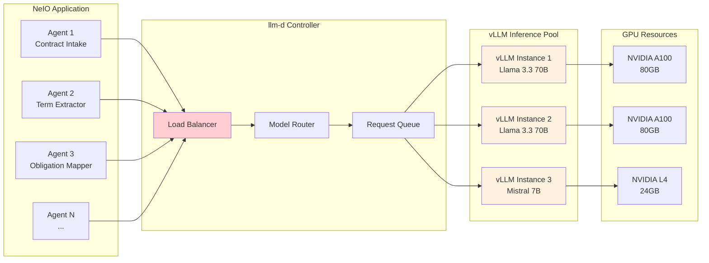

### 3.1 Why vLLM + llm-d on OpenShift?

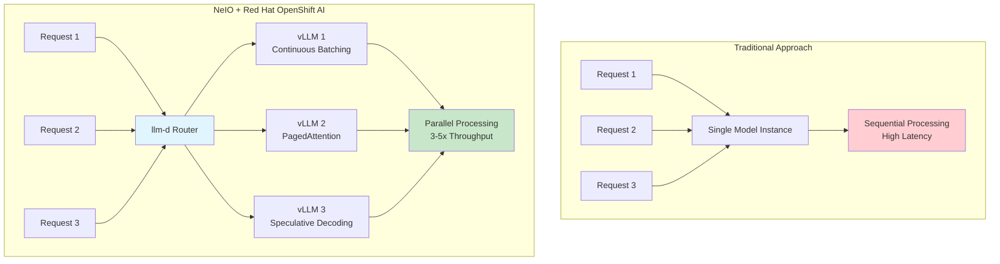

**Key Benefits of Red Hat OpenShift AI Model Serving:**

| Capability | Benefit |
|------------|---------|
| **Continuous Batching** | 3-5x higher throughput |
| **PagedAttention** | 70% GPU memory reduction |
| **llm-d Routing** | Intelligent load distribution |
| **KServe Autoscaling** | Scale-to-zero and burst handling |
| **Multi-model Support** | Right-size models per use case |

---

## 4. AI Agent Architecture

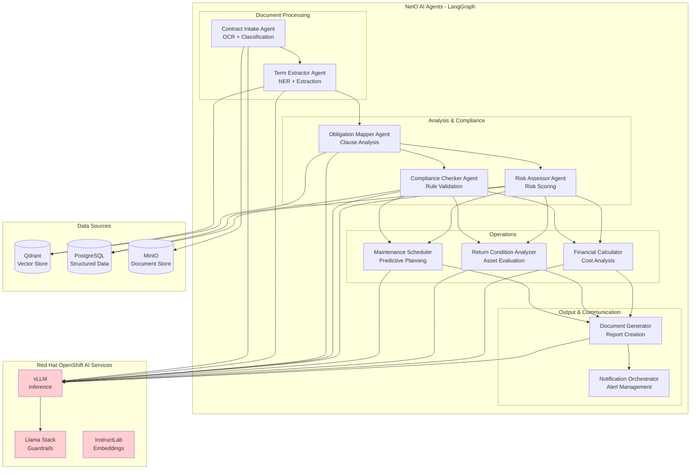

---

## 5. Safety & Guardrails with Llama Stack

```mermaid
flowchart LR
    subgraph "User Input"
        Q[User Query]
    end

    subgraph "Llama Stack Guardrails"
        subgraph "Input Safety"
            PII[PII Detection<br/>& Redaction]
            INJECT[Prompt Injection<br/>Detection]
            TOXIC[Toxicity<br/>Filter]
        end

        subgraph "Content Policy"
            TOPIC[Topic<br/>Restrictions]
            DOMAIN[Domain<br/>Boundaries]
        end
    end

    subgraph "LLM Processing"
        VLLM[vLLM Inference<br/>Llama 3.3 70B]
    end

    subgraph "Output Safety"
        FACT[Factuality<br/>Check]
        HALLU[Hallucination<br/>Detection]
        COMPLY[Compliance<br/>Validation]
    end

    subgraph "Response"
        R[Safe Response<br/>to User]
    end

    Q --> PII --> INJECT --> TOXIC
    TOXIC --> TOPIC --> DOMAIN
    DOMAIN --> VLLM
    VLLM --> FACT --> HALLU --> COMPLY
    COMPLY --> R

    style PII fill:#fff3e0
    style INJECT fill:#fff3e0
    style TOXIC fill:#fff3e0
    style FACT fill:#c8e6c9
    style HALLU fill:#c8e6c9
    style COMPLY fill:#c8e6c9
```

### 5.1 Guardrail Configuration

| Guardrail | Purpose | NeIO Implementation |
|-----------|---------|---------------------|
| **PII Detection** | Protect sensitive data | Auto-redact SSN, credit cards, account numbers |
| **Prompt Injection** | Prevent manipulation | Block jailbreak and injection attempts |
| **Topic Restrictions** | Stay on domain | Industry-specific response boundaries |
| **Factuality Check** | Ensure accuracy | Cross-reference with source documents |
| **Hallucination Detection** | Prevent fabrication | Confidence scoring and citation validation |

---

## 6. RAG Pipeline with Red Hat OpenShift AI

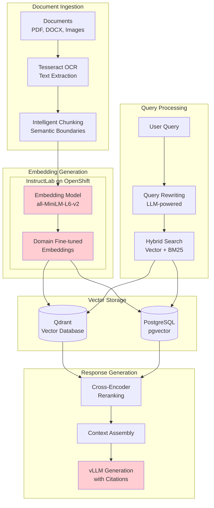

---

## 7. Deployment Architecture on Red Hat OpenShift

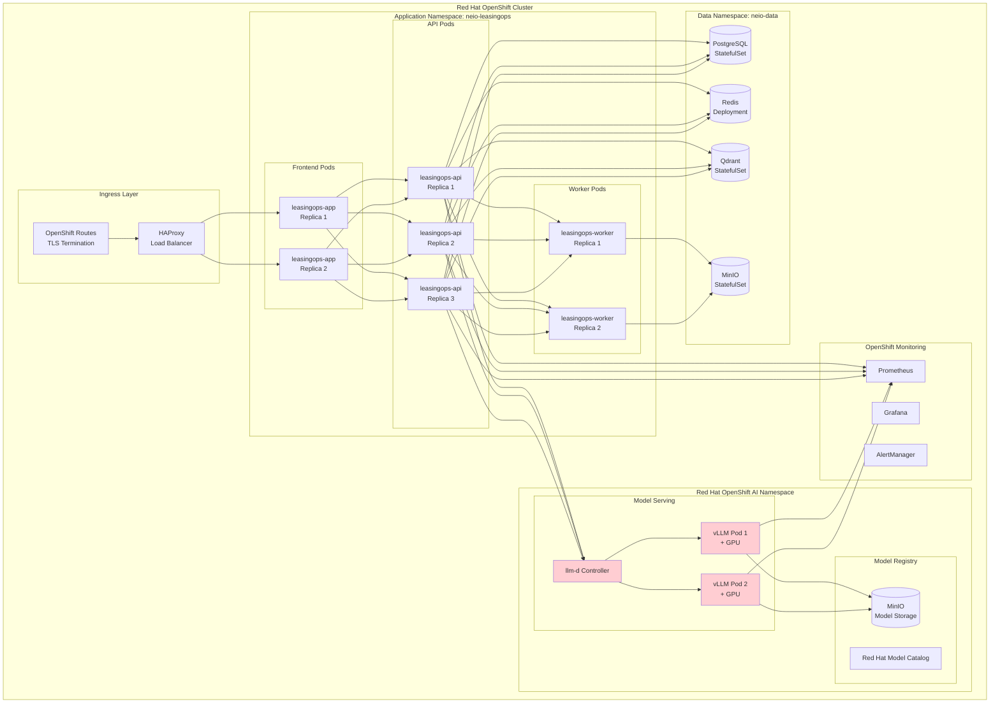

---

## 8. Request Flow: End-to-End

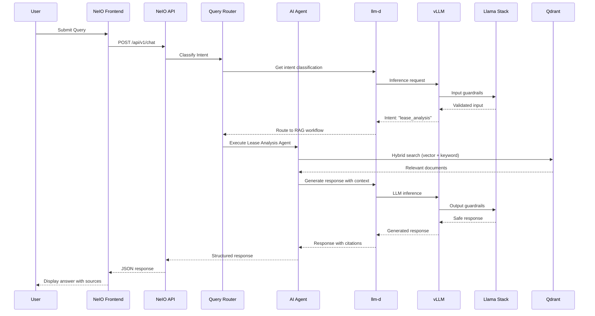

---

## 9. GPU Resource Management with NVIDIA GPU Operator

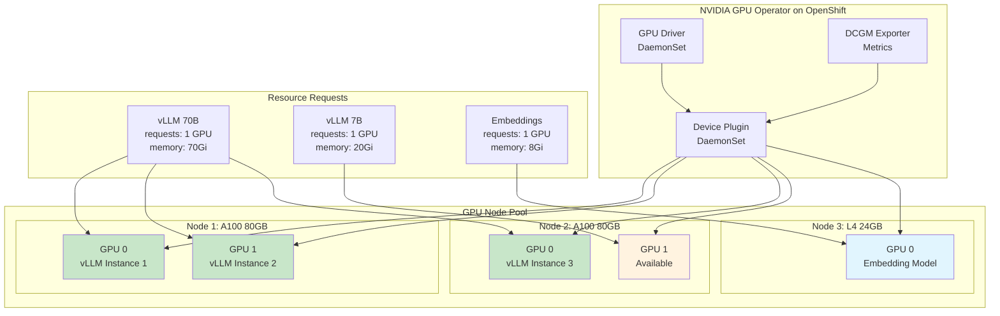

---

## 10. Monitoring with OpenShift Monitoring Stack

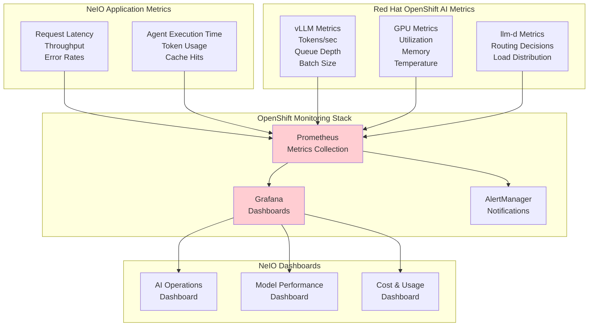

### 10.1 Key Metrics Tracked

| Category | Metric | Alert Threshold |
|----------|--------|-----------------|
| **Latency** | P95 response time | > 2s |
| **Throughput** | Tokens per second | < 100 |
| **GPU** | Utilization | < 30% or > 95% |
| **Memory** | GPU memory usage | > 90% |
| **Errors** | LLM error rate | > 1% |
| **Queue** | Request queue depth | > 100 |

---

## 11. Security & Compliance on OpenShift

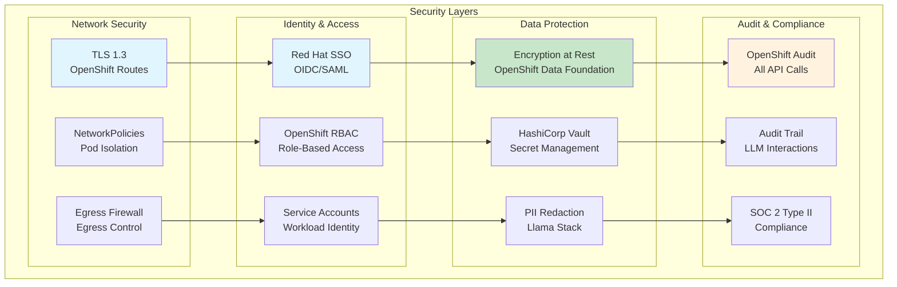

---

## 12. Value Proposition Summary

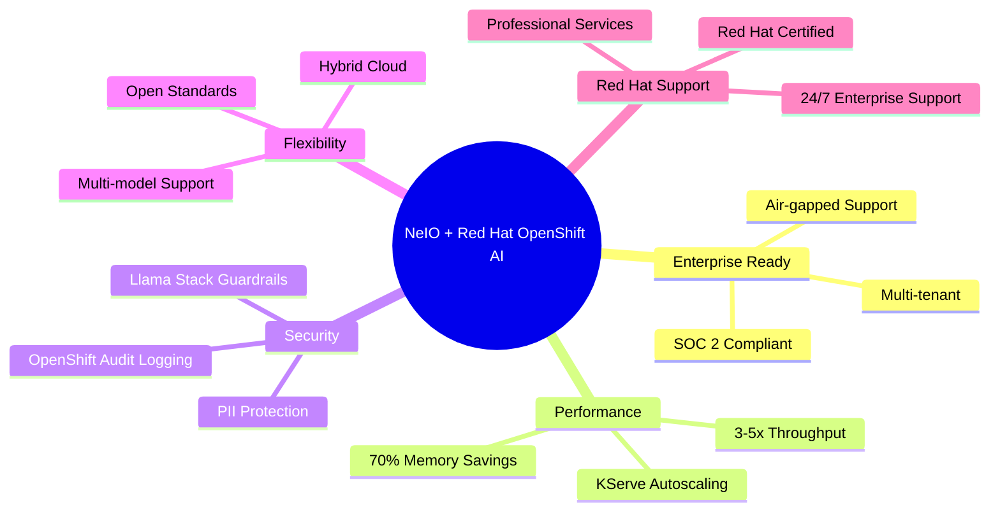

### Key Differentiators

| Capability | Without Red Hat OpenShift AI | With Red Hat OpenShift AI |
|------------|------------------------------|---------------------------|
| **Model Serving** | Custom infrastructure, high ops burden | Managed vLLM + llm-d on OpenShift |
| **Scaling** | Manual, complex | KServe autoscaling, scale-to-zero |
| **Safety** | DIY guardrails | Llama Stack built-in |
| **GPU Management** | Manual allocation | NVIDIA GPU Operator |
| **Storage** | Custom object storage | MinIO on OpenShift Data Foundation |
| **Monitoring** | Custom dashboards | OpenShift Monitoring (Prometheus/Grafana) |
| **Support** | Community only | Red Hat Enterprise 24/7 Support |
| **Compliance** | Self-certification | Red Hat Certified, OpenShift hardened |

---

## 13. Architecture Comparison: Before & After

```mermaid
flowchart LR
    subgraph "Before: Generic Cloud AI"
        B1[Third-party LLM API<br/>Per-token costs] --> B2[No Control<br/>Data leaves organization]
        B2 --> B3[Vendor Lock-in<br/>No customization]
        B3 --> B4[Compliance Risk<br/>No audit trail]
    end

    subgraph "After: NeIO + Red Hat OpenShift AI"
        A1[On-premises vLLM<br/>Predictable costs] --> A2[Full Control<br/>Data stays internal]
        A2 --> A3[Open Standards<br/>InstructLab customization]
        A3 --> A4[Enterprise Compliant<br/>Full audit trail]
    end

    B4 -.->|Migration| A1

    style B1 fill:#ffcdd2
    style B2 fill:#ffcdd2
    style B3 fill:#ffcdd2
    style B4 fill:#ffcdd2
    style A1 fill:#c8e6c9
    style A2 fill:#c8e6c9
    style A3 fill:#c8e6c9
    style A4 fill:#c8e6c9
```

---

## Contact

**CODVO.AI** - Red Hat Technology Partner

- Website: https://codvo.ai
- Email: partnerships@codvo.ai
- Red Hat Ecosystem Catalog: CODVO.AI

---

*Document Version: 1.0 | February 2025 | Prepared for Red Hat Partnership*
