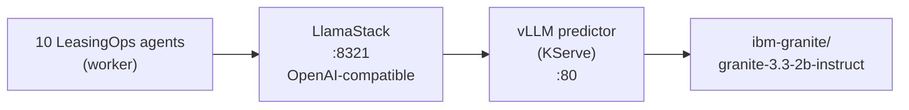

# Red Hat OpenShift AI Integration

This document describes how NeIO LeasingOps uses Red Hat OpenShift AI, as the quickstart actually deploys it. It is scoped to what ships in this repository.

---

## What the quickstart uses

NeIO LeasingOps runs its inference on Red Hat OpenShift AI (RHOAI). Three pieces from the Red Hat AI stack are involved:

| Component | Role in the quickstart |
|-----------|------------------------|
| Red Hat OpenShift AI (KServe) | Serves the model. KServe creates the vLLM predictor pod from the `llm-service` chart. |
| vLLM | The inference engine. Serves a single model, IBM Granite 3.3 2B Instruct (Apache 2.0, no gated weights). |
| LlamaStack | OpenAI-compatible gateway in front of vLLM. Every agent LLM call goes through it. |
| NVIDIA GPU Operator | Schedules the model onto a GPU node. CPU-only inference is supported but slower (see README Appendix A). |

Both vLLM and LlamaStack are deployed from the [Red Hat AI Architecture Charts](https://github.com/rh-ai-quickstart/ai-architecture-charts), exactly as the README's step 2 shows. The LeasingOps chart does not bundle them; it connects to LlamaStack at `http://llamastack:8321`.

---

## Serving flow

1. The worker runs each document through the ten agents. Every agent that needs the model issues an OpenAI-style `POST /v1/chat/completions` to LlamaStack.
2. LlamaStack forwards the request to the vLLM predictor that KServe stands up.
3. vLLM runs Granite 3.3 2B and returns the completion.

A post-install Helm Job registers the Granite model with LlamaStack so the agents can address it by its provider-prefixed id, `remote-llm/ibm-granite/granite-3.3-2b-instruct`.

---

## Choosing a larger model

Granite 3.3 2B is the default because it runs on modest hardware. For higher quality, deploy a larger Granite model in step 2 (for example `granite-3.3-8b-instruct`) and set `llamastack.model` to its provider-prefixed id. No application changes are needed; the agents always talk to LlamaStack.

---

## Not in the quickstart

The following are **not** deployed or wired up by this quickstart:

- llm-d multi-model routing and load balancing across several vLLM instances.
- Multiple concurrently served models (the quickstart serves one).
- Model-level guardrails configured through Llama Stack shields.
- KServe scale-to-zero and autoscaling of the predictor.
- A managed RAG vector store; document context is handled within the application.

None of these are configuration flags in this chart; each would have to be added on top of it.

---

## Contact

**CODVO.AI** - Red Hat Technology Partner

- Website: https://codvo.ai
- Email: partnerships@codvo.ai
- Red Hat Ecosystem Catalog: CODVO.AI
