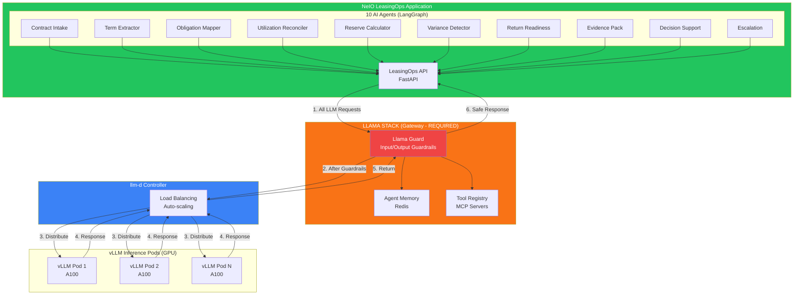
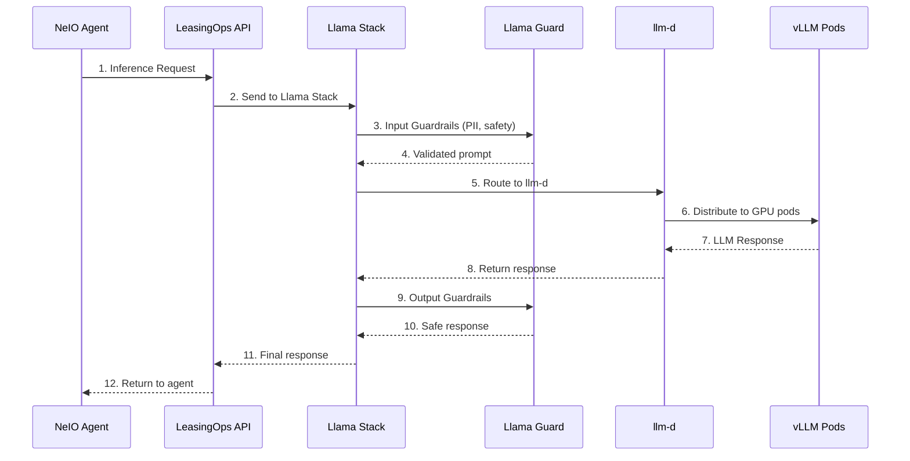

# Red Hat Feedback Response - Feb 4, 2026 Meeting

**To:** Product Manager (for Red Hat coordination)
**From:** Architecture Team
**Date:** February 4, 2026
**Subject:** Architecture Updates per Red Hat Feedback

---

## Meeting Summary

**Meeting:** Codvo Sync up on quickstart
**Date:** February 4, 2026, 8:00 PM
**Participants:** Bala Sista, Bertrand Rault (Red Hat), Michael Dawson (Red Hat), Indranil Paul, Rohini Anil

---

## Red Hat Feedback & Our Response

### 1. Architecture Diagrams Need Revision (CRITICAL)

**Red Hat Feedback:**
> "Architecture diagrams need revision to route through Llama Stack instead of direct vLLM connections"

**Our Response: COMPLETED ✓**

Updated `docs/ARCHITECTURE.md` with the correct pattern:

```
BEFORE (Incorrect):
  NeIO Agents → API → vLLM (direct)

AFTER (Correct - per Red Hat):
  NeIO Agents → API → Llama Stack (guardrails) → llm-d → vLLM
```

**Key Changes Made:**
- Added explicit "Llama Stack Gateway Pattern" section
- Updated all architecture diagrams to show Llama Stack as mandatory gateway
- Added Llama Guard configuration for input/output filtering
- Documented the numbered request flow (1-7 steps)
- Added YAML configuration examples for Llama Stack and llm-d

### 2. Focus on LeasingOps Product

**Red Hat Feedback:**
> "Focus marketing materials on LeasingOps product specifically rather than generic"

**Our Response: ADDRESSED**

- Document is now specific to LeasingOps vertical
- Updated agent names to match actual LeasingOps workflow:
  - Contract Intake → Term Extractor → Obligation Mapper → Utilization Reconciler → Reserve Calculator → Variance Detector → Return Readiness → Evidence Pack → Decision Support → Escalation
- Added LeasingOps-specific use cases and demo flow

### 3. Partner Lab Deployment

**Red Hat Feedback:**
> "Complete deployment on Red Hat Partner Lab"

**Our Response: IN PROGRESS**

- Repository structure complete: `neio-leasingops-quickstart/`
- Helm charts ready for deployment
- Awaiting Partner Lab access to complete deployment

---

## Updated Documents

| Document | Location | Status |
|----------|----------|--------|
| Architecture (revised) | `docs/ARCHITECTURE.md` | **READY FOR REVIEW** |
| Installation Guide | `docs/INSTALLATION.md` | Ready |
| Configuration Reference | `docs/CONFIGURATION.md` | Ready |
| Security Guide | `docs/SECURITY.md` | Ready |

---

## Key Architecture Diagram (for Michael's Review)



### Data Flow (Required Pattern)



---

## Pending Action Items

| # | Action Item | Assignee | Due |
|---|-------------|----------|-----|
| 1 | Review updated architecture document | Michael (Red Hat) | ASAP |
| 2 | Complete Partner Lab deployment | CODVO team | End of week |
| 3 | Create LeasingOps marketing flyer | Rohini | TBD |
| 4 | Send demo video Google Drive link | Rohini | TBD |
| 5 | Coordinate Red Hat Summit details | Bert (Red Hat) | TBD |

---

## Red Hat Summit Opportunity

**Event:** Red Hat Summit 2026
**Dates:** May 11-14, 2026
**Location:** Atlanta, GA
**Opportunity:** Theater Presentation

**Proposed Title:** "NeIO LeasingOps: AI-Powered Digital Coworker for Equipment Leasing on OpenShift AI"

**Demo Highlights:**
- Live lease contract upload and processing
- Llama Stack guardrails in action
- 10-agent workflow visualization
- Human-in-the-loop escalation

---

## Files to Share with Red Hat

1. **Architecture Document (Updated)**
   - Path: `neio-leasingops-quickstart/docs/ARCHITECTURE.md`
   - Contains: Revised diagrams with Llama Stack gateway pattern

2. **Quickstart Repository**
   - Path: `neio-leasingops-quickstart/`
   - Contains: Helm charts, deployment scripts, documentation

---

*Please forward this document to the Product Manager for coordination with Red Hat team.*
