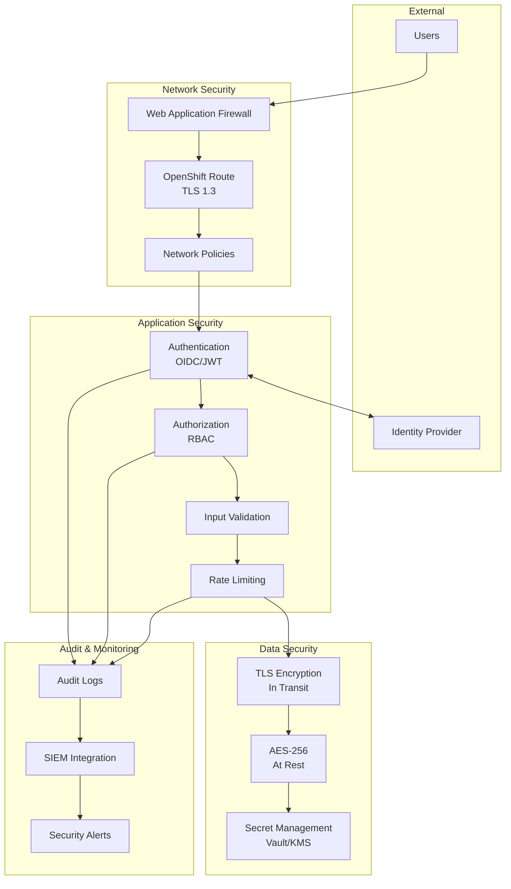
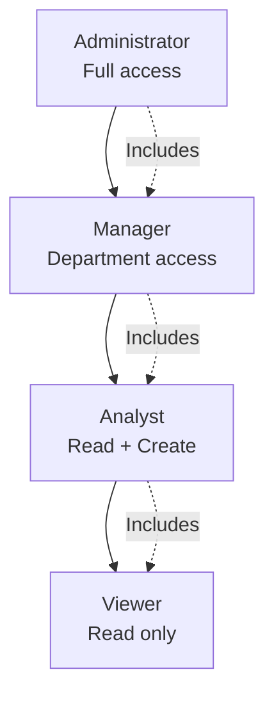

# NeIO LeasingOps - Security Model Documentation

This document describes the security architecture and best practices for NeIO LeasingOps deployments.

## Table of Contents

- [Security Overview](#security-overview)
- [Authentication (OIDC)](#authentication-oidc)
- [Authorization (RBAC)](#authorization-rbac)
- [Network Policies](#network-policies)
- [Secret Management](#secret-management)
- [Audit Logging](#audit-logging)
- [Data Protection](#data-protection)
- [Compliance Notes](#compliance-notes)
- [Security Hardening Checklist](#security-hardening-checklist)

---

## Security Overview

NeIO LeasingOps implements a defense-in-depth security model with multiple layers of protection.



### Security Principles

| Principle | Implementation |
|-----------|----------------|
| Zero Trust | All requests authenticated and authorized |
| Least Privilege | RBAC with minimal permissions |
| Defense in Depth | Multiple security layers |
| Encryption Everywhere | TLS in transit, AES at rest |
| Audit Everything | Comprehensive logging |
| Fail Secure | Deny by default |

---

## Authentication (OIDC)

NeIO LeasingOps supports OpenID Connect (OIDC) for authentication, integrating with enterprise identity providers.

### Supported Identity Providers

| Provider | Protocol | Notes |
|----------|----------|-------|
| Red Hat SSO (Keycloak) | OIDC | Recommended for OpenShift |
| Azure AD | OIDC | Microsoft enterprise |
| Okta | OIDC | Cloud-native identity |
| Google Workspace | OIDC | Google enterprise |
| ADFS | OIDC | Windows Server |

### OIDC Configuration

```yaml
# values.yaml
auth:
  # Enable OIDC authentication
  oidc:
    enabled: true

    # Identity provider configuration
    issuer: "https://sso.example.com/auth/realms/leasingops"
    clientId: "leasingops-app"
    clientSecret: ""  # Use existingSecret instead
    existingSecret: "oidc-credentials"
    secretKey: "client-secret"

    # Token configuration
    audience: "leasingops-api"
    scopes:
      - openid
      - profile
      - email
      - groups

    # Claims mapping
    usernameClaim: "preferred_username"
    emailClaim: "email"
    groupsClaim: "groups"

    # Session configuration
    sessionLifetime: "8h"
    refreshInterval: "15m"

    # Logout
    logoutUrl: "https://sso.example.com/auth/realms/leasingops/protocol/openid-connect/logout"
```

### Red Hat SSO (Keycloak) Setup

1. **Create Realm:**
   ```json
   {
     "realm": "leasingops",
     "enabled": true,
     "sslRequired": "all",
     "defaultSignatureAlgorithm": "RS256"
   }
   ```

2. **Create Client:**
   ```json
   {
     "clientId": "leasingops-app",
     "enabled": true,
     "publicClient": false,
     "protocol": "openid-connect",
     "standardFlowEnabled": true,
     "implicitFlowEnabled": false,
     "directAccessGrantsEnabled": false,
     "serviceAccountsEnabled": true,
     "redirectUris": [
       "https://leasingops.example.com/*"
     ],
     "webOrigins": [
       "https://leasingops.example.com"
     ]
   }
   ```

3. **Configure Groups:**
   - Create groups: `leasingops-admins`, `leasingops-users`, `leasingops-readonly`
   - Map groups to roles

### JWT Token Validation

The API validates JWT tokens on every request:

```python
# Token validation flow
1. Extract token from Authorization header
2. Verify signature using JWKS from issuer
3. Validate claims (iss, aud, exp, nbf)
4. Extract user identity and groups
5. Cache validated claims for request
```

### Service Account Authentication

For machine-to-machine communication:

```yaml
# Service account configuration
auth:
  serviceAccounts:
    enabled: true
    # API key authentication for services
    apiKeys:
      - name: "external-system"
        key: ""  # Use secret reference
        existingSecret: "api-keys"
        secretKey: "external-system-key"
        permissions:
          - "read:contracts"
          - "write:obligations"
```

---

## Authorization (RBAC)

NeIO LeasingOps implements Role-Based Access Control (RBAC) for fine-grained authorization.

### Role Hierarchy



### Predefined Roles

| Role | Description | Permissions |
|------|-------------|-------------|
| `admin` | System administrator | Full access to all resources |
| `manager` | Department manager | Manage contracts, users, reports |
| `analyst` | Contract analyst | Create/edit contracts, run analysis |
| `viewer` | Read-only user | View contracts and reports |
| `api-service` | API service account | Machine-to-machine access |

### Permission Matrix

| Resource | admin | manager | analyst | viewer |
|----------|-------|---------|---------|--------|
| Contracts - View | Yes | Yes | Yes | Yes |
| Contracts - Create | Yes | Yes | Yes | No |
| Contracts - Edit | Yes | Yes | Yes | No |
| Contracts - Delete | Yes | Yes | No | No |
| Obligations - Manage | Yes | Yes | Yes | No |
| Reports - Generate | Yes | Yes | Yes | No |
| Reports - View | Yes | Yes | Yes | Yes |
| Users - Manage | Yes | Yes | No | No |
| Settings - Configure | Yes | No | No | No |
| Audit Logs - View | Yes | Yes | No | No |

### RBAC Configuration

```yaml
# values.yaml
rbac:
  enabled: true

  # Role definitions
  roles:
    admin:
      description: "System administrator"
      permissions:
        - "*:*"

    manager:
      description: "Department manager"
      permissions:
        - "contracts:*"
        - "obligations:*"
        - "reports:*"
        - "users:read"
        - "audit:read"

    analyst:
      description: "Contract analyst"
      permissions:
        - "contracts:read"
        - "contracts:create"
        - "contracts:update"
        - "obligations:*"
        - "reports:read"
        - "reports:create"
        - "chat:*"

    viewer:
      description: "Read-only user"
      permissions:
        - "contracts:read"
        - "obligations:read"
        - "reports:read"

  # Default role for new users
  defaultRole: "viewer"

  # Group to role mapping (from OIDC)
  groupMappings:
    "leasingops-admins": "admin"
    "leasingops-managers": "manager"
    "leasingops-analysts": "analyst"
    "leasingops-users": "viewer"
```

### Custom Permissions

Define custom permissions for specific use cases:

```yaml
rbac:
  customPermissions:
    - name: "aircraft-data-admin"
      description: "Manage aircraft data"
      resources:
        - "aircraft:*"
        - "maintenance:*"

    - name: "compliance-officer"
      description: "Compliance oversight"
      resources:
        - "contracts:read"
        - "obligations:read"
        - "compliance:*"
        - "audit:*"
```

---

## Network Policies

Network policies control pod-to-pod communication within the cluster.

### Default Deny

```yaml
# Deny all traffic by default
apiVersion: networking.k8s.io/v1
kind: NetworkPolicy
metadata:
  name: default-deny-all
  namespace: leasingops
spec:
  podSelector: {}
  policyTypes:
    - Ingress
    - Egress
```

### Allow Required Traffic

```yaml
# Allow ingress from OpenShift Router
apiVersion: networking.k8s.io/v1
kind: NetworkPolicy
metadata:
  name: allow-ingress-from-router
  namespace: leasingops
spec:
  podSelector:
    matchLabels:
      app.kubernetes.io/component: app
  ingress:
    - from:
        - namespaceSelector:
            matchLabels:
              network.openshift.io/policy-group: ingress
      ports:
        - port: 3000
          protocol: TCP
---
# Allow API to access database
apiVersion: networking.k8s.io/v1
kind: NetworkPolicy
metadata:
  name: allow-api-to-database
  namespace: leasingops
spec:
  podSelector:
    matchLabels:
      app.kubernetes.io/name: postgresql
  ingress:
    - from:
        - podSelector:
            matchLabels:
              app.kubernetes.io/component: api
        - podSelector:
            matchLabels:
              app.kubernetes.io/component: worker
      ports:
        - port: 5432
          protocol: TCP
```

### Network Policy Configuration

```yaml
# values.yaml
networkPolicies:
  enabled: true

  # Allow external access via ingress controller
  allowIngress: true

  # Allow egress to external LLM APIs (disable for air-gapped)
  allowExternalAI: true

  # Allow egress for DNS
  allowDNS: true

  # Additional allowed egress endpoints
  additionalEgress:
    - to:
        - ipBlock:
            cidr: 10.0.0.0/8  # Internal network
      ports:
        - port: 443
          protocol: TCP
```

---

## Secret Management

### Secret Types

| Secret | Purpose | Rotation Frequency |
|--------|---------|-------------------|
| Database credentials | PostgreSQL access | 90 days |
| Redis password | Cache access | 90 days |
| AI API keys | LLM provider access | Per provider policy |
| JWT signing key | Token signatures | 180 days |
| OIDC client secret | IdP authentication | Per IdP policy |
| Encryption keys | Data at rest | 365 days |

### Secret Structure

```yaml
# Recommended secret organization
apiVersion: v1
kind: Secret
metadata:
  name: leasingops-credentials
  namespace: leasingops
  labels:
    app.kubernetes.io/part-of: neio-leasingops
    app.kubernetes.io/component: security
  annotations:
    # Rotation tracking
    secret.codvo.ai/last-rotated: "2025-01-15"
    secret.codvo.ai/rotation-period: "90d"
type: Opaque
stringData:
  # Database
  POSTGRES_PASSWORD: "<strong-password>"

  # AI Providers
  ANTHROPIC_API_KEY: "sk-ant-..."
  VOYAGE_API_KEY: "pa-..."

  # Security
  JWT_SECRET_KEY: "<64-char-random>"
  ENCRYPTION_KEY: "<32-char-key>"
```

### External Secret Management

**HashiCorp Vault Integration:**

```yaml
# Using External Secrets Operator
apiVersion: external-secrets.io/v1beta1
kind: ExternalSecret
metadata:
  name: leasingops-credentials
  namespace: leasingops
spec:
  refreshInterval: 1h
  secretStoreRef:
    name: vault-backend
    kind: ClusterSecretStore
  target:
    name: leasingops-credentials
    creationPolicy: Owner
  dataFrom:
    - extract:
        key: secret/data/leasingops/credentials
```

**AWS Secrets Manager Integration:**

```yaml
apiVersion: external-secrets.io/v1beta1
kind: ExternalSecret
metadata:
  name: leasingops-credentials
  namespace: leasingops
spec:
  refreshInterval: 1h
  secretStoreRef:
    name: aws-secrets-manager
    kind: ClusterSecretStore
  target:
    name: leasingops-credentials
  data:
    - secretKey: ANTHROPIC_API_KEY
      remoteRef:
        key: leasingops/ai-credentials
        property: anthropic_api_key
```

### Secret Rotation

```bash
#!/bin/bash
# rotate-secrets.sh

# Generate new credentials
NEW_JWT_SECRET=$(openssl rand -hex 32)
NEW_ENCRYPTION_KEY=$(openssl rand -hex 16)

# Update secret
oc create secret generic leasingops-security \
  --from-literal=JWT_SECRET_KEY=${NEW_JWT_SECRET} \
  --from-literal=ENCRYPTION_KEY=${NEW_ENCRYPTION_KEY} \
  -n leasingops \
  --dry-run=client -o yaml | oc apply -f -

# Update rotation annotation
oc annotate secret leasingops-security \
  secret.codvo.ai/last-rotated=$(date -I) \
  -n leasingops --overwrite

# Rolling restart to pick up new secrets
oc rollout restart deployment/leasingops-api -n leasingops
oc rollout restart deployment/leasingops-worker -n leasingops
```

---

## Audit Logging

### Audit Events

| Event Category | Examples |
|---------------|----------|
| Authentication | Login, logout, failed login, token refresh |
| Authorization | Permission denied, role change |
| Data Access | Contract viewed, document downloaded |
| Data Modification | Contract created, obligation updated |
| Admin Actions | User created, settings changed |
| Security Events | Rate limit exceeded, suspicious activity |

### Audit Log Format

```json
{
  "timestamp": "2025-01-15T10:30:45.123Z",
  "event_type": "data.access",
  "event_action": "contract.view",
  "actor": {
    "user_id": "user-123",
    "username": "jane.doe@example.com",
    "roles": ["analyst"],
    "ip_address": "10.0.1.50",
    "user_agent": "Mozilla/5.0..."
  },
  "resource": {
    "type": "contract",
    "id": "contract-456",
    "name": "Lease Agreement ABC-2025"
  },
  "context": {
    "workspace_id": "workspace-789",
    "session_id": "session-abc"
  },
  "outcome": {
    "status": "success",
    "duration_ms": 45
  }
}
```

### Audit Configuration

```yaml
# values.yaml
audit:
  enabled: true

  # Log level for audit events
  level: "info"

  # Events to capture
  events:
    authentication: true
    authorization: true
    dataAccess: true
    dataModification: true
    adminActions: true
    securityEvents: true

  # Output destinations
  outputs:
    # Write to stdout (captured by OpenShift logging)
    stdout: true

    # Write to file
    file:
      enabled: true
      path: /var/log/audit/audit.log
      maxSize: "100Mi"
      maxAge: 30
      maxBackups: 10

    # Send to external SIEM
    siem:
      enabled: false
      endpoint: "https://siem.example.com/api/events"
      format: "cef"  # or "json", "syslog"
      batchSize: 100
      flushInterval: "10s"

  # Retention
  retention:
    days: 90
    archiveEnabled: true
    archiveBucket: "audit-archive"
```

### Viewing Audit Logs

```bash
# View recent audit events
oc logs deployment/leasingops-api -n leasingops | grep '"event_type"'

# Search for specific user activity
oc logs deployment/leasingops-api -n leasingops | \
  jq 'select(.actor.username == "jane.doe@example.com")'

# Find failed authentication attempts
oc logs deployment/leasingops-api -n leasingops | \
  jq 'select(.event_type == "auth.login_failed")'
```

---

## Data Protection

### Encryption at Rest

| Data Type | Encryption Method | Key Management |
|-----------|-------------------|----------------|
| PostgreSQL | TDE (pgcrypto) | OpenShift KMS |
| Qdrant Vectors | AES-256-GCM | Application-managed |
| Object Storage | SSE-S3 | Storage provider |
| Redis | Not encrypted | Use for cache only |

```yaml
# values.yaml
encryption:
  atRest:
    enabled: true

    # PostgreSQL encryption
    postgresql:
      enableTDE: true
      keyRotationDays: 365

    # Object storage encryption
    objectStorage:
      enabled: true
      algorithm: "AES256"

    # Vector store encryption
    vectorStore:
      enabled: true
      keySecret: "vector-encryption-key"
```

### Encryption in Transit

All communication uses TLS 1.3:

```yaml
# values.yaml
tls:
  # Minimum TLS version
  minVersion: "TLSv1.3"

  # Cipher suites
  cipherSuites:
    - TLS_AES_256_GCM_SHA384
    - TLS_CHACHA20_POLY1305_SHA256
    - TLS_AES_128_GCM_SHA256

  # Certificate configuration
  certificate:
    # Use OpenShift service serving certificates
    useServiceServingCerts: true

    # Or provide custom certificates
    existingSecret: ""
```

### Data Classification

| Classification | Examples | Controls |
|---------------|----------|----------|
| Public | Marketing materials | None |
| Internal | General contracts | Authentication |
| Confidential | Financial terms | RBAC + Encryption |
| Restricted | PII, payment data | RBAC + Encryption + Audit |

### Data Retention

```yaml
# values.yaml
dataRetention:
  # Contract data
  contracts:
    activeRetention: "7y"  # Keep active contracts
    archivedRetention: "10y"  # After closure

  # Audit logs
  auditLogs:
    retention: "90d"
    archiveRetention: "7y"

  # Temporary data
  temporary:
    uploadedFiles: "24h"
    processingCache: "1h"
```

---

## Compliance Notes

### Regulatory Frameworks

| Framework | Applicability | Key Requirements |
|-----------|--------------|------------------|
| SOC 2 Type II | Enterprise SaaS | Access control, audit logging |
| ISO 27001 | Information security | ISMS implementation |
| GDPR | EU personal data | Data protection, consent |
| CCPA | California residents | Privacy rights |
| SOX | Financial reporting | Change control, audit trails |

### SOC 2 Controls

| Control | Implementation |
|---------|----------------|
| CC6.1 - Logical Access | OIDC + RBAC |
| CC6.2 - Authentication | MFA via IdP |
| CC6.3 - Authorization | Role-based permissions |
| CC7.1 - Change Management | GitOps + approvals |
| CC7.2 - Infrastructure | OpenShift platform controls |
| CC8.1 - Audit Logging | Comprehensive event logging |

### GDPR Compliance

```yaml
# values.yaml
gdpr:
  enabled: true

  # Data subject rights
  dataSubjectRights:
    accessEnabled: true
    rectificationEnabled: true
    erasureEnabled: true
    portabilityEnabled: true

  # Consent management
  consent:
    required: true
    granular: true

  # Data processing records
  processingRecords:
    enabled: true
    exportFormat: "json"
```

### PII Handling

| Data Element | Classification | Handling |
|--------------|---------------|----------|
| User email | PII | Encrypted, access logged |
| User name | PII | Encrypted, access logged |
| IP address | PII | Hashed after 30 days |
| Contract parties | Business | Standard encryption |

---

## Security Hardening Checklist

### Pre-Deployment

- [ ] Generate strong passwords (20+ characters)
- [ ] Configure OIDC with enterprise IdP
- [ ] Set up external secret management (Vault/KMS)
- [ ] Review and customize RBAC roles
- [ ] Configure network policies
- [ ] Set up TLS certificates

### Deployment

- [ ] Verify all pods running as non-root
- [ ] Check Security Context Constraints (SCC)
- [ ] Validate network policy enforcement
- [ ] Test authentication flow
- [ ] Verify audit logging working

### Post-Deployment

- [ ] Enable and test intrusion detection
- [ ] Configure security monitoring alerts
- [ ] Set up vulnerability scanning
- [ ] Document incident response procedures
- [ ] Schedule security reviews

### Ongoing

- [ ] Rotate secrets per schedule
- [ ] Review audit logs weekly
- [ ] Apply security patches promptly
- [ ] Conduct quarterly access reviews
- [ ] Annual penetration testing

### OpenShift-Specific Hardening

```yaml
# Security Context Constraints
apiVersion: security.openshift.io/v1
kind: SecurityContextConstraints
metadata:
  name: leasingops-restricted
allowHostDirVolumePlugin: false
allowHostIPC: false
allowHostNetwork: false
allowHostPID: false
allowHostPorts: false
allowPrivilegeEscalation: false
allowPrivilegedContainer: false
allowedCapabilities: []
defaultAddCapabilities: []
fsGroup:
  type: MustRunAs
readOnlyRootFilesystem: true
requiredDropCapabilities:
  - ALL
runAsUser:
  type: MustRunAsNonRoot
seLinuxContext:
  type: MustRunAs
supplementalGroups:
  type: RunAsAny
volumes:
  - configMap
  - downwardAPI
  - emptyDir
  - persistentVolumeClaim
  - projected
  - secret
```

---

## Incident Response

### Security Incident Types

| Severity | Examples | Response Time |
|----------|----------|---------------|
| Critical | Data breach, system compromise | Immediate |
| High | Unauthorized access, DoS | < 1 hour |
| Medium | Policy violation, suspicious activity | < 4 hours |
| Low | Failed logins, minor anomalies | < 24 hours |

### Response Procedures

1. **Detection** - Monitor alerts and logs
2. **Containment** - Isolate affected systems
3. **Investigation** - Determine scope and cause
4. **Eradication** - Remove threat
5. **Recovery** - Restore normal operations
6. **Lessons Learned** - Update procedures

### Emergency Contacts

| Role | Contact |
|------|---------|
| Security Team | security@codvo.ai |
| On-Call Engineer | pagerduty |
| Enterprise Support | support@codvo.ai |

---

## Next Steps

- [Installation Guide](./INSTALLATION.md) - Deploy with security
- [Configuration Reference](./CONFIGURATION.md) - Security settings
- [Troubleshooting](./TROUBLESHOOTING.md) - Security issues
- [Air-Gapped Deployment](./AIRGAPPED.md) - Isolated environments
